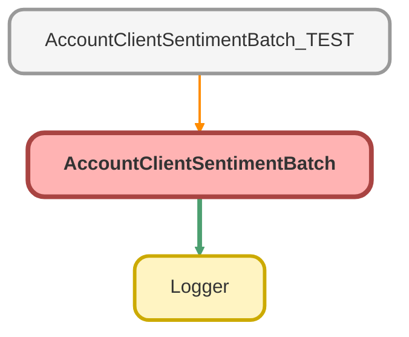

---
hide:
  - path
---

# AccountClientSentimentBatch Class

**Implements**

Database.Batchable&lt;sObject&gt;, 
Database.Stateful, 
Schedulable

## Class Diagram



<!-- Apex description -->

## Apex Code

```java
public without sharing class AccountClientSentimentBatch implements Database.Batchable<sObject>, Database.Stateful, Schedulable {
  //Constants for weighting scores based on origin
  private static final Decimal SAVER_WEIGHT = .2;
  private static final Decimal SPONSOR_WEIGHT = .8;
  //Variables for storing batch info
  private String originalTransactionId;
  private Integer accUpdateAttemptedCount = 0;
  private Integer accsUpdated = 0;
  private Integer accsErrored = 0;

  //Retrieves all accounts with an attached survey or review created in the last 6 months
  //OR with an existing average score (needs to be wiped) OR without a sentiment (new account).
  public Database.QueryLocator start(Database.BatchableContext bc) {
    this.originalTransactionId = Logger.getTransactionId();
    Logger.info('Starting Client Sentiment Batch ' + originalTransactionId);
    Logger.saveLog();
    List<simplesurvey__Survey__c> surveys = [
      SELECT simplesurvey__Account__c
      FROM simplesurvey__Survey__c
      WHERE
        CreatedDate >= LAST_N_MONTHS:6
        AND simplesurvey__Account__c != NULL
        AND ((simplesurvey__Survey_Score__c != NULL
        AND simplesurvey__Rating_Scale__c = '1-5')
        OR NPS_Score__c != NULL)
    ];
    List<Reviews__c> reviews = [SELECT Account__c FROM Reviews__c WHERE CreatedDate >= LAST_N_MONTHS:6 AND Account__c != NULL AND Rating__c != NULL];
    Set<Id> accountIds = new Set<Id>();
    for (simplesurvey__Survey__c survey : surveys) {
      accountIds.add(survey.simplesurvey__Account__c);
    }

    for (Reviews__c review : reviews) {
      accountIds.add(review.Account__c);
    }

    return Database.getQueryLocator(
      [
        SELECT
          Id,
          Name,
          Client_Sentiment__c,
          CSAT_Average__c,
          NPS_Average__c,
          Review_Average__c,
          (
            SELECT Id, Contact_Role__c, simplesurvey__Survey_Score__c, NPS_Score__c, simplesurvey__Rating_Scale__c
            FROM simplesurvey__Surveys__r
            WHERE CreatedDate >= LAST_N_MONTHS:6 AND ((simplesurvey__Survey_Score__c != NULL AND simplesurvey__Rating_Scale__c = '1-5') OR NPS_Score__c != NULL)
          ),
          (SELECT Id, Reviewer_Type__c, Rating__c, Rating_Scale__c FROM Reviews__r WHERE CreatedDate >= LAST_N_MONTHS:6 AND Rating__c != NULL)
        FROM Account
        WHERE Id IN :accountIds OR CSAT_Average__c != NULL OR NPS_Average__c != NULL OR Review_Average__c != NULL OR Client_Sentiment__c = NULL
      ]
    );
  }

  public void execute(Database.BatchableContext bc, List<Account> accounts) {
    Logger.setParentLogTransactionId(this.originalTransactionId);
    List<Account> accs2Update = new List<Account>();
    for (Account acc : accounts) {
      List<Decimal> sv = getSentimentAverages(acc);
      Decimal csatAvg = sv[0];
      Decimal npsAvg = sv[1];
      Decimal reviewAvg = sv[2];
      Logger.debug('Averages. . . csat: ' + csatAvg + ', nps: ' + npsAvg + ', review: ' + reviewAvg);
      Integer csatRating = getRating(csatAvg, 4, 3);
      Integer npsRating = getRating(npsAvg, 9, 7);
      Integer reviewRating = getRating(reviewAvg, 4, 3);
      Integer clientSentiment = calcTotalSentiment(csatRating, npsRating, reviewRating);
      Logger.debug(
        'Results for account ' +
          acc.Name +
          ': csat: ' +
          csatRating +
          ', nps: ' +
          npsRating +
          ', review: ' +
          reviewRating +
          ', clientSentiment:  ' +
          clientSentiment,
        acc.Id
      );
      //If any calculated values differ from account record (averages or total), queue for update.  Otherwise move on.
      if (acc.Client_Sentiment__c != clientSentiment || acc.CSAT_Average__c != csatAvg || acc.NPS_Average__c != npsAvg || acc.Review_Average__c != reviewAvg) {
        acc.CSAT_Average__c = csatAvg;
        acc.NPS_Average__c = npsAvg;
        acc.Review_Average__c = reviewAvg;
        acc.Client_Sentiment__c = clientSentiment;
        accs2Update.add(acc);
      } else {
        Logger.debug('No update needed for ' + acc.Name, acc.Id);
      }
    }
    if (!accs2Update.isEmpty()) {
      accUpdateAttemptedCount += accs2Update.size();
      List<Database.SaveResult> sResults = Database.update(accs2Update, false);
      //Loops through saveresults, individually tracking and logging number of successes, failures, and attempts.
      //Might be overkill but should help with catching issues in the future.  At least it's not attached to a trigger.
      for (Database.SaveResult sr : sResults) {
        if (sr.getErrors().isEmpty()) {
          Logger.debug('Successfuly updated account: ' + sr.getId(), sr);
          accsUpdated++;
        } else {
          Logger.error('Error updating account: ' + sr.getId(), sr);
          accsErrored++;
        }
      }
    }
    Logger.saveLog();
  }

  //Returns a list of weighted average csat, nps, and review scores for account.
  //Return index: csat[0], nps[1], review[2]
  //If no records exist for a given metric, then null is returned in the appropriate index.
  private List<Decimal> getSentimentAverages(Account acc) {
    List<Decimal> valueList = new List<Decimal>();
    Map<String, WeightedScore> surveyScores = calcSurveys(acc.simplesurvey__Surveys__r);
    WeightedScore csat = surveyScores.get('csat');
    valueList.add(csat.weight == 0 ? null : (csat.score / csat.weight).setScale(2));
    WeightedScore nps = surveyScores.get('nps');
    valueList.add(nps.weight == 0 ? null : (nps.score / nps.weight).setScale(2));
    WeightedScore reviewScore = calcReviews(acc.Reviews__r);
    valueList.add(reviewScore.weight == 0 ? null : (reviewScore.score / reviewScore.weight).setScale(2));
    return valueList;
  }

  //CSAT, NPS, and review averages are classified as positive(1), neutral(0), or negative(-1)
  private Integer getRating(Decimal score, Integer positiveFloor, Integer neutralFloor) {
    Integer rating = null;
    if (score >= positiveFloor) {
      rating = 1;
    } else if (score >= neutralFloor) {
      rating = 0;
    } else if (score != null) {
      rating = -1;
    }
    return rating;
  }

  Map<String, WeightedScore> calcSurveys(List<simplesurvey__Survey__c> surveys) {
    Map<String, WeightedScore> surveyTotals = new Map<String, WeightedScore>();
    WeightedScore csatTotals = new WeightedScore();
    csatTotals.score = 0;
    csatTotals.weight = 0;
    WeightedScore npsTotals = new WeightedScore();
    npsTotals.score = 0;
    npsTotals.weight = 0;
    for (simplesurvey__Survey__c survey : surveys) {
      Decimal weight = survey.Contact_Role__c != null && (survey.Contact_Role__c.contains('Sponsor') || survey.Contact_Role__c.contains('Trustee'))
        ? SPONSOR_WEIGHT
        : SAVER_WEIGHT;
      if (survey.simplesurvey__Survey_Score__c != null && survey.simplesurvey__Rating_Scale__c == '1-5') {
        csatTotals.weight += weight;
        csatTotals.score += survey.simplesurvey__Survey_Score__c * weight;
      }
      if (survey.NPS_Score__c != null) {
        npsTotals.weight += weight;
        npsTotals.score += survey.NPS_Score__c * weight;
      }
    }
    surveyTotals.put('csat', csatTotals);
    surveyTotals.put('nps', npsTotals);
    return surveyTotals;
  }

  private WeightedScore calcReviews(List<Reviews__c> reviews) {
    WeightedScore reviewTotals = new WeightedScore();
    reviewTotals.score = 0;
    reviewTotals.weight = 0;
    for (Reviews__c review : reviews) {
      Decimal weight = review.Reviewer_Type__c == 'Sponsor and/or Trustee' ? SPONSOR_WEIGHT : SAVER_WEIGHT;
      reviewTotals.weight += weight;
      WeightedScore reviewScore = new WeightedScore();
      reviewScore.score = Integer.valueOf(review.Rating__c);
      reviewScore.weight = weight;
      reviewScore.inputScale = review.Rating_Scale__c;
      reviewScore.outputScale = '1-5';
      reviewTotals.score += getScaledScore(reviewScore);
    }
    return reviewTotals; 
  }

  private Decimal getScaledScore(WeightedScore score) {
    return score.score *
      (Double.valueOf(score.outputScale.right(score.outputScale.length() - score.outputScale.indexOf('-') - 1)) /
      Double.valueOf(score.inputScale.right(score.inputScale.length() - score.inputScale.indexOf('-') - 1))) *
      score.weight;
  }

  private class WeightedScore {
    Decimal score;
    Decimal weight;
    String inputScale;
    String outputScale;
  }

  //Calculate total sentiment based on rating inputs.  CSAT(20%), NPS(30%), and Reviews(50%)
  private Integer calcTotalSentiment(Integer csatRating, Integer npsRating, Integer reviewRating) {
    Integer clientSentiment = 0;
    clientSentiment += csatRating == null ? 0 : csatRating * 20;
    clientSentiment += npsRating == null ? 0 : npsRating * 30;
    clientSentiment += reviewRating == null ? 0 : reviewRating * 50;
    return clientSentiment;
  }

  public void finish(Database.BatchableContext bc) {
    Logger.setParentLogTransactionId(this.originalTransactionId);
    Logger.info('Completed Client Sentiment batch job');
    Logger.info('Number of accounts where update was attempted: ' + accUpdateAttemptedCount);
    Logger.info('Number of accounts updated: ' + accsUpdated);
    Logger.info('Number of accounts that errored: ' + accsErrored);
    Logger.saveLog();
  }

  public void execute(SchedulableContext sc) {
    Database.executeBatch(new AccountClientSentimentBatch(), 200);
  }
}
```

## Fields
### `SAVER_WEIGHT`

#### Signature
```apex
private static final SAVER_WEIGHT
```

#### Type
Decimal

---

### `SPONSOR_WEIGHT`

#### Signature
```apex
private static final SPONSOR_WEIGHT
```

#### Type
Decimal

---

### `originalTransactionId`

#### Signature
```apex
private originalTransactionId
```

#### Type
String

---

### `accUpdateAttemptedCount`

#### Signature
```apex
private accUpdateAttemptedCount
```

#### Type
Integer

---

### `accsUpdated`

#### Signature
```apex
private accsUpdated
```

#### Type
Integer

---

### `accsErrored`

#### Signature
```apex
private accsErrored
```

#### Type
Integer

## Methods
### `start(bc)`

#### Signature
```apex
public Database.QueryLocator start(Database.BatchableContext bc)
```

#### Parameters
| Name | Type | Description |
|------|------|-------------|
| bc | Database.BatchableContext |  |

#### Return Type
**Database.QueryLocator**

---

### `execute(bc, accounts)`

#### Signature
```apex
public void execute(Database.BatchableContext bc, List<Account> accounts)
```

#### Parameters
| Name | Type | Description |
|------|------|-------------|
| bc | Database.BatchableContext |  |
| accounts | List&lt;Account&gt; |  |

#### Return Type
**void**

---

### `getSentimentAverages(acc)`

#### Signature
```apex
private List<Decimal> getSentimentAverages(Account acc)
```

#### Parameters
| Name | Type | Description |
|------|------|-------------|
| acc | [Account](../objects/Account.md) |  |

#### Return Type
**List&lt;Decimal&gt;**

---

### `getRating(score, positiveFloor, neutralFloor)`

#### Signature
```apex
private Integer getRating(Decimal score, Integer positiveFloor, Integer neutralFloor)
```

#### Parameters
| Name | Type | Description |
|------|------|-------------|
| score | Decimal |  |
| positiveFloor | Integer |  |
| neutralFloor | Integer |  |

#### Return Type
**Integer**

---

### `calcSurveys(surveys)`

#### Signature
```apex
private Map<String,WeightedScore> calcSurveys(List<simplesurvey__Survey__c> surveys)
```

#### Parameters
| Name | Type | Description |
|------|------|-------------|
| surveys | List&lt;simplesurvey__Survey__c&gt; |  |

#### Return Type
**Map&lt;String,WeightedScore&gt;**

---

### `calcReviews(reviews)`

#### Signature
```apex
private WeightedScore calcReviews(List<Reviews__c> reviews)
```

#### Parameters
| Name | Type | Description |
|------|------|-------------|
| reviews | List&lt;Reviews__c&gt; |  |

#### Return Type
**WeightedScore**

---

### `getScaledScore(score)`

#### Signature
```apex
private Decimal getScaledScore(WeightedScore score)
```

#### Parameters
| Name | Type | Description |
|------|------|-------------|
| score | WeightedScore |  |

#### Return Type
**Decimal**

---

### `calcTotalSentiment(csatRating, npsRating, reviewRating)`

#### Signature
```apex
private Integer calcTotalSentiment(Integer csatRating, Integer npsRating, Integer reviewRating)
```

#### Parameters
| Name | Type | Description |
|------|------|-------------|
| csatRating | Integer |  |
| npsRating | Integer |  |
| reviewRating | Integer |  |

#### Return Type
**Integer**

---

### `finish(bc)`

#### Signature
```apex
public void finish(Database.BatchableContext bc)
```

#### Parameters
| Name | Type | Description |
|------|------|-------------|
| bc | Database.BatchableContext |  |

#### Return Type
**void**

---

### `execute(sc)`

#### Signature
```apex
public void execute(SchedulableContext sc)
```

#### Parameters
| Name | Type | Description |
|------|------|-------------|
| sc | SchedulableContext |  |

#### Return Type
**void**

## Classes
### WeightedScore Class

#### Fields
##### `score`

###### Signature
```apex
private score
```

###### Type
Decimal

---

##### `weight`

###### Signature
```apex
private weight
```

###### Type
Decimal

---

##### `inputScale`

###### Signature
```apex
private inputScale
```

###### Type
String

---

##### `outputScale`

###### Signature
```apex
private outputScale
```

###### Type
String