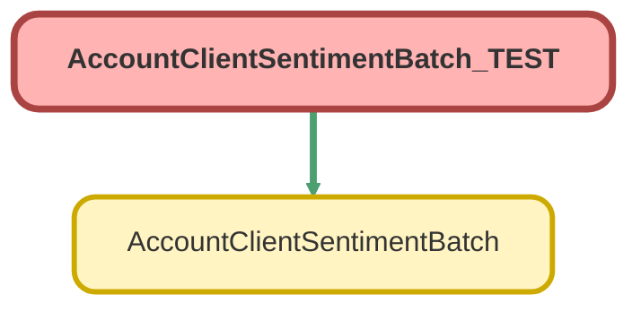

---
hide:
  - path
---

# AccountClientSentimentBatch_TEST Class

`ISTEST`

## Class Diagram



<!-- Apex description -->

## Apex Code

```java
@isTest
private class AccountClientSentimentBatch_TEST {
  @TestSetup
  static void makeData() {
    Id saverRecordTypeId = Schema.SObjectType.Contact.getRecordTypeInfosByName().get('Plan Participant').getRecordTypeId();
    List<Account> aList = new List<Account>();
    for (Integer i = 0; i < 3; i++) {
      Account a = new Account(Name = 'Test Account ' + i);
      alist.add(a);
    }
    insert aList;
    List<Contact> cList = new List<Contact>();
    for (Account a : aList) {
      Contact cSponsor = new Contact(FirstName = 'Test', LastName = 'Sponsor', Role__c = 'Sponsor', AccountId = a.Id);
      cList.add(cSponsor);
      Contact cSaver = new Contact(FirstName = 'Test', LastName = 'Saver', Role__c = 'Saver', AccountId = a.Id, RecordTypeId = saverRecordTypeId);
      cList.add(cSaver);
      Contact cUnknown = new Contact(FirstName = 'Test', LastName = 'Unknown', AccountId = a.Id);
      cList.add(cUnknown);
    }
    insert cList;
    List<simplesurvey__Survey__c> sList = new List<simplesurvey__Survey__c>();
    List<Reviews__c> rList = new List<Reviews__c>();
    for (Integer i = 0; i < 6; i++) {
      Contact c = cList[i];
      simplesurvey__Survey__c s = new simplesurvey__Survey__c();
      s.simplesurvey__Rating_Scale__c = '1-5';
      s.simplesurvey__Account__c = c.AccountId;
      s.simplesurvey__Contact__c = c.Id;
      if (i < 3) {
        s.simplesurvey__Survey_Score__c = 5;
        s.NPS_Score__c = 10;
        s.simplesurvey__Contact__c = c.Id;
        Reviews__c r = new Reviews__c(
          Account__c = c.AccountId,
          Rating__c = '5',
          Rating_Scale__c = '1-5',
          Reviewer_Type__c = i == 0 ? 'Sponsor and/or Trustee' : 'Saver'
        );
        rList.add(r);
      } else if (i == 3) {
        s.simplesurvey__Survey_Score__c = 1;
        s.NPS_Score__c = 0;
      } else {
        s.simplesurvey__Survey_Score__c = 5;
        s.NPS_Score__c = 10;
      }
      sList.add(s);
    }
    insert sList;
    insert rList;
  }

  @isTest
  private static void testBatch() {
    AccountClientSentimentBatch batch = new AccountClientSentimentBatch();
    Test.startTest();
    Database.executeBatch(batch, 20);
    Test.stopTest();
    List<Account> accounts = [
      SELECT Id, Name, CSAT_Average__c, NPS_Average__c, Review_Average__c, Client_Sentiment__c
      FROM Account
      WHERE Name LIKE 'Test Account%'
      ORDER BY Name ASC
    ];
    for (Account a : accounts) {
      switch on a.Name {
        when 'Test Account 0' {
          Assert.areEqual(5, a.CSAT_Average__c, 'CSAT_Average__c should be 5 for ' + a.Name);
          Assert.areEqual(10, a.NPS_Average__c, 'NPS_Average__c should be 10 for ' + a.Name);
          Assert.areEqual(5, a.Review_Average__c, 'Review_Average__c should be 5 for ' + a.Name);
          Assert.areEqual(100, a.Client_Sentiment__c, 'Client_Sentiment__c should be 100 for ' + a.Name);
        }
        when 'Test Account 1' {
          Assert.areEqual(2.33, a.CSAT_Average__c, 'CSAT_Average__c should be 2.33 for ' + a.Name);
          Assert.areEqual(3.33, a.NPS_Average__c, 'NPS_Average__c should be 3.33 for ' + a.Name);
          Assert.isNull(a.Review_Average__c, 'Review_Average__c should be null for ' + a.Name);
          Assert.areEqual(-50, a.Client_Sentiment__c, 'Client_Sentiment__c should be -50 for ' + a.Name);
        }
        when 'Test Account 2' {
          Assert.isNull(a.CSAT_Average__c, 'CSAT_Average__c should be null for ' + a.Name);
          Assert.isNull(a.NPS_Average__c, 'NPS_Average__c should be null for ' + a.Name);
          Assert.isNull(a.Review_Average__c, 'Review_Average__c should be null for ' + a.Name);
          Assert.areEqual(0, a.Client_Sentiment__c, 'Client_Sentiment__c should be 0 for ' + a.Name);
        }
      }
    }
  }
}
```

## Methods
### `makeData()`

`TESTSETUP`

#### Signature
```apex
private static void makeData()
```

#### Return Type
**void**

---

### `testBatch()`

`ISTEST`

#### Signature
```apex
private static void testBatch()
```

#### Return Type
**void**