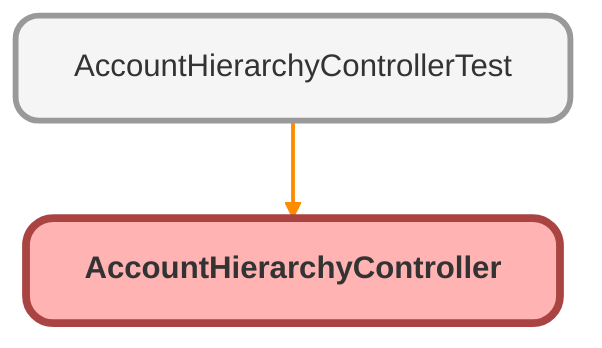

---
hide:
  - path
---

# AccountHierarchyController Class

## Class Diagram



<!-- Apex description -->

## Apex Code

```java
public class AccountHierarchyController {

    @AuraEnabled
    public static Boolean hasParent(String accountId) {
        //Looks for Parent Account on Account user is viewing
        List<Account> listAccounts = [SELECT ParentId FROM Account WHERE Id = :accountId LIMIT 1];
        Account acct = listAccounts[0];
        return acct.ParentId != null;
    }

    @AuraEnabled
    public static Integer numChildren(String accountId) {
        //Looks for Accounts that share the Parent Account present on Account user is viewing
        List<Account> listAccounts = [SELECT Id FROM Account WHERE ParentId = :accountId];
        return listAccounts.size();
    }
}
```

## Methods
### `hasParent(accountId)`

`AURAENABLED`

#### Signature
```apex
public static Boolean hasParent(String accountId)
```

#### Parameters
| Name | Type | Description |
|------|------|-------------|
| accountId | String |  |

#### Return Type
**Boolean**

---

### `numChildren(accountId)`

`AURAENABLED`

#### Signature
```apex
public static Integer numChildren(String accountId)
```

#### Parameters
| Name | Type | Description |
|------|------|-------------|
| accountId | String |  |

#### Return Type
**Integer**