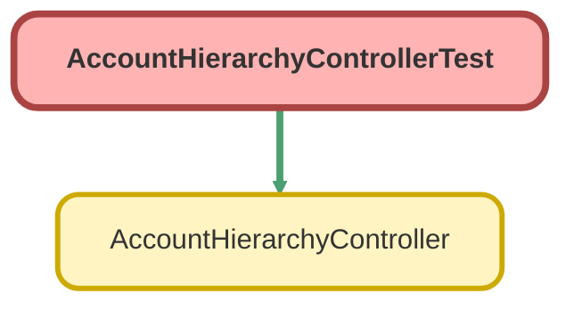

---
hide:
  - path
---

# AccountHierarchyControllerTest Class

`ISTEST`

## Class Diagram



<!-- Apex description -->

## Apex Code

```java
@isTest
public class AccountHierarchyControllerTest {

	static testMethod void testHasParent() {
        Account acct = new Account(Name='Test');
        insert acct;

        Account acct2 = new Account(Name='Test2');
        acct2.ParentId = acct.Id;
        insert acct2;

        System.assertEquals(AccountHierarchyController.hasParent(acct.Id), False);
        System.assertEquals(AccountHierarchyController.hasParent(acct2.Id), True);
    }

    static testMethod void testNumChildren() {
        Account acct = new Account(Name='Test');
        insert acct;

        Account acct2 = new Account(Name='Test2');
        acct2.ParentId = acct.Id;
        insert acct2;

        System.assertEquals(AccountHierarchyController.numChildren(acct.Id), 1);
        System.assertEquals(AccountHierarchyController.numChildren(acct2.Id), 0);
    }
}
```

## Methods
### `testHasParent()`

#### Signature
```apex
private static testMethod void testHasParent()
```

#### Return Type
**void**

---

### `testNumChildren()`

#### Signature
```apex
private static testMethod void testNumChildren()
```

#### Return Type
**void**