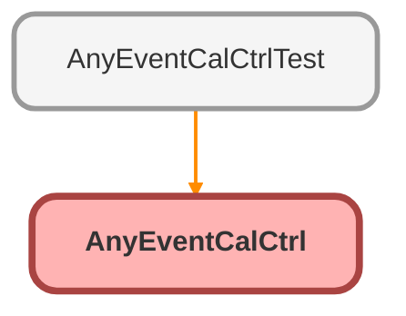

---
hide:
  - path
---

# AnyEventCalCtrl Class

─────────────────────────────────────────────────────────────────────────────────────────────────┐ 
Get, Upsert and Delete relevent sObject declared in the Lightning and Community Builder 
──────────────────────────────────────────────────────────────────────────────────────────────────

**Salesfore** 

.com&gt;

**ModifiedBy** 

Randy Grewal   &lt;rgrewal

**Salesfore** 

.com&gt;

**MaintainedBy** 

Randy Grewal   &lt;rgrewal

**Salesfore** 

.com&gt;

**Version** 

1.1

**Created** 

2017-05-01

**Modified** 

2017-06-12 
──────────────────────────────────────────────────────────────────────────────────────────────────

**Changes** 

v1.1            rgrewal

**Salesfore** 

.com 
2017-06-08     	Added option to filter query by logged in user and removed System.debug logs 
2017-06-12		Security Review Fixes: 
Added isAccessible(), isCreateable(), isDeletable() for CRUD/FLS Enforcement fix 
Added Typecasting to all injected field API names for SOQL Injection fix 
Added &quot;with sharing&quot; keyword to Class for Sharing Violation Fix 
─────────────────────────────────────────────────────────────────────────────────────────────────┘

**Author** Randy Grewal   &lt;rgrewal

## Class Diagram



<!-- Apex description -->

## Apex Code

```java
/**
* ─────────────────────────────────────────────────────────────────────────────────────────────────┐
* Get, Upsert and Delete relevent sObject declared in the Lightning and Community Builder
* ──────────────────────────────────────────────────────────────────────────────────────────────────
* @author         Randy Grewal   <rgrewal@salesfore.com>
* @modifiedBy     Randy Grewal   <rgrewal@salesfore.com>
* @maintainedBy   Randy Grewal   <rgrewal@salesfore.com>
* @version        1.1
* @created        2017-05-01
* @modified       2017-06-12
* ──────────────────────────────────────────────────────────────────────────────────────────────────
* @changes
* v1.1            rgrewal@salesfore.com
* 2017-06-08     	Added option to filter query by logged in user and removed System.debug logs
* 2017-06-12		Security Review Fixes:
*					Added isAccessible(), isCreateable(), isDeletable() for CRUD/FLS Enforcement fix
*					Added Typecasting to all injected field API names for SOQL Injection fix
*					Added "with sharing" keyword to Class for Sharing Violation Fix
* ─────────────────────────────────────────────────────────────────────────────────────────────────┘
*/

public with sharing class AnyEventCalCtrl {
    @AuraEnabled
    public static List<EventObj> getEvents(String sObjectName, String titleField, String startDateTimeField, String endDateTimeField, String descriptionField, String userField, Boolean filterByUserField){
        String q = 'SELECT Id,' + 
            String.valueOf(titleField) + ',' + 
            String.valueOf(startDateTimeField) + ',' +
            String.valueOf(endDateTimeField) + ',' +
            String.valueOf(descriptionField) + ',' +
            String.valueOf(userField) + ' FROM ' + 
            String.valueOf(sObjectName) + ' WHERE ' + 
            String.valueOf(userField) + ' = \'' + UserInfo.getUserId() + '\'';
        if (!filterByUserField) {
            q = 'SELECT Id,' + 
                String.valueOf(titleField) + ',' + 
            String.valueOf(startDateTimeField) + ',' +
            String.valueOf(endDateTimeField) + ',' +
            String.valueOf(descriptionField) + ',' +
            String.valueOf(userField) + ' FROM ' + 
            String.valueOf(sObjectName);
        } 
        
        List<sObject> sObjectList = Database.query(q);
        
        List<EventObj> eventRecords = new List<EventObj>();
        if(isAccessible(sObjectName)) {
            for (sObject obj : sObjectList) {
                EventObj newEv = new EventObj(obj.Id,
                                              String.valueOf(obj.get(titleField)),
                                              DateTime.valueOf(obj.get(startDateTimeField)),
                                              DateTime.valueOf(obj.get(endDateTimeField)),
                                              String.valueOf(obj.get(descriptionField)),
                                              String.valueOf(obj.get(userField))
                                             );
                eventRecords.add(newEv);
            }
        }
        return eventRecords;
    }
    @AuraEnabled
    public static EventObj upsertEvents(String sEventObj, String sObjectName, String titleField, String startDateTimeField, String endDateTimeField, String descriptionField, String userField){
        EventObj upsertingEvent = (EventObj)JSON.deserialize(sEventObj, EventObj.class);
        sObject newRecord = Schema.getGlobalDescribe().get(sObjectName).newSObject(); 
        if (upsertingEvent.Id != null && isAccessible(sObjectName,'Id')){
            newRecord.put('Id',upsertingEvent.Id);
        } 
        if (isAccessible(sObjectName,titleField)) {
            newRecord.put(titleField, upsertingEvent.title);
        }
        if (isAccessible(sObjectName,startDateTimeField)) {
            newRecord.put(startDateTimeField, upsertingEvent.startDateTime);
        }
        if (isAccessible(sObjectName,endDateTimeField)) {
            newRecord.put(endDateTimeField, upsertingEvent.endDateTime);
        }
        if (isAccessible(sObjectName,descriptionField)) {
            newRecord.put(descriptionField, upsertingEvent.description);
        }
        
        
        
        try {
            upsert newRecord;
            EventObj newEv = new EventObj(newRecord.Id,
                                  String.valueOf(newRecord.get(titleField)),
                                  DateTime.valueOf(newRecord.get(startDateTimeField)),
                                  DateTime.valueOf(newRecord.get(endDateTimeField)),
                                  String.valueOf(newRecord.get(descriptionField)),
                                  String.valueOf(newRecord.get(userField))
                                 );
            return newEv;
        } catch (Exception e) {
            System.debug(e.getMessage());
            return null;
        }
        
    }
    @AuraEnabled
    public static String deleteEvent(String eventId, String sObjectName, String titleField, String startDateTimeField, String endDateTimeField, String descriptionField, String userField){
        String q = 'SELECT Id,' + 
                titleField + ',' + 
                startDateTimeField + ',' +
                endDateTimeField + ',' +
                descriptionField + ',' +
                userField + ' FROM ' + 
                sObjectName + ' WHERE Id = \'' + eventId  + '\'';
        List<sObject> sObjectList = Database.query(q);
        try {
            if(isDeletable(sObjectName)) {
                delete sObjectList;
            }
            return eventId;
        } catch (Exception e) {
            System.debug(e.getMessage());
            return null;
        }
        
    }
    public class EventObj {
        @AuraEnabled
        public String Id {get;set;}
        @AuraEnabled
        public String title {get;set;}
        @AuraEnabled
        public DateTime startDateTime {get;set;}
        @AuraEnabled
        public DateTime endDateTime {get;set;}
        @AuraEnabled
        public String description {get;set;}
        @AuraEnabled
        public String owner {get;set;}

        
        public EventObj(String i,String t, DateTime s, DateTime e, String d, String o){
            this.Id = i;
            this.title = t;
            this.startDateTime = s;
            this.endDateTime = e;
            this.description = d;
            this.owner = o;
        }
        
    }
    public static Boolean isAccessible(String sObjectType, String fieldName){
        SObjectType schemaType = Schema.getGlobalDescribe().get(sObjectType);
        Map<String, SObjectField> fields = schemaType.getDescribe().fields.getMap();
        DescribeFieldResult fieldDescribe = fields.get(fieldName).getDescribe();
        return fieldDescribe.isAccessible();
    }
    public static Boolean isAccessible(String sObjectType){
        SObjectType schemaType = Schema.getGlobalDescribe().get(sObjectType);
        return schemaType.getDescribe().isAccessible();
    }
    public static Boolean isCreateable(String sObjectType){
        SObjectType schemaType = Schema.getGlobalDescribe().get(sObjectType);
        return schemaType.getDescribe().isCreateable();
    }
    public static Boolean isDeletable(String sObjectType){
        SObjectType schemaType = Schema.getGlobalDescribe().get(sObjectType);
        return schemaType.getDescribe().isDeletable();
    }
}
```

## Methods
### `getEvents(sObjectName, titleField, startDateTimeField, endDateTimeField, descriptionField, userField, filterByUserField)`

`AURAENABLED`

#### Signature
```apex
public static List<EventObj> getEvents(String sObjectName, String titleField, String startDateTimeField, String endDateTimeField, String descriptionField, String userField, Boolean filterByUserField)
```

#### Parameters
| Name | Type | Description |
|------|------|-------------|
| sObjectName | String |  |
| titleField | String |  |
| startDateTimeField | String |  |
| endDateTimeField | String |  |
| descriptionField | String |  |
| userField | String |  |
| filterByUserField | Boolean |  |

#### Return Type
**List&lt;EventObj&gt;**

---

### `upsertEvents(sEventObj, sObjectName, titleField, startDateTimeField, endDateTimeField, descriptionField, userField)`

`AURAENABLED`

#### Signature
```apex
public static EventObj upsertEvents(String sEventObj, String sObjectName, String titleField, String startDateTimeField, String endDateTimeField, String descriptionField, String userField)
```

#### Parameters
| Name | Type | Description |
|------|------|-------------|
| sEventObj | String |  |
| sObjectName | String |  |
| titleField | String |  |
| startDateTimeField | String |  |
| endDateTimeField | String |  |
| descriptionField | String |  |
| userField | String |  |

#### Return Type
**EventObj**

---

### `deleteEvent(eventId, sObjectName, titleField, startDateTimeField, endDateTimeField, descriptionField, userField)`

`AURAENABLED`

#### Signature
```apex
public static String deleteEvent(String eventId, String sObjectName, String titleField, String startDateTimeField, String endDateTimeField, String descriptionField, String userField)
```

#### Parameters
| Name | Type | Description |
|------|------|-------------|
| eventId | String |  |
| sObjectName | String |  |
| titleField | String |  |
| startDateTimeField | String |  |
| endDateTimeField | String |  |
| descriptionField | String |  |
| userField | String |  |

#### Return Type
**String**

---

### `isAccessible(sObjectType, fieldName)`

#### Signature
```apex
public static Boolean isAccessible(String sObjectType, String fieldName)
```

#### Parameters
| Name | Type | Description |
|------|------|-------------|
| sObjectType | String |  |
| fieldName | String |  |

#### Return Type
**Boolean**

---

### `isAccessible(sObjectType)`

#### Signature
```apex
public static Boolean isAccessible(String sObjectType)
```

#### Parameters
| Name | Type | Description |
|------|------|-------------|
| sObjectType | String |  |

#### Return Type
**Boolean**

---

### `isCreateable(sObjectType)`

#### Signature
```apex
public static Boolean isCreateable(String sObjectType)
```

#### Parameters
| Name | Type | Description |
|------|------|-------------|
| sObjectType | String |  |

#### Return Type
**Boolean**

---

### `isDeletable(sObjectType)`

#### Signature
```apex
public static Boolean isDeletable(String sObjectType)
```

#### Parameters
| Name | Type | Description |
|------|------|-------------|
| sObjectType | String |  |

#### Return Type
**Boolean**

## Classes
### EventObj Class

#### Properties
##### `Id`

`AURAENABLED`

###### Signature
```apex
public Id
```

###### Type
String

---

##### `title`

`AURAENABLED`

###### Signature
```apex
public title
```

###### Type
String

---

##### `startDateTime`

`AURAENABLED`

###### Signature
```apex
public startDateTime
```

###### Type
DateTime

---

##### `endDateTime`

`AURAENABLED`

###### Signature
```apex
public endDateTime
```

###### Type
DateTime

---

##### `description`

`AURAENABLED`

###### Signature
```apex
public description
```

###### Type
String

---

##### `owner`

`AURAENABLED`

###### Signature
```apex
public owner
```

###### Type
String

#### Constructors
##### `EventObj(i, t, s, e, d, o)`

###### Signature
```apex
public EventObj(String i, String t, DateTime s, DateTime e, String d, String o)
```

###### Parameters
| Name | Type | Description |
|------|------|-------------|
| i | String |  |
| t | String |  |
| s | DateTime |  |
| e | DateTime |  |
| d | String |  |
| o | String |  |