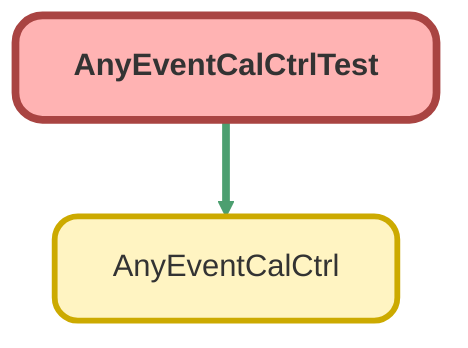

---
hide:
  - path
---

# AnyEventCalCtrlTest Class

`ISTEST`

## Class Diagram



<!-- Apex description -->

## Apex Code

```java
@isTest(seeAllData=true)
public class AnyEventCalCtrlTest {
	static testMethod void getEventsTest() {
        AnyEventCalCtrl.getEvents('Event', 'Subject', 'StartDateTime', 'EndDateTime', 'Description', 'OwnerId', true);
        AnyEventCalCtrl.getEvents('Event', 'Subject', 'StartDateTime', 'EndDateTime', 'Description', 'OwnerId', false);
    }
    static testMethod void upsertEventsTest() {
        AnyEventCalCtrl.upsertEvents('{"title":"dasdsad","startDateTime":"2017-04-26T17:00:00-07:00","endDateTime":"2017-04-26T19:00:00-07:00","description":"asdasd"}', 'Event', 'Subject', 'StartDateTime', 'EndDateTime', 'Description', 'OwnerId');
    	AnyEventCalCtrl.upsertEvents('{"id":"sadad","title":"dasdsad","startDateTime":"2017-04-26T17:00:00-07:00","endDateTime":"2017-04-26T19:00:00-07:00","description":"asdasd"}', 'Event', 'Subject', 'StartDateTime', 'EndDateTime', 'Description', 'OwnerId');
    }
    static testMethod void deleteEventTest() {
        AnyEventCalCtrl.deleteEvent('00U41000006bFIA', 'Event', 'Subject', 'StartDateTime', 'EndDateTime', 'Description', 'OwnerId');
    }
    static testMethod void crudSecurityTest() {
        AnyEventCalCtrl.isAccessible('Event');
        AnyEventCalCtrl.isAccessible('Event','Subject');
        AnyEventCalCtrl.isCreateable('Event');
        AnyEventCalCtrl.isDeletable('Event');
    }
}
```

## Methods
### `getEventsTest()`

#### Signature
```apex
private static testMethod void getEventsTest()
```

#### Return Type
**void**

---

### `upsertEventsTest()`

#### Signature
```apex
private static testMethod void upsertEventsTest()
```

#### Return Type
**void**

---

### `deleteEventTest()`

#### Signature
```apex
private static testMethod void deleteEventTest()
```

#### Return Type
**void**

---

### `crudSecurityTest()`

#### Signature
```apex
private static testMethod void crudSecurityTest()
```

#### Return Type
**void**