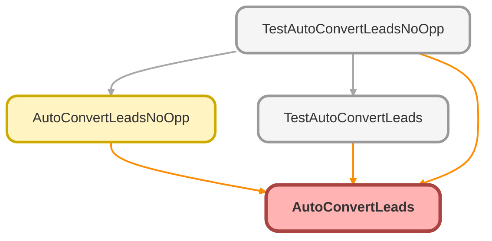

---
hide:
  - path
---

# AutoConvertLeads Class

## Class Diagram



<!-- Apex description -->

## Apex Code

```java
Public class AutoConvertLeads
{
    @InvocableMethod
    public static void LeadAssign(List<Id> LeadIds)
    {
            Database.LeadConvert Leadconvert = new Database.LeadConvert();
        	Leadconvert.setDoNotCreateOpportunity(false);
            Leadconvert.setLeadId(LeadIds[0]);
            LeadStatus Leads= [SELECT Id, MasterLabel FROM LeadStatus WHERE IsConverted=true LIMIT 1];
            Leadconvert.setConvertedStatus(Leads.MasterLabel);
            Database.LeadConvertResult Leadconverts = Database.convertLead(Leadconvert);
            System.assert(Leadconverts.isSuccess());
   }
}
```

## Methods
### `LeadAssign(LeadIds)`

`INVOCABLEMETHOD`

#### Signature
```apex
public static void LeadAssign(List<Id> LeadIds)
```

#### Parameters
| Name | Type | Description |
|------|------|-------------|
| LeadIds | List&lt;Id&gt; |  |

#### Return Type
**void**