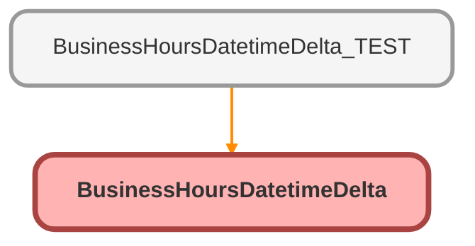

---
hide:
  - path
---

# BusinessHoursDatetimeDelta Class

## Class Diagram



<!-- Apex description -->

## Apex Code

```java
public with sharing class BusinessHoursDatetimeDelta {
    @InvocableMethod(label='Subtract Business Hours' description='Returns the absolute difference - order of dates does not matter.')
    public static List<returnVariables> results(List<inputVariables> inputs){
        String defaultBhId = [SELECT id FROM BusinessHours WHERE IsDefault = true LIMIT 1].id;
        List<returnVariables> returnVarsList = new List<returnVariables>();
        for(InputVariables input : inputs){
            
            //Grab Flow Inputs
            Datetime dateTimeInput1 = input.dateTime1;
            Datetime dateTimeInput2 = input.dateTime2;
            String businessHoursInput = input.businessHoursId;
            
            //Declare Variables
            Decimal dateTimeResultHours;
            String bh;

            IF(String.isNotBlank(businessHoursInput)) {
                bh = businessHoursInput;
            } else {
                bh = defaultBhId;
            }
            
            IF(dateTimeInput1 != null && dateTimeInput2 != null){
                Decimal dateTimeResultMili = BusinessHours.diff(bh, dateTimeInput1, dateTimeInput2).intValue();
                dateTimeResultHours = dateTimeResultMili.divide(3600000,2).abs();
            }

            returnVariables returnVars = new returnVariables();
            returnVars.dateTimeDifference = dateTimeResultHours;
            returnVarsList.add(returnVars);
        }
        return returnVarsList;
    }
    public class InputVariables{
        @InvocableVariable(label='First datetime' required=true)
        public datetime dateTime1;
        @InvocableVariable(label='Second datetime' required=true)
        public datetime dateTime2;
        @InvocableVariable(label='Business Hours ID' description='Business Hours ID to be used in calc.  Will use org default if left blank.')
        public string businessHoursId;
        
    }
    public class ReturnVariables{
        @InvocableVariable
        public Decimal dateTimeDifference;
    }
}
```

## Methods
### `results(inputs)`

`INVOCABLEMETHOD`

#### Signature
```apex
public static List<returnVariables> results(List<inputVariables> inputs)
```

#### Parameters
| Name | Type | Description |
|------|------|-------------|
| inputs | List&lt;inputVariables&gt; |  |

#### Return Type
**List&lt;returnVariables&gt;**

## Classes
### InputVariables Class

#### Fields
##### `dateTime1`

`INVOCABLEVARIABLE`

###### Signature
```apex
public dateTime1
```

###### Type
datetime

---

##### `dateTime2`

`INVOCABLEVARIABLE`

###### Signature
```apex
public dateTime2
```

###### Type
datetime

---

##### `businessHoursId`

`INVOCABLEVARIABLE`

###### Signature
```apex
public businessHoursId
```

###### Type
string

### ReturnVariables Class

#### Fields
##### `dateTimeDifference`

`INVOCABLEVARIABLE`

###### Signature
```apex
public dateTimeDifference
```

###### Type
Decimal