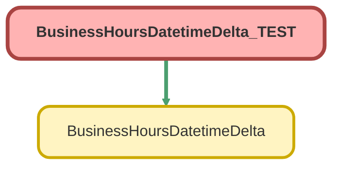

---
hide:
  - path
---

# BusinessHoursDatetimeDelta_TEST Class

`ISTEST`

## Class Diagram



<!-- Apex description -->

## Apex Code

```java
@isTest
private class BusinessHoursDatetimeDelta_TEST {

    @isTest
    private static void checkNullDatetime() {
        List<BusinessHoursDatetimeDelta.InputVariables> inputList = new List<BusinessHoursDatetimeDelta.InputVariables>();
        BusinessHoursDatetimeDelta.InputVariables input = new BusinessHoursDatetimeDelta.InputVariables();
        String bh = [SELECT id FROM BusinessHours WHERE IsDefault = true LIMIT 1].id;
        input.businessHoursId = bh;
        input.dateTime1 = null;
        input.dateTime2 = Datetime.newInstance(1982, 8, 25, 0, 0, 0);
        inputList.add(input);
        Test.startTest();
        List<BusinessHoursDatetimeDelta.ReturnVariables> outputList = BusinessHoursDatetimeDelta.results(inputList);
        test.stopTest();
        BusinessHoursDatetimeDelta.ReturnVariables output = outputList.get(0);
        system.assert(output.dateTimeDifference == null, 'Missing datetime input should return a null result');
    }
    @isTest
    private static void checkWithNoBizHours() {
        List<BusinessHoursDatetimeDelta.InputVariables> inputList = new List<BusinessHoursDatetimeDelta.InputVariables>();
        BusinessHoursDatetimeDelta.InputVariables input = new BusinessHoursDatetimeDelta.InputVariables();
        input.dateTime1 = Datetime.newInstance(1995, 3, 9, 0, 0, 0);
        input.dateTime2 = Datetime.newInstance(1982, 8, 25, 0, 0, 0);
        inputList.add(input);
        Test.startTest();
        List<BusinessHoursDatetimeDelta.ReturnVariables> outputList = BusinessHoursDatetimeDelta.results(inputList);
        test.stopTest();
        BusinessHoursDatetimeDelta.ReturnVariables output = outputList.get(0);
        system.assert(output.dateTimeDifference >= 1, 'Should return a positive despite missing business hours input');
    }
    @isTest
    private static void checkWithIdealConditions() {
        List<BusinessHoursDatetimeDelta.InputVariables> inputList = new List<BusinessHoursDatetimeDelta.InputVariables>();
        BusinessHoursDatetimeDelta.InputVariables input = new BusinessHoursDatetimeDelta.InputVariables();
        String bh = [SELECT id FROM BusinessHours WHERE IsDefault = true LIMIT 1].id;
        input.businessHoursId = bh;
        input.dateTime2 = Datetime.newInstance(1995, 3, 9, 0, 0, 0);
        input.dateTime1 = Datetime.newInstance(1982, 8, 25, 0, 0, 0);
        inputList.add(input);
        Test.startTest();
        List<BusinessHoursDatetimeDelta.ReturnVariables> outputList = BusinessHoursDatetimeDelta.results(inputList);
        test.stopTest();
        BusinessHoursDatetimeDelta.ReturnVariables output = outputList.get(0);
        system.assert(output.dateTimeDifference >= 1, 'Should return a positive result');
    }
}
```

## Methods
### `checkNullDatetime()`

`ISTEST`

#### Signature
```apex
private static void checkNullDatetime()
```

#### Return Type
**void**

---

### `checkWithNoBizHours()`

`ISTEST`

#### Signature
```apex
private static void checkWithNoBizHours()
```

#### Return Type
**void**

---

### `checkWithIdealConditions()`

`ISTEST`

#### Signature
```apex
private static void checkWithIdealConditions()
```

#### Return Type
**void**