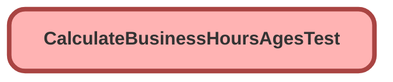

---
hide:
  - path
---

# CalculateBusinessHoursAgesTest Class

`ISTEST`

## Class Diagram



<!-- Apex description -->

## Apex Code

```java
@isTest 
public class CalculateBusinessHoursAgesTest {
    public static testMethod void testBusinessHoursBucketer() {
        Stop_Status__c ss = new Stop_Status__c(Name = 'On Hold');
        insert ss;

        Case c = new Case();
        c.Status = 'New';
        c.Last_Status_Change__c = System.Now();
        insert c;

        c.Status = 'On Hold';
        update c;

        c.Status = 'New';
        update c;

    Case updatedCase = [select Time_With_Customer__c,Time_With_Support__c,Case_Age_In_Business_Hours__c from Case where Id=:c.Id];
    System.assert(updatedCase.Time_With_Customer__c!=null);
        System.assert(updatedCase.Time_With_Support__c!=null);
        System.assert(updatedCase.Case_Age_In_Business_Hours__c==null);

        c.Status = 'Closed';
        update c;

        updatedCase = [select Time_With_Customer__c,Time_With_Support__c,Case_Age_In_Business_Hours__c from Case where Id=:c.Id];

        System.assert(updatedCase.Time_With_Customer__c!=null);
        System.assert(updatedCase.Time_With_Support__c!=null);
        /*System.assert(updatedCase.Case_Age_In_Business_Hours__c!=null);*/
    }
}
```

## Methods
### `testBusinessHoursBucketer()`

#### Signature
```apex
public static testMethod void testBusinessHoursBucketer()
```

#### Return Type
**void**