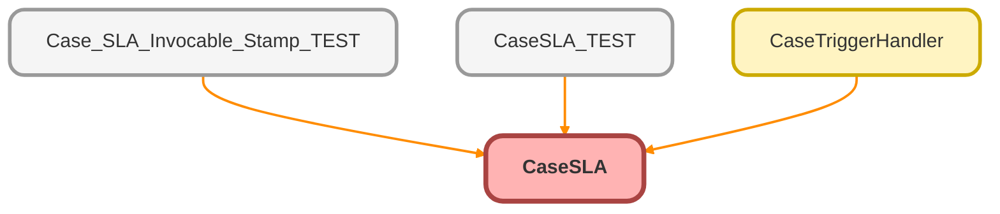

---
hide:
  - path
---

# CaseSLA Class

This class manages the Service Level Agreement (SLA) for Cases, calculating and assigning response and closure goals based on business hours and project deliverables. 
Also sets expected days to close.

**Class** 

CaseSLA

## Class Diagram



<!-- Apex description -->

## Apex Code

```java
/**
 * @class CaseSLA
 * @description This class manages the Service Level Agreement (SLA) for Cases, calculating and assigning response and closure goals based on business hours and project deliverables.
 * Also sets expected days to close.
 */
public with sharing class CaseSLA {
  /**
   * @property bizMap
   * @description A map of BusinessHours records keyed by their Id. It caches active business hours for efficient access.
   */
  private static Map<Id, BusinessHours> bizMap {
    get {
      if (bizMap == null) {
        bizMap = new Map<Id, BusinessHours>(
          [
            SELECT Id, MondayStartTime, MondayEndTime, IsDefault
            FROM BusinessHours
            WHERE IsActive = TRUE
          ]
        );
      }
      return bizMap;
    }
    set {
      bizMap = value;
    }
  }
  /**
   * @property defaultBizHours
   * @description The default BusinessHours record used when no specific business hours are assigned to a case.
   */
  private static final BusinessHours defaultBizHours {
    get {
      if (defaultBizHours == null) {
        for (BusinessHours b : bizMap.values()) {
          if (b.IsDefault) {
            defaultBizHours = b;
            break;
          }
        }
      }
      return defaultBizHours;
    }
    set {
      defaultBizHours = value;
    }
  }
  /**
   * @property wbsMap
   * @description A map of Work Breakdown Structure records keyed by the managed case record type or 'Default' for global defaults.
   */
  private static final Map<String, Work_Breakdown_Structure__c> wbsMap {
    get {
      if (wbsMap == null) {
        wbsMap = new Map<String, Work_Breakdown_Structure__c>();
        for (Work_Breakdown_Structure__c wbs : [
          SELECT
            Id,
            Active__c,
            Case_Record_Type__c,
            Object_Managed__c,
            Global_Default__c,
            (
              SELECT Id, Default__c, Category__c, First_Response_Time_Hours__c, Case_Close_Time_Hours__c
              FROM Project_Deliverables__r
              WHERE Active__c = TRUE
              ORDER BY Default__c
            )
          FROM Work_Breakdown_Structure__c
          WHERE Active__c = TRUE AND Object_Managed__c = 'Case'
        ]) {
          if (wbs.Global_Default__c) {
            wbsMap.put('Default', wbs);
          } else {
            wbsMap.put(wbs.Case_Record_Type__c, wbs);
          }
        }
      }
      return wbsMap;
    }
    set {
      wbsMap = value;
    }
  }
  /**
   * @property recordTypeMap
   * @description A map of RecordTypeInfo for the Case object, used to retrieve record type details.
   */
  private static final Map<Id, Schema.RecordTypeInfo> recordTypeMap {
    get {
      if (recordTypeMap == null) {
        recordTypeMap = Case.SobjectType.getDescribe(SObjectDescribeOptions.DEFERRED).getRecordTypeInfosById();
      }
      return recordTypeMap;
    }
    set {
      recordTypeMap = value;
    }
  }
  /**
   * @method check
   * @description Checks the cases and assigns a project deliverable to each case.
   * @param cases List<Case> - The list of cases to check
   */
  public static void check(List<Case> cases) {
    for (Case c : Cases) {
      if (skipCheck(c)) {
        continue;
      }
      Work_Breakdown_Structure__c wbs = new Work_Breakdown_Structure__c();
      if (wbsMap.containsKey(recordTypeMap.get(c.RecordTypeId).getName())) {
        wbs = wbsMap.get(recordTypeMap.get(c.RecordTypeId).getName());
      } else if (wbsMap.containsKey('Default')) {
        wbs = wbsMap.get('Default');
      } else {
        continue;
      }
      for (Project_Deliverables__c pd : wbs.Project_Deliverables__r) {
        if ((c.Category__c != null && pd.Category__c != null && pd.Category__c.contains(c.Category__c)) || pd.Default__c) {
          c = assign(c, pd);
          break;
        }
      }
    }
  }
  /**
   * @method assign
   * @description Calculates and sets the actual values for the case's SLA stamp fields and expected days to close.
   * @param c Case - The case to assign project deliverables to.
   * @param pd Project_Deliverables__c - The project deliverable to assign.
   * @return Case - The updated case with assigned deliverable and goal timestamps.
   */
  private static Case assign(Case c, Project_Deliverables__c pd) {
    BusinessHours bizHours = c.BusinessHoursId == null ? defaultBizHours : bizMap.get(c.BusinessHoursId);
    Datetime startDate = c.CreatedDate == null ? Datetime.now() : c.CreatedDate;
    if (pd.First_Response_Time_Hours__c != null) {
      c.Goal_FR_DT_Stamp__c = BusinessHours.add(bizHours.Id, startDate, (pd.First_Response_Time_Hours__c * 3600000).intValue());
    } else {
      c.Goal_FR_DT_Stamp__c = null;
    }
    if (pd.Case_Close_Time_Hours__c != null) {
      c.Goal_Close_DT_Stamp__c = BusinessHours.add(bizHours.Id, startDate, (pd.Case_Close_Time_Hours__c * 3600000).intValue());
      c.Expected_Days_To_Close__c = (Decimal.valueOf(
          ((BusinessHours.diff(bizHours.Id, startDate, c.Goal_Close_DT_Stamp__c)) / (bizHours.MondayEndTime.hour() - bizHours.MondayStartTime.hour()))
        ) / 3600000)
        .round();
    } else {
      c.Goal_Close_DT_Stamp__c = null;
      c.Expected_Days_To_Close__c = null;
    }
    c.Project_Deliverable__c = pd.Id;
    return c;
  }
  /**
   * @method skipCheck
   * @description Evaluates if a case should be skipped for checks.  If the case is an insert, always execute.
   * @param c Case - The case to evaluate.
   * @return Boolean - True if the case should be skipped, false otherwise.
   */
  private static Boolean skipCheck(Case c) {
    if (Trigger.isExecuting) {
      if (Trigger.isUpdate) {
        String oldCategory = Trigger.oldMap.get(c.Id).get('Category__c') != null ? (String) Trigger.oldMap.get(c.Id).get('Category__c') : '';
        String newCategory = c.Category__c != null ? c.Category__c : '';
        return oldCategory == newCategory && Trigger.oldMap.get(c.Id).get('RecordTypeId') == c.RecordTypeId && c.Project_Deliverable__c != null && !c.isClosed;
      } else {
        return false;
      }
    } else {
      return false;
    }
  }
}
```

## Properties
### `bizMap`

A map of BusinessHours records keyed by their Id. It caches active business hours for efficient access.

**Property** 

bizMap

#### Signature
```apex
private static bizMap
```

#### Type
Map&lt;Id,BusinessHours&gt;

---

### `defaultBizHours`

The default BusinessHours record used when no specific business hours are assigned to a case.

**Property** 

defaultBizHours

#### Signature
```apex
private static final defaultBizHours
```

#### Type
BusinessHours

---

### `wbsMap`

A map of Work Breakdown Structure records keyed by the managed case record type or &#x27;Default&#x27; for global defaults.

**Property** 

wbsMap

#### Signature
```apex
private static final wbsMap
```

#### Type
Map&lt;String,Work_Breakdown_Structure__c&gt;

---

### `recordTypeMap`

A map of RecordTypeInfo for the Case object, used to retrieve record type details.

**Property** 

recordTypeMap

#### Signature
```apex
private static final recordTypeMap
```

#### Type
Map&lt;Id,Schema.RecordTypeInfo&gt;

## Methods
### `check(cases)`

Checks the cases and assigns a project deliverable to each case.

**Method** 

check

#### Signature
```apex
public static void check(List<Case> cases)
```

#### Parameters
| Name | Type | Description |
|------|------|-------------|
| cases | List&lt;Case&gt; | List&lt;Case&gt; - The list of cases to check |

#### Return Type
**void**

---

### `assign(c, pd)`

Calculates and sets the actual values for the case&#x27;s SLA stamp fields and expected days to close.

**Method** 

assign

#### Signature
```apex
private static Case assign(Case c, Project_Deliverables__c pd)
```

#### Parameters
| Name | Type | Description |
|------|------|-------------|
| c | [Case](../objects/Case.md) | Case - The case to assign project deliverables to. |
| pd | [Project_Deliverables__c](../objects/Project_Deliverables__c.md) | Project_Deliverables__c - The project deliverable to assign. |

#### Return Type
**[Case](../objects/Case.md)**

Case - The updated case with assigned deliverable and goal timestamps.

---

### `skipCheck(c)`

Evaluates if a case should be skipped for checks.  If the case is an insert, always execute.

**Method** 

skipCheck

#### Signature
```apex
private static Boolean skipCheck(Case c)
```

#### Parameters
| Name | Type | Description |
|------|------|-------------|
| c | [Case](../objects/Case.md) | Case - The case to evaluate. |

#### Return Type
**Boolean**

Boolean - True if the case should be skipped, false otherwise.