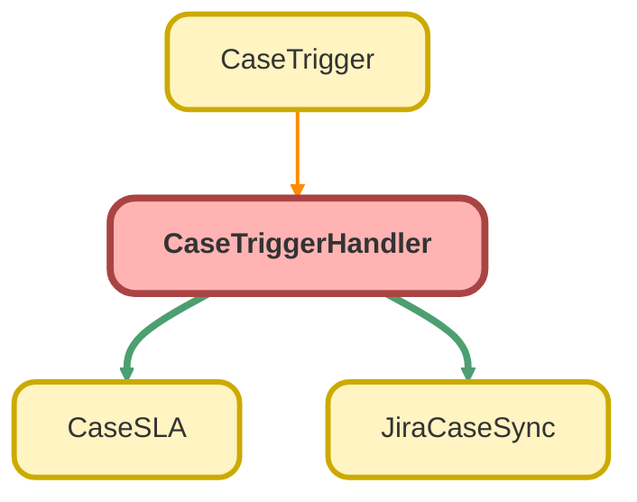

---
hide:
  - path
---

# CaseTriggerHandler Class

## Class Diagram



<!-- Apex description -->

## Apex Code

```java
public with sharing class CaseTriggerHandler {
  public static void onBeforeInsert(List<Case> cases) {
    CaseSLA.check(cases);
  }

  public static void onAfterInsert(List<Case> cases, List<Case> oldCases) {
    JiraCaseSync.newCases(cases, oldCases);
  }

  public static void onBeforeUpdate(List<Case> cases) {
    CaseSLA.check(cases);
  }
  
  public static void onAfterUpdate(List<Case> cases, Map<Id, Case> oldCaseMap) {
    JiraCaseSync.updateCases(cases, oldCaseMap);
  }
}
```

## Methods
### `onBeforeInsert(cases)`

#### Signature
```apex
public static void onBeforeInsert(List<Case> cases)
```

#### Parameters
| Name | Type | Description |
|------|------|-------------|
| cases | List&lt;Case&gt; |  |

#### Return Type
**void**

---

### `onAfterInsert(cases, oldCases)`

#### Signature
```apex
public static void onAfterInsert(List<Case> cases, List<Case> oldCases)
```

#### Parameters
| Name | Type | Description |
|------|------|-------------|
| cases | List&lt;Case&gt; |  |
| oldCases | List&lt;Case&gt; |  |

#### Return Type
**void**

---

### `onBeforeUpdate(cases)`

#### Signature
```apex
public static void onBeforeUpdate(List<Case> cases)
```

#### Parameters
| Name | Type | Description |
|------|------|-------------|
| cases | List&lt;Case&gt; |  |

#### Return Type
**void**

---

### `onAfterUpdate(cases, oldCaseMap)`

#### Signature
```apex
public static void onAfterUpdate(List<Case> cases, Map<Id,Case> oldCaseMap)
```

#### Parameters
| Name | Type | Description |
|------|------|-------------|
| cases | List&lt;Case&gt; |  |
| oldCaseMap | Map&lt;Id,Case&gt; |  |

#### Return Type
**void**