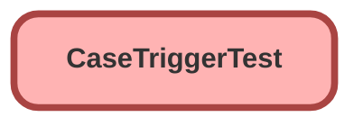

---
hide:
  - path
---

# CaseTriggerTest Class

`ISTEST`

## Class Diagram



<!-- Apex description -->

## Apex Code

```java
@isTest public class CaseTriggerTest {
    @isTest static void caseAfterInsertTest() {
        Case testCase = new Case();
        testCase.RecordTypeId = '01237000000EyimAAC';
        testCase.Reason = 'Paradigm Bug';
        insert testCase;
    }
    @isTest static void caseAfterUpdateTest() {
        Case testCaseUpdate = new Case();
        testCaseUpdate.RecordTypeId = '01237000000EyimAAC';
        testCaseUpdate.Status = 'New';
        testCaseUpdate.Reason = 'Paradigm Bug';
        insert testCaseUpdate;
        testCaseUpdate = [SELECT Id, Status, RecordTypeId FROM Case WHERE Id = :testCaseUpdate.Id];
        testCaseUpdate.Status = 'Jira Comment Sent';
        update testCaseUpdate;
    }
    @isTest static void caseEnhancementAfterInsertTest() {
        Case testCaseEnhancement = new Case();
        testCaseEnhancement.RecordTypeId = '01237000000EyimAAC';
        testCaseEnhancement.Reason = 'Paradigm Enhancement';
        testCaseEnhancement.Approval_status__c = 'Requested';
        insert testCaseEnhancement;
        testCaseEnhancement = [SELECT Id, Status, RecordTypeId, Approval_Status__c FROM Case WHERE Id = :testCaseEnhancement.Id];
        testCaseEnhancement.Approval_Status__c = 'Approved';
        update testCaseEnhancement;
    }
    @isTest static void caseEnhancementAfterUpdateTest() {
        Case testCaseEnhancementUpdate = new Case();
        testCaseEnhancementUpdate.RecordTypeId = '01237000000EyimAAC';
        testCaseEnhancementUpdate.Reason = 'Paradigm Enhancement';
        testCaseEnhancementUpdate.Status = 'New';
        testCaseEnhancementUpdate.Approval_status__c = 'Approved';
        insert testCaseEnhancementUpdate;
        testCaseEnhancementUpdate = [SELECT Id, Status, RecordTypeId FROM Case WHERE Id = :testCaseEnhancementUpdate.Id];
        testCaseEnhancementUpdate.Status = 'Jira Comment Sent';
        update testCaseEnhancementUpdate;
    }
}
```

## Methods
### `caseAfterInsertTest()`

`ISTEST`

#### Signature
```apex
private static void caseAfterInsertTest()
```

#### Return Type
**void**

---

### `caseAfterUpdateTest()`

`ISTEST`

#### Signature
```apex
private static void caseAfterUpdateTest()
```

#### Return Type
**void**

---

### `caseEnhancementAfterInsertTest()`

`ISTEST`

#### Signature
```apex
private static void caseEnhancementAfterInsertTest()
```

#### Return Type
**void**

---

### `caseEnhancementAfterUpdateTest()`

`ISTEST`

#### Signature
```apex
private static void caseEnhancementAfterUpdateTest()
```

#### Return Type
**void**