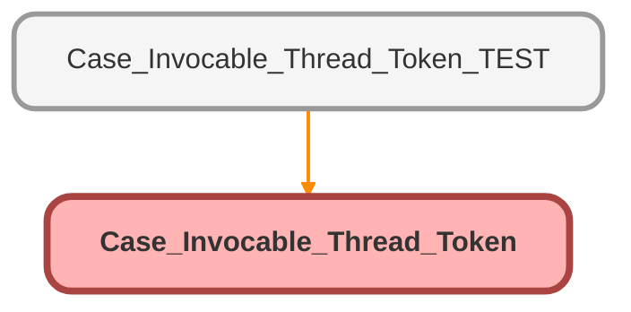

---
hide:
  - path
---

# Case_Invocable_Thread_Token Class

## Class Diagram



<!-- Apex description -->

## Apex Code

```java
public class Case_Invocable_Thread_Token {
    
    @InvocableMethod(label='Retrieve Case Thread Token' description='Returns case thread token for use with email alerts')
    public static List<returnVariables> caseThreadToken(List<inputVariables> inputs){
        List<returnVariables> returnVarsList = new List<returnVariables>();
        for(InputVariables input : inputs){
            
            //Grab Flow Inputs
            id caseFlowId = input.caseId;
            
            //Declare Variables
            string flowThreadToken;
            
            IF (caseFlowId != NULL){
                flowThreadToken  =  EmailMessages.getFormattedThreadingToken(caseFlowId);
            }
            
            //Return Variables
            ReturnVariables returnVars = new ReturnVariables();
            returnVars.threadToken = flowThreadToken;
            returnVarsList.add(returnVars);
        }
        return returnVarsList;
    }
    
    public class inputVariables{
        @InvocableVariable
        public id caseId;
    }
    
    public class returnVariables{
        @InvocableVariable
        public string threadToken;
    }
    
}
```

## Methods
### `caseThreadToken(inputs)`

`INVOCABLEMETHOD`

#### Signature
```apex
public static List<returnVariables> caseThreadToken(List<inputVariables> inputs)
```

#### Parameters
| Name | Type | Description |
|------|------|-------------|
| inputs | List&lt;inputVariables&gt; |  |

#### Return Type
**List&lt;returnVariables&gt;**

## Classes
### inputVariables Class

#### Fields
##### `caseId`

`INVOCABLEVARIABLE`

###### Signature
```apex
public caseId
```

###### Type
id

### returnVariables Class

#### Fields
##### `threadToken`

`INVOCABLEVARIABLE`

###### Signature
```apex
public threadToken
```

###### Type
string