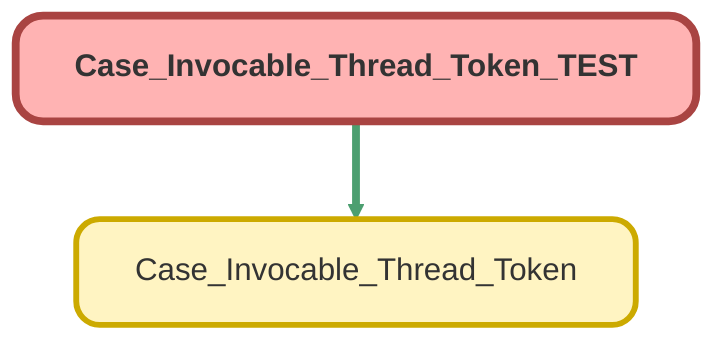

---
hide:
  - path
---

# Case_Invocable_Thread_Token_TEST Class

`ISTEST`

## Class Diagram



<!-- Apex description -->

## Apex Code

```java
@isTest
public class Case_Invocable_Thread_Token_TEST {
    @isTest
    private static void checkInvocableThreadToken(){
        Case_Invocable_Thread_Token.inputVariables inputVars = new Case_Invocable_Thread_Token.inputVariables();
        Case A = new Case();
        	A.Origin = 'BI Inbox';
        insert A;
        inputVars.caseId = [SELECT Id FROM case WHERE Origin LIKE '%Inbox%' LIMIT 1].Id;
        Test.startTest();
        Case_Invocable_Thread_Token.caseThreadToken(new List<Case_Invocable_Thread_Token.inputVariables> {inputVars});
        Test.stopTest();
    }

}
```

## Methods
### `checkInvocableThreadToken()`

`ISTEST`

#### Signature
```apex
private static void checkInvocableThreadToken()
```

#### Return Type
**void**