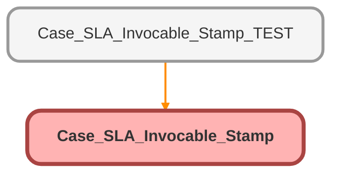

---
hide:
  - path
---

# Case_SLA_Invocable_Stamp Class

## Class Diagram



<!-- Apex description -->

## Apex Code

```java
public class Case_SLA_Invocable_Stamp {
    
    @InvocableMethod(label='Retrieve Case SLA' description='Returns SLA for first response and/or closure')
    public static List<ReturnVariables> newcaseSLA(List<InputVariables> inputs){
        List<ReturnVariables> returnVarsList = new List<ReturnVariables>();
        for(InputVariables input : inputs){
            
            //Grab Flow Inputs
            integer casecloseHour = input.CloseSLA;
            integer responseHour = input.ResponseSLA;
            datetime createdDatetime = input.caseCreatedDT;
            string bh = input.bizhoursId;
            
            //Declare variables
            datetime newCloseSLA;
            datetime newResponseSLA;
            
            
            //Add assigned business hours to creation datetime
            //If an input is null set new SLA to null
            IF (casecloseHour != NULL){
                integer casecloseMili = casecloseHour*3600000;
                newCloseSLA = BusinessHours.add(bh, createdDatetime, casecloseMili);
            } else {
                newCloseSLA = NULL;
            }
            
            IF (responseHour != NULL){
                integer responseMili = responseHour*3600000;
                newResponseSLA = BusinessHours.add(bh, createdDatetime, responseMili);
            } else {
                newResponseSLA = NULL;
            }
            
            //Return Variables
            ReturnVariables returnVars = new ReturnVariables();
            returnVars.caseCloseGoal = newCloseSLA;
            returnVars.caseResponseGoal = newResponseSLA;
            returnVarsList.add(returnVars);
            
        }
        return returnVarsList;
        
    }
    public class inputVariables{
        @InvocableVariable
        public integer CloseSLA;
        @InvocableVariable
        public integer ResponseSLA;
        @InvocableVariable
        public datetime caseCreatedDT;
        @InvocableVariable
        public string bizhoursId;
    }
    
    public class ReturnVariables{
        @InvocableVariable
        public datetime caseCloseGoal;
        @InvocableVariable
        public datetime caseResponseGoal;
    }
}
```

## Methods
### `newcaseSLA(inputs)`

`INVOCABLEMETHOD`

#### Signature
```apex
public static List<ReturnVariables> newcaseSLA(List<InputVariables> inputs)
```

#### Parameters
| Name | Type | Description |
|------|------|-------------|
| inputs | List&lt;InputVariables&gt; |  |

#### Return Type
**List&lt;ReturnVariables&gt;**

## Classes
### inputVariables Class

#### Fields
##### `CloseSLA`

`INVOCABLEVARIABLE`

###### Signature
```apex
public CloseSLA
```

###### Type
integer

---

##### `ResponseSLA`

`INVOCABLEVARIABLE`

###### Signature
```apex
public ResponseSLA
```

###### Type
integer

---

##### `caseCreatedDT`

`INVOCABLEVARIABLE`

###### Signature
```apex
public caseCreatedDT
```

###### Type
datetime

---

##### `bizhoursId`

`INVOCABLEVARIABLE`

###### Signature
```apex
public bizhoursId
```

###### Type
string

### ReturnVariables Class

#### Fields
##### `caseCloseGoal`

`INVOCABLEVARIABLE`

###### Signature
```apex
public caseCloseGoal
```

###### Type
datetime

---

##### `caseResponseGoal`

`INVOCABLEVARIABLE`

###### Signature
```apex
public caseResponseGoal
```

###### Type
datetime