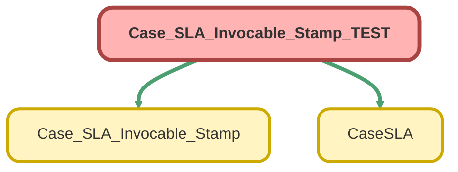

---
hide:
  - path
---

# Case_SLA_Invocable_Stamp_TEST Class

`ISTEST`

## Class Diagram



<!-- Apex description -->

## Apex Code

```java
@istest
private class Case_SLA_Invocable_Stamp_TEST {
    @isTest
    private static void checkInvocableSLAnoNull(){
        Case_SLA_Invocable_Stamp.inputVariables inputVars= new Case_SLA_Invocable_Stamp.inputVariables();
        inputVars.CloseSLA = 4;
        inputVars.ResponseSLA = 4;
        inputVars.caseCreatedDT= datetime.newInstance(2023,3,13,12,0,0);
        inputVars.bizhoursId = '01m00000000000J';
        Test.startTest();
        Case_SLA_Invocable_Stamp.newCaseSLA(new List<Case_SLA_Invocable_Stamp.inputVariables> {inputVars});
        test.stopTest();
    }
    @isTest
    private static void checkInvocableSLANullFR(){
        Case_SLA_Invocable_Stamp.inputVariables inputVars= new Case_SLA_Invocable_Stamp.inputVariables();
        inputVars.CloseSLA = 4;
        inputVars.ResponseSLA = NULL;
        inputVars.caseCreatedDT= datetime.newInstance(2023,3,13,12,0,0);
        inputVars.bizhoursId = '01m00000000000J';
        Test.startTest();
        Case_SLA_Invocable_Stamp.newCaseSLA(new List<Case_SLA_Invocable_Stamp.inputVariables> {inputVars});
        test.stopTest();
    }
    @isTest
    private static void checkInvocableSLANullClose(){
        Case_SLA_Invocable_Stamp.inputVariables inputVars= new Case_SLA_Invocable_Stamp.inputVariables();
        inputVars.CloseSLA = NULL;
        inputVars.ResponseSLA = 4;
        inputVars.caseCreatedDT= datetime.newInstance(2023,3,13,12,0,0);
        inputVars.bizhoursId = '01m00000000000J';
        Test.startTest();
        Case_SLA_Invocable_Stamp.newCaseSLA(new List<Case_SLA_Invocable_Stamp.inputVariables> {inputVars});
        test.stopTest();
    }
    
}
```

## Methods
### `checkInvocableSLAnoNull()`

`ISTEST`

#### Signature
```apex
private static void checkInvocableSLAnoNull()
```

#### Return Type
**void**

---

### `checkInvocableSLANullFR()`

`ISTEST`

#### Signature
```apex
private static void checkInvocableSLANullFR()
```

#### Return Type
**void**

---

### `checkInvocableSLANullClose()`

`ISTEST`

#### Signature
```apex
private static void checkInvocableSLANullClose()
```

#### Return Type
**void**