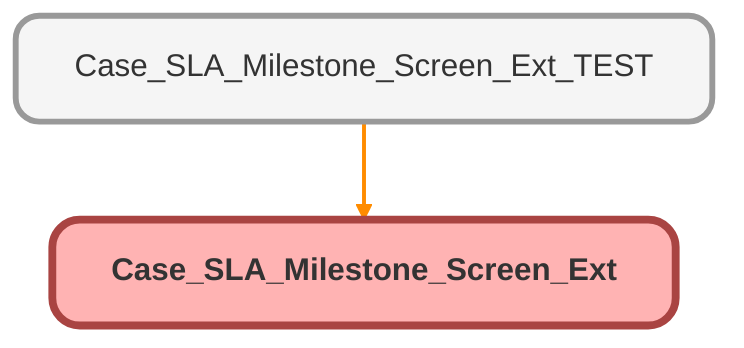

---
hide:
  - path
---

# Case_SLA_Milestone_Screen_Ext Class

## Class Diagram



<!-- Apex description -->

## Apex Code

```java
public class Case_SLA_Milestone_Screen_Ext {
    
    public String caseId {get;set;}
    
    public Case_SLA_Milestone_Screen_Ext(ApexPages.StandardController controller){
        string caseId = ApexPages.currentPage().getparameters().get('id'); 
    }
    // Grab Case Record
    public case CaseRecord = 
        [select id, Goal_FR_DT_Stamp__c, Goal_Close_DT_Stamp__c, CreatedDate, BusinessHoursId from Case 
         where id = :ApexPages.currentPage().getParameters().get('id')];
    
    //Calculate Difference between now and SLAs + establish some variables
    public Long CloseDiff = CaseRecord.Goal_Close_DT_Stamp__c != NULL ? BusinessHours.diff(CaseRecord.BusinessHoursId, datetime.now(), CaseRecord.Goal_Close_DT_Stamp__c) : Null;
    public Long FrDiff = CaseRecord.Goal_FR_DT_Stamp__c != NULL ? BusinessHours.diff(CaseRecord.BusinessHoursId, datetime.now(), CaseRecord.Goal_FR_DT_Stamp__c) : Null;
    public string formattedCloseDiff;
    public string formattedFrDiff;
    
    //Calculate Closure Time
    public String getFormattedCloseDiff(){
        IF(CloseDiff != null){
            Integer closeSeconds = CloseDiff.intValue() / 1000;
            String closeSecondsText;
            Integer closeMinutes = closeSeconds / 60;
            String closeMinutesText;
            Integer closeHours = closeMinutes / 60;
            String closeHoursText;
            
            
            IF(closeHours >= 1){
                closeHoursText = closeHours + ' Hours ';
            } else {
                closeHoursText = '';
            }
            
            IF(closeMinutes >= 1){
                closeMinutesText = string.valueOf(math.mod(closeMinutes, 60)) + ' Minutes ';
            } else {
                closeMinutesText = '';
            }
            
            IF(closeSeconds >= 1){
                closeSecondsText = string.valueOf(math.mod(closeSeconds, 60)) + ' Seconds ';
            } else {
                closeSecondsText = '';
            }
            
            formattedCloseDiff = closeHoursText + closeMinutesText + closeSecondsText;
        } else {
            formattedCloseDiff = '';
        }
        return formattedCloseDiff;
    }

    //Calculate Fr Time
    public String getFormattedFrDiff(){
        IF(FrDiff != null){
            Integer FrSeconds = FrDiff.intValue() / 1000;
            String FrSecondsText;
            Integer FrMinutes = FrSeconds / 60;
            String FrMinutesText;
            Integer FrHours = FrMinutes / 60;
            String FrHoursText;
            
            
            IF(FrHours >= 1){
                FrHoursText = FrHours + ' Hours ';
            } else {
                FrHoursText = '';
            }
            
            IF(FrMinutes >= 1){
                FrMinutesText = string.valueOf(math.mod(FrMinutes, 60)) + ' Minutes ';
            } else {
                FrMinutesText = '';
            }
            
            IF(FrSeconds >= 1){
                FrSecondsText = string.valueOf(math.mod(FrSeconds, 60)) + ' Seconds ';
            } else {
                FrSecondsText = '';
            }
            
            formattedFrDiff = FrHoursText + FrMinutesText + FrSecondsText;
        } else {
            formattedFrDiff = '';
        }
        system.debug('First Response Timer = ' +formattedFrDiff);
        return formattedFrDiff;
    }

    //Recalculate values on page, "count down"
    public PageReference subtractTime(){
        IF(closeDiff != null){
            closeDiff -= 5000;
        }
        IF(FrDiff != null){
            FrDiff -= 5000;
        }
        return null;      
    }
}
```

## Fields
### `CaseRecord`

#### Signature
```apex
public CaseRecord
```

#### Type
case

---

### `CloseDiff`

#### Signature
```apex
public CloseDiff
```

#### Type
Long

---

### `FrDiff`

#### Signature
```apex
public FrDiff
```

#### Type
Long

---

### `formattedCloseDiff`

#### Signature
```apex
public formattedCloseDiff
```

#### Type
string

---

### `formattedFrDiff`

#### Signature
```apex
public formattedFrDiff
```

#### Type
string

## Properties
### `caseId`

#### Signature
```apex
public caseId
```

#### Type
String

## Constructors
### `Case_SLA_Milestone_Screen_Ext(controller)`

#### Signature
```apex
public Case_SLA_Milestone_Screen_Ext(ApexPages.StandardController controller)
```

#### Parameters
| Name | Type | Description |
|------|------|-------------|
| controller | ApexPages.StandardController |  |

## Methods
### `getFormattedCloseDiff()`

#### Signature
```apex
public String getFormattedCloseDiff()
```

#### Return Type
**String**

---

### `getFormattedFrDiff()`

#### Signature
```apex
public String getFormattedFrDiff()
```

#### Return Type
**String**

---

### `subtractTime()`

#### Signature
```apex
public PageReference subtractTime()
```

#### Return Type
**PageReference**