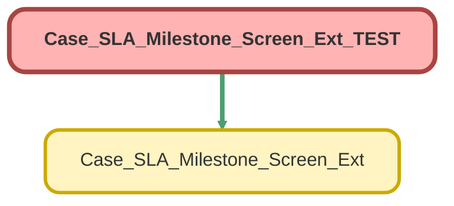

---
hide:
  - path
---

# Case_SLA_Milestone_Screen_Ext_TEST Class

`ISTEST`

## Class Diagram



<!-- Apex description -->

## Apex Code

```java
@isTest
public class Case_SLA_Milestone_Screen_Ext_TEST {
    
    public static testMethod void testSLAController() {
        Case ca = new Case();
        ca.BusinessHoursId = '01m00000000000J'; 
        ca.Goal_FR_DT_Stamp__c = datetime.newInstance(2030,3,13,12,0,0);
        ca.Goal_Close_DT_Stamp__c = datetime.newInstance(2030,3,13,12,0,0);
        insert ca;
        test.startTest();
        PageReference testPage = Page.Case_SLA_Milestone_Screen;
               testPage.getParameters().put('Id', String.valueOf(ca.Id));
                Test.setCurrentPage(testPage);
           ApexPages.StandardController sc = new ApexPages.StandardController(ca);
        Case_SLA_Milestone_Screen_Ext CaseScreenTest = new Case_SLA_Milestone_Screen_Ext(sc);
        CaseScreenTest.getFormattedCloseDiff();
        CaseScreenTest.getFormattedFrDiff();
        CaseScreenTest.subtractTime();
        test.stopTest();
    }
    
}
```

## Methods
### `testSLAController()`

#### Signature
```apex
public static testMethod void testSLAController()
```

#### Return Type
**void**