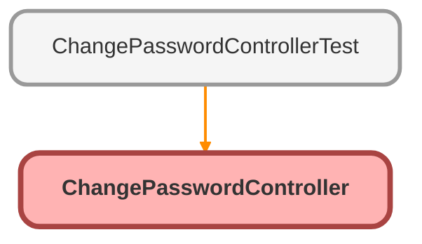

---
hide:
  - path
---

# ChangePasswordController Class

An apex page controller that exposes the change password functionality

## Class Diagram



<!-- Apex description -->

## Apex Code

```java
/**
 * An apex page controller that exposes the change password functionality
 */
public with sharing class ChangePasswordController {
    public String oldPassword {get; set;}
    public String newPassword {get; set;}
    public String verifyNewPassword {get; set;}        
    
    public PageReference changePassword() {
        return Site.changePassword(newPassword, verifyNewPassword, oldpassword);    
    }     
    
   	public ChangePasswordController() {}
}
```

## Properties
### `oldPassword`

#### Signature
```apex
public oldPassword
```

#### Type
String

---

### `newPassword`

#### Signature
```apex
public newPassword
```

#### Type
String

---

### `verifyNewPassword`

#### Signature
```apex
public verifyNewPassword
```

#### Type
String

## Constructors
### `ChangePasswordController()`

#### Signature
```apex
public ChangePasswordController()
```

## Methods
### `changePassword()`

#### Signature
```apex
public PageReference changePassword()
```

#### Return Type
**PageReference**