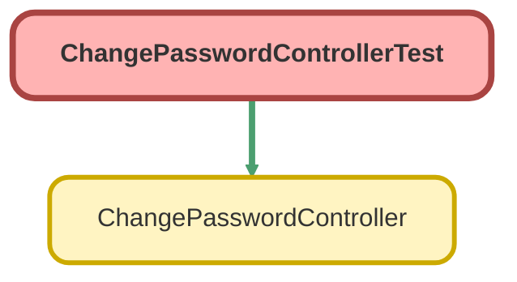

---
hide:
  - path
---

# ChangePasswordControllerTest Class

`ISTEST`

An apex page controller that exposes the change password functionality

## Class Diagram



<!-- Apex description -->

## Apex Code

```java
/**
 * An apex page controller that exposes the change password functionality
 */
@IsTest public with sharing class ChangePasswordControllerTest {
   	@IsTest(SeeAllData=true) public static void testChangePasswordController() {
        // Instantiate a new controller with all parameters in the page
        ChangePasswordController controller = new ChangePasswordController();
        controller.oldPassword = '123456';
        controller.newPassword = 'qwerty1'; 
        controller.verifyNewPassword = 'qwerty1';                
        
        System.assertEquals(controller.changePassword(),null);                           
    }    
}
```

## Methods
### `testChangePasswordController()`

`ISTEST`

#### Signature
```apex
public static void testChangePasswordController()
```

#### Return Type
**void**