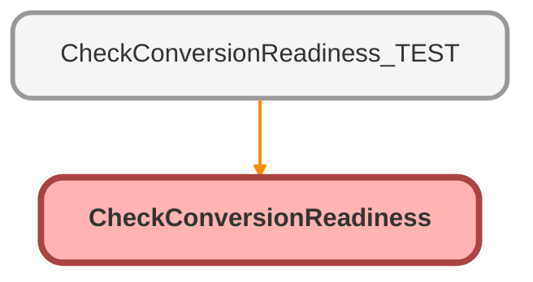

---
hide:
  - path
---

# CheckConversionReadiness Class

## Class Diagram



<!-- Apex description -->

## Apex Code

```java
public with sharing class CheckConversionReadiness {
  @AuraEnabled
  public static List<String> runCheck(Id leadId) {
    List<String> errors = new List<String>();
    final String convStatus = [
      SELECT MasterLabel
      FROM LeadStatus
      WHERE IsConverted = TRUE
      WITH SECURITY_ENFORCED
      LIMIT 1
    ]
    .MasterLabel;
    System.SavePoint sp = Database.setSavePoint();
    Lead lead2Check = new Lead(Id = leadId, Status = convStatus);
    Database.SaveResult sr = Database.update(lead2Check, false);
    if (!sr.isSuccess()) {
      for (Database.Error e : sr.getErrors()) {
        if (e.getStatusCode().toString() == 'FIELD_CUSTOM_VALIDATION_EXCEPTION') {
          errors.add(e.getMessage());
        }
      }
    }
    Database.rollback(sp);
    return errors;
  }
}
```

## Methods
### `runCheck(leadId)`

`AURAENABLED`

#### Signature
```apex
public static List<String> runCheck(Id leadId)
```

#### Parameters
| Name | Type | Description |
|------|------|-------------|
| leadId | Id |  |

#### Return Type
**List&lt;String&gt;**