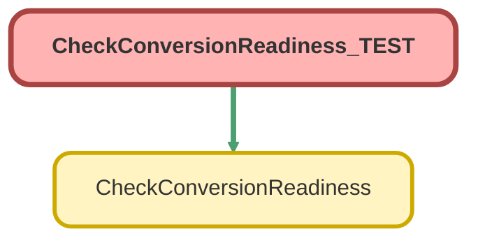

---
hide:
  - path
---

# CheckConversionReadiness_TEST Class

`ISTEST`

## Class Diagram



<!-- Apex description -->

## Apex Code

```java
@isTest
private class CheckConversionReadiness_TEST {

    @isTest
    static void badLead() {
        Lead l = new Lead(LastName = 'test', Company = 'test');
        insert l;
        Test.startTest();
        List<String> errorList = CheckConversionReadiness.runCheck(l.Id);
        Test.stopTest();
        Assert.isTrue(errorList.size() > 0, 'At least one error should have returned');
    }
}
```

## Methods
### `badLead()`

`ISTEST`

#### Signature
```apex
private static void badLead()
```

#### Return Type
**void**