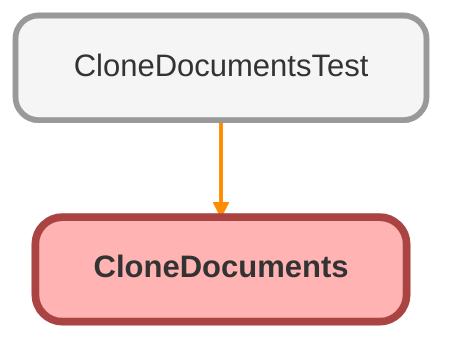

---
hide:
  - path
---

# CloneDocuments Class

## Class Diagram



<!-- Apex description -->

## Apex Code

```java
public class CloneDocuments {

    @invocableMethod
    public static void linkClone(List<Id> Ids){
		//Grabs Id of new Case created from split
        Case newCase = [SELECT Id, Splited_From__c
                         FROM Case
                         WHERE Id = :Ids];
        List<Id> contentDocIds = new List<Id>();
        List<ContentDocumentLink> toBeCloned       = new List<ContentDocumentLink>(); 
        List<ContentDocumentLink> newLinks         = new List<ContentDocumentLink>();
        List<EmailMessage> reLinkEmail             = new List<EmailMessage>();
        List<EmailMessage> linkedEmails            = new List<EmailMessage>();
      //Grabs Id of Case that has been split
      Case oldCase = [SELECT Id, Splited_From__c
                         FROM Case
                         WHERE Id = :newCase.Splited_From__c];
        
        if(oldCase.Id != null)  {
        //Grabs attachments associated with the original Case
        toBeCloned   = [SELECT ContentDocumentId, Id,
                        LinkedEntityId, ShareType 
                        FROM ContentDocumentLink
                        WHERE LinkedEntityId = :oldCase.Id];
        //Grabs Emails associated with the above attachments    
        linkedEmails = [Select Id, RelatedToId, ParentId
                        FROM EmailMessage
                        WHERE ParentId = :oldCase.Id AND HASATTACHMENT = true AND CreatedDate >= :(DateTime.Now().AddDays(-30))
                       	LIMIT 10];
        
            if(toBeCloned != null){
            //Loops over all found attachments, assigns them to new Case
            for(ContentDocumentLink cdl : toBeCloned){
                if(contentDocIds.contains(cdl.ContentDocumentId) != true){
                cdl.Id             = null;
                cdl.LinkedEntityId = newCase.Id;
                contentDocIds.add(cdl.ContentDocumentId);
                }
            }
            if(linkedEmails != null){
            //Loops over all found emails, assigns them to new Case
            for(EmailMessage email : linkedEmails){
                newLinks = [SELECT ContentDocumentId, Id,
                                    LinkedEntityId, ShareType 
                                    FROM ContentDocumentLink
                                    WHERE LinkedEntityId = :email.Id];    
              if(newLinks != null){
              for(ContentDocumentLink attch : newLinks){
                  if(contentDocIds.contains(attch.ContentDocumentId) != true){
                    attch.Id = null;
                    attch.LinkedEntityId = newCase.Id;
                    toBeCloned.add(attch);
                    contentDocIds.add(attch.ContentDocumentId);
                  }
                }
            }
      }
    }
}
    insert toBeCloned;
}
}
}
```

## Methods
### `linkClone(Ids)`

`INVOCABLEMETHOD`

#### Signature
```apex
public static void linkClone(List<Id> Ids)
```

#### Parameters
| Name | Type | Description |
|------|------|-------------|
| Ids | List&lt;Id&gt; |  |

#### Return Type
**void**