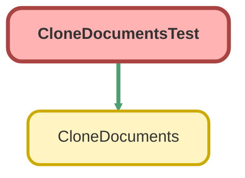

---
hide:
  - path
---

# CloneDocumentsTest Class

`ISTEST`

## Class Diagram



<!-- Apex description -->

## Apex Code

```java
@isTest
public class CloneDocumentsTest {
    @isTest public static void LinkCloneTest(){
        
        Test.startTest();
        
        Case oldCase    = new Case();
        oldCase.Subject = 'Test';
        insert oldCase;

        Blob beforeblob=Blob.valueOf('Unit Test Attachment Body');
        
        ContentVersion cv = new ContentVersion();
        cv.title = 'test content trigger';      
        cv.PathOnClient ='test';           
        cv.VersionData =beforeblob;          
        insert cv;
        
        ContentVersion cv2 = new ContentVersion();
        cv2.title = 'test content trigger2';      
        cv2.PathOnClient ='test';           
        cv2.VersionData =beforeblob;          
        insert cv2;
        
        Case newCase    = new Case();
        newCase.Subject = 'Test';
        newCase.Splited_From__c = oldCase.Id;
        
        insert newCase;
        
        EmailMessage oldEmail = new EmailMessage();
        oldEmail.RelatedToId  = oldCase.Id;
        oldEmail.Subject      = 'junk mail';
        oldEmail.MessageDate  = DateTime.now();
        
        insert oldEmail;
        
        ContentVersion testContent = [SELECT id, ContentDocumentId FROM ContentVersion where Id = :cv.Id];
        ContentDocumentLink contentlink=new ContentDocumentLink();
        contentlink.LinkedEntityId=oldCase.id;
        contentlink.ShareType= 'V';
        contentlink.ContentDocumentId=testcontent.ContentDocumentId;

        insert contentlink;
        
        EmailMessage newEmail = new EmailMessage();
        newEmail.RelatedToId  = newCase.Id;
        newEmail.Subject      = 'junk mail';
        newEmail.MessageDate  = DateTime.now();
        
        insert newEmail;
        
        ContentVersion testContent2 = [SELECT id, ContentDocumentId FROM ContentVersion where Id = :cv2.Id];
        ContentDocumentLink contentlink2=new ContentDocumentLink();
        contentlink2.LinkedEntityId=oldEmail.id;
        contentlink2.ShareType= 'V';
        contentlink2.ContentDocumentId=testcontent2.ContentDocumentId;

        insert contentlink2;
        
        Attachment a0 = new Attachment(ParentId = oldEmail.Id, Name = 'n0', Body = Blob.valueOf('b0'));
		insert new Attachment[] {a0};
        
        List<Id> Ids = new List<Id>();
        
        Ids.add(newCase.Id);
        CloneDocuments.linkClone(Ids);
        
        Test.stopTest();
        

    }
}
```

## Methods
### `LinkCloneTest()`

`ISTEST`

#### Signature
```apex
public static void LinkCloneTest()
```

#### Return Type
**void**