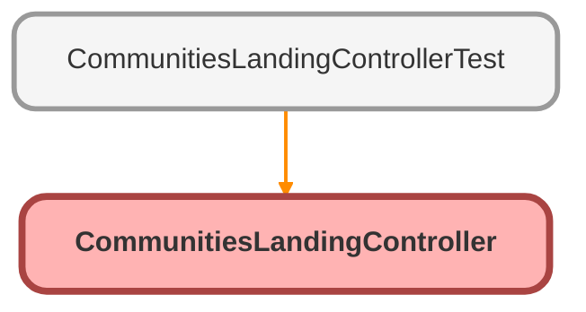

---
hide:
  - path
---

# CommunitiesLandingController Class

An apex page controller that takes the user to the right start page based on credentials or lack thereof

## Class Diagram



<!-- Apex description -->

## Apex Code

```java
/**
 * An apex page controller that takes the user to the right start page based on credentials or lack thereof
 */
public with sharing class CommunitiesLandingController {
    
    // Code we will invoke on page load.
    public PageReference forwardToStartPage() {
        return Network.communitiesLanding();
    }
    
    public CommunitiesLandingController() {}
}
```

## Constructors
### `CommunitiesLandingController()`

#### Signature
```apex
public CommunitiesLandingController()
```

## Methods
### `forwardToStartPage()`

#### Signature
```apex
public PageReference forwardToStartPage()
```

#### Return Type
**PageReference**