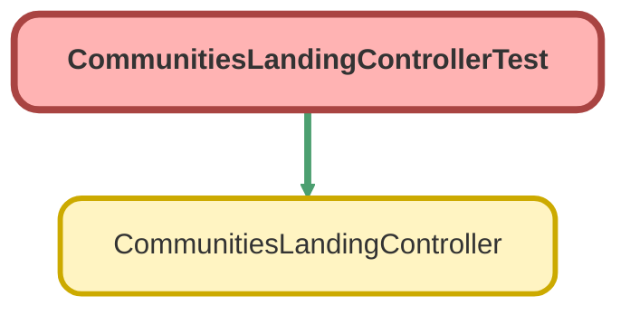

---
hide:
  - path
---

# CommunitiesLandingControllerTest Class

`ISTEST`

An apex page controller that takes the user to the right start page based on credentials or lack thereof

## Class Diagram



<!-- Apex description -->

## Apex Code

```java
/**
 * An apex page controller that takes the user to the right start page based on credentials or lack thereof
 */
@IsTest public with sharing class CommunitiesLandingControllerTest {
    @IsTest(SeeAllData=true) public static void testCommunitiesLandingController() {
        // Instantiate a new controller with all parameters in the page
        CommunitiesLandingController controller = new CommunitiesLandingController();
        PageReference pageRef = controller.forwardToStartPage();
        //PageRef is either null or an empty object in test context
        if(pageRef != null){
            String url = pageRef.getUrl();
            if(url != null){
                System.assertEquals(true, String.isEmpty(url));
                //show up in perforce
            }
        }
    }
}
```

## Methods
### `testCommunitiesLandingController()`

`ISTEST`

#### Signature
```apex
public static void testCommunitiesLandingController()
```

#### Return Type
**void**