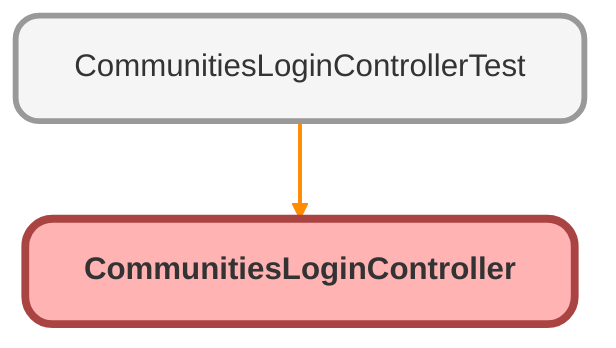

---
hide:
  - path
---

# CommunitiesLoginController Class

An apex page controller that exposes the site login functionality

## Class Diagram



<!-- Apex description -->

## Apex Code

```java
/**
 * An apex page controller that exposes the site login functionality
 */
global with sharing class CommunitiesLoginController {

    global CommunitiesLoginController () {}
    
    // Code we will invoke on page load.
    global PageReference forwardToAuthPage() {
    	String startUrl = System.currentPageReference().getParameters().get('startURL');
    	String displayType = System.currentPageReference().getParameters().get('display');
        return Network.forwardToAuthPage(startUrl, displayType);
    }
}
```

## Constructors
### `CommunitiesLoginController()`

#### Signature
```apex
global CommunitiesLoginController()
```

## Methods
### `forwardToAuthPage()`

#### Signature
```apex
global PageReference forwardToAuthPage()
```

#### Return Type
**PageReference**