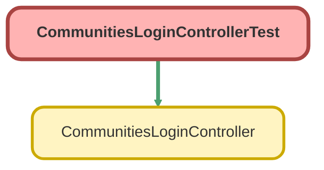

---
hide:
  - path
---

# CommunitiesLoginControllerTest Class

`ISTEST`

An apex page controller that exposes the site login functionality

## Class Diagram



<!-- Apex description -->

## Apex Code

```java
/**
 * An apex page controller that exposes the site login functionality
 */
@IsTest global with sharing class CommunitiesLoginControllerTest {
    @IsTest(SeeAllData=true) 
    global static void testCommunitiesLoginController () {
     	CommunitiesLoginController controller = new CommunitiesLoginController();
     	System.assertEquals(null, controller.forwardToAuthPage());       
    }    
}
```

## Methods
### `testCommunitiesLoginController()`

`ISTEST`

#### Signature
```apex
global static void testCommunitiesLoginController()
```

#### Return Type
**void**