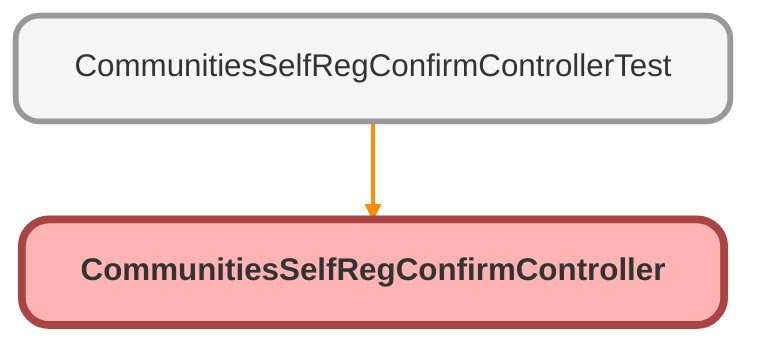

---
hide:
  - path
---

# CommunitiesSelfRegConfirmController Class

An apex page controller that takes the user to the right start page based on credentials or lack thereof

## Class Diagram



<!-- Apex description -->

## Apex Code

```java
/**
 * An apex page controller that takes the user to the right start page based on credentials or lack thereof
 */
public with sharing class CommunitiesSelfRegConfirmController {
    
    public CommunitiesSelfRegConfirmController() {}
}
```

## Constructors
### `CommunitiesSelfRegConfirmController()`

#### Signature
```apex
public CommunitiesSelfRegConfirmController()
```