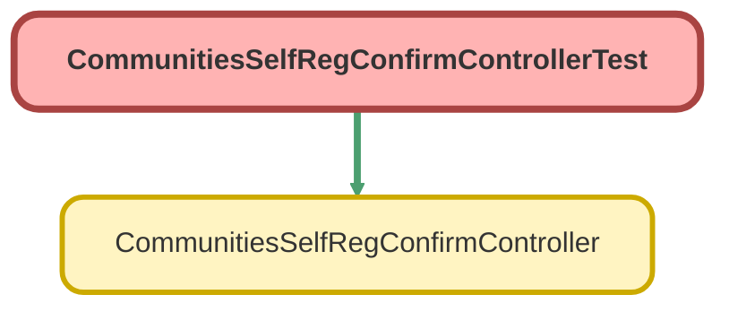

---
hide:
  - path
---

# CommunitiesSelfRegConfirmControllerTest Class

`ISTEST`

An apex page controller that takes the user to the right start page based on credentials or lack thereof

## Class Diagram



<!-- Apex description -->

## Apex Code

```java
/**
 * An apex page controller that takes the user to the right start page based on credentials or lack thereof
 */
@IsTest public with sharing class CommunitiesSelfRegConfirmControllerTest {
    @IsTest(SeeAllData=true) public static void testCommunitiesSelfRegConfirmController() {
        // Instantiate a new controller with all parameters in the page
        CommunitiesSelfRegConfirmController controller = new CommunitiesSelfRegConfirmController();
      }    
}
```

## Methods
### `testCommunitiesSelfRegConfirmController()`

`ISTEST`

#### Signature
```apex
public static void testCommunitiesSelfRegConfirmController()
```

#### Return Type
**void**