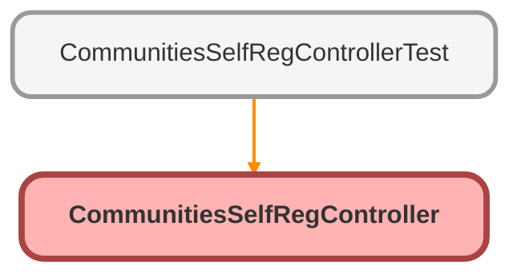

---
hide:
  - path
---

# CommunitiesSelfRegController Class

An apex page controller that supports self registration of users in communities that allow self registration

## Class Diagram



<!-- Apex description -->

## Apex Code

```java
/**
 * An apex page controller that supports self registration of users in communities that allow self registration
 */
public class CommunitiesSelfRegController {

    public String firstName {get; set;}
    public String lastName {get; set;}
    public String email {get; set;}
    public String password {get; set {password = value == null ? value : value.trim(); } }
    public String confirmPassword {get; set { confirmPassword = value == null ? value : value.trim(); } }
    public String communityNickname {get; set { communityNickname = value == null ? value : value.trim(); } }
    
    public CommunitiesSelfRegController() {
        String expid = ApexPages.currentPage().getParameters().get('expid');            
        if (expId != null) {
            Site.setExperienceId(expId); 
        }    
    }
    
    private boolean isValidPassword() {
        return password == confirmPassword;
    }

    public PageReference registerUser() {
    
           // it's okay if password is null - we'll send the user a random password in that case
        if (!isValidPassword()) {
            ApexPages.Message msg = new ApexPages.Message(ApexPages.Severity.ERROR, Label.site.passwords_dont_match);
            ApexPages.addMessage(msg);
            return null;
        }    

        String profileId = null; // To be filled in by customer.
        String roleEnum = null; // To be filled in by customer.
        String accountId = ''; // To be filled in by customer.
        
        String userName = email;

        User u = new User();
        u.Username = userName;
        u.Email = email;
        u.FirstName = firstName;
        u.LastName = lastName;
        u.CommunityNickname = communityNickname;
		u.ProfileId = profileId;
		
        String userId;

        try {
            userId = Site.createExternalUser(u, accountId, password);
        } catch(Site.ExternalUserCreateException ex) {
            List<String> errors = ex.getDisplayMessages();
            for (String error : errors)  {
                ApexPages.addMessage(new ApexPages.Message(ApexPages.Severity.ERROR, error));
            }
            
            // This message is used for debugging. Do not display this in the UI to the end user.
            // It has the information around why the user creation failed.
            System.debug(ex.getMessage());
        }
        
        if (userId != null) { 
            if (password != null && password.length() > 1) {
                return Site.login(userName, password, ApexPages.currentPage().getParameters().get('startURL'));
            }
            else {
                PageReference page = System.Page.CommunitiesSelfRegConfirm;
                page.setRedirect(true);
                return page;
            }
        }
        return null;
    }
}
```

## Properties
### `firstName`

#### Signature
```apex
public firstName
```

#### Type
String

---

### `lastName`

#### Signature
```apex
public lastName
```

#### Type
String

---

### `email`

#### Signature
```apex
public email
```

#### Type
String

---

### `password`

#### Signature
```apex
public password
```

#### Type
String

---

### `confirmPassword`

#### Signature
```apex
public confirmPassword
```

#### Type
String

---

### `communityNickname`

#### Signature
```apex
public communityNickname
```

#### Type
String

## Constructors
### `CommunitiesSelfRegController()`

#### Signature
```apex
public CommunitiesSelfRegController()
```

## Methods
### `isValidPassword()`

#### Signature
```apex
private boolean isValidPassword()
```

#### Return Type
**boolean**

---

### `registerUser()`

#### Signature
```apex
public PageReference registerUser()
```

#### Return Type
**PageReference**