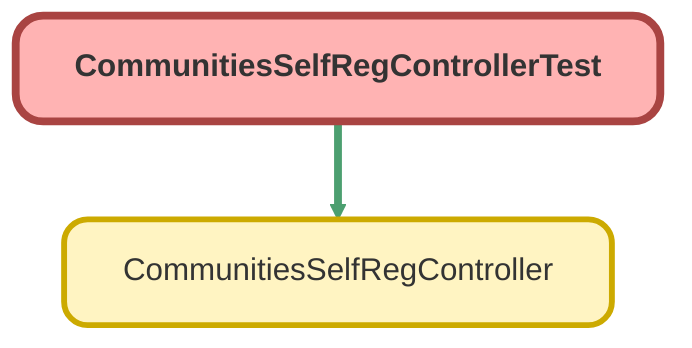

---
hide:
  - path
---

# CommunitiesSelfRegControllerTest Class

`ISTEST`

An apex page controller that supports self registration of users in communities that allow self registration

## Class Diagram



<!-- Apex description -->

## Apex Code

```java
/**
 * An apex page controller that supports self registration of users in communities that allow self registration
 */
@IsTest public with sharing class CommunitiesSelfRegControllerTest {
    @IsTest(SeeAllData=true) 
    public static void testCommunitiesSelfRegController() {
        CommunitiesSelfRegController controller = new CommunitiesSelfRegController();
        controller.firstName = 'FirstName';
        controller.lastName = 'LastName';
        controller.email = 'test@force.com';
        controller.communityNickname = 'test';
        
        // registerUser will always return null when the page isn't accessed as a guest user
        System.assert(controller.registerUser() == null);    
        
        controller.password = 'abcd1234';
        controller.confirmPassword = 'abcd123';
        System.assert(controller.registerUser() == null);  
    }    
}
```

## Methods
### `testCommunitiesSelfRegController()`

`ISTEST`

#### Signature
```apex
public static void testCommunitiesSelfRegController()
```

#### Return Type
**void**