---
hide:
  - path
---

# DataFactory Class

`ISTEST`

## Class Diagram

```mermaid
graph TD
  DataFactory["DataFactory"]:::mainApexClass
  click DataFactory "/objects/DataFactory/"
  LoggerMockDataCreator["LoggerMockDataCreator"]:::apexTestClass
  ProposalTriggerTest["ProposalTriggerTest"]:::apexTestClass
  click ProposalTriggerTest "/apex/ProposalTriggerTest/"
  SimplyCalloutBatchTest["SimplyCalloutBatchTest"]:::apexTestClass
  click SimplyCalloutBatchTest "/apex/SimplyCalloutBatchTest/"
  ZoomCallCenterRecordingServiceTest["ZoomCallCenterRecordingServiceTest"]:::apexTestClass
  click ZoomCallCenterRecordingServiceTest "/apex/ZoomCallCenterRecordingServiceTest/"
  ZoomCallCenterServiceMock["ZoomCallCenterServiceMock"]:::apexTestClass
  click ZoomCallCenterServiceMock "/apex/ZoomCallCenterServiceMock/"
  ZoomPhoneCallRecordingServiceTest["ZoomPhoneCallRecordingServiceTest"]:::apexTestClass
  click ZoomPhoneCallRecordingServiceTest "/apex/ZoomPhoneCallRecordingServiceTest/"
  ZoomTestDataFactory["ZoomTestDataFactory"]:::apexTestClass
  click ZoomTestDataFactory "/apex/ZoomTestDataFactory/"
  ZoomUserInfosRecordCreatorBatchTest["ZoomUserInfosRecordCreatorBatchTest"]:::apexTestClass
  click ZoomUserInfosRecordCreatorBatchTest "/apex/ZoomUserInfosRecordCreatorBatchTest/"
  ZoomUsersInfoTriggerControllerTest["ZoomUsersInfoTriggerControllerTest"]:::apexTestClass
  click ZoomUsersInfoTriggerControllerTest "/apex/ZoomUsersInfoTriggerControllerTest/"
  ZoomUsersPermissionCheckerBatchTest["ZoomUsersPermissionCheckerBatchTest"]:::apexTestClass
  click ZoomUsersPermissionCheckerBatchTest "/apex/ZoomUsersPermissionCheckerBatchTest/"
  ZoomUsersPhoneInfosBatchHttpCalloutMock["ZoomUsersPhoneInfosBatchHttpCalloutMock"]:::apexTestClass
  click ZoomUsersPhoneInfosBatchHttpCalloutMock "/apex/ZoomUsersPhoneInfosBatchHttpCalloutMock/"


  LoggerMockDataCreator --> DataFactory
  ProposalTriggerTest --> DataFactory
  SimplyCalloutBatchTest --> DataFactory
  ZoomCallCenterRecordingServiceTest --> DataFactory
  ZoomCallCenterServiceMock --> DataFactory
  ZoomPhoneCallRecordingServiceTest --> DataFactory
  ZoomTestDataFactory --> DataFactory
  ZoomUserInfosRecordCreatorBatchTest --> DataFactory
  ZoomUsersInfoTriggerControllerTest --> DataFactory
  ZoomUsersPermissionCheckerBatchTest --> DataFactory
  ZoomUsersPhoneInfosBatchHttpCalloutMock --> DataFactory

  %% Too many related classes, skipping transverse links


classDef apexClass fill:#FFF4C2,stroke:#CCAA00,stroke-width:3px,rx:12px,ry:12px,shadow:drop,color:#333;
classDef apexTestClass fill:#F5F5F5,stroke:#999999,stroke-width:3px,rx:12px,ry:12px,shadow:drop,color:#333;
classDef mainApexClass fill:#FFB3B3,stroke:#A94442,stroke-width:4px,rx:14px,ry:14px,shadow:drop,color:#333,font-weight:bold;

linkStyle 0,1,2,3,4,5,6,7,8,9,10 stroke:#FF8C00,stroke-width:2px;
```



<!-- Apex description -->

## Apex Code

```java
@isTest
public with sharing class DataFactory {

    public static Account createAccount(){
        Account acc = new Account();
        acc.Name = 'Test Account';
        acc.BillingPostalCode = '12345';
        acc.NumberOfEmployees = 5;
        acc.Employer_Identification_Number_EIN__c = '122456';
        acc.Business_Unit__c = 'Ubiquity';
        acc.Connected_Partner__c = 'JPM';
        insert acc;
        return acc;
    }

    public static Opportunity createOpportunity(Account acc){
        Opportunity opp = new Opportunity();
        opp.Name = 'Test Opp';
        opp.Type = 'Ancillary Billing Hourly Rate';
        opp.StageName = 'Quote Sent';
        opp.CloseDate = Date.today();
        opp.AccountId = acc.Id; // Assign each opportunity to a different account
        opp.Product_Type__c = '401(k)';
        opp.Plan_Type__c = 'New Plan';
        opp.Service_Option__c = 'Express(k)';
        opp.LeadSource = 'Organic Search';
        opp.LeadSourceDetail__c = 'Website';
        opp.Method_of_First_Contact__c = 'Phone';
        insert opp;
		return opp;
    }

	public static List<Account> createAccounts(Integer numAccounts) {
		List<Account> accounts = new List<Account>();
		for (Integer i = 0; i < numAccounts; i++) {
			Account acc = new Account();
			acc.Name = 'Test' +i+ 'Account' + i;
			acc.BillingPostalCode = '12345' + i;
			acc.NumberOfEmployees = 5 + i;
			acc.Employer_Identification_Number_EIN__c = '122456' + i;
			acc.Business_Unit__c = 'Ubiquity';
			acc.Connected_Partner__c = 'JPM';
			accounts.add(acc);
		}
		insert accounts;
		return accounts;
	}

	public static List<Opportunity> createOpportunities(Integer numOpportunities,  List<Account> accounts) {
		List<Opportunity> opps = new List<Opportunity>();
		for (Integer i = 0; i < numOpportunities; i++) {
			Opportunity opp = new Opportunity();
			opp.Name = 'Test Opp' + i;
			opp.Type = 'Ancillary Billing Hourly Rate';
			opp.StageName = 'Quote Sent';
			opp.CloseDate = Date.today();
			opp.AccountId = accounts[i].Id; // Assign each opportunity to a different account
			opp.Product_Type__c = '401(k)';
			opp.Plan_Type__c = 'New Plan';
			opp.Service_Option__c = 'Express(k)';
			opp.LeadSource = 'Organic Search';
			opp.LeadSourceDetail__c = 'Website';
			opp.Method_of_First_Contact__c = 'Phone';
			opps.add(opp);
		}
		insert opps;
		return opps; // Return the list of created opportunities
	}

	public static List<Proposal__c> createProposals(Integer numProposals, Opportunity opportunity) {
		List<Proposal__c> proposals = new List<Proposal__c>();
		for (Integer i = 0; i < numProposals; i++) {
			Proposal__c testProp = new Proposal__c();
			testProp.Advisor_CRD__c = '55555';
			testProp.Plan_Effective_Date__c = Date.today();
			testProp.Client_Company_Name__c = 'Client Company 0' + i;
			testProp.Firm_Name__c = 'Advisory Firm 0' + i;
			testProp.Principal_Opportunity_Closed_Lost_Reason__c = 'Unknown';
			testProp.Insurance_Agency_NPN__c = 4444 + i;
			testProp.Number_of_Employees__c = 5 + i;
			testProp.Contact_Phone_Number__c = '(555)1234-4321';
			testProp.TPA_Firm_Name__c = 'TPA Firm 0' + i;
			testProp.Company_Zip_Postal_Code__c = 12345;
			testProp.Company_State__c = 'California';
			testProp.Advisor_NPN__c = '3333' + i;
			testProp.TPA_EIN__c = '123456' + i;
			testProp.Company_EIN__c = '123456' + i;
			//testProp.Opportunity__c = opportunity.Id;
			testProp.Queued__c = false;
			// testProp.Status__c = 'Pending';
			testProp.CreatedDate = Date.valueOf('2022-07-14 00:00:00');
			if (i <= 5) {
				testProp.Principal_Opportunity_Stage__c = 'Presentation';
				testProp.Financial_Professional_Role__c = 'IAR';
				testProp.Principal_Id__c = '000' + i;
			} else if (i > 5 && i <= 15) {
				testProp.Principal_Opportunity_Stage__c = 'Presentation';
				testProp.Financial_Professional_Role__c = 'IA';
				testProp.Principal_Id__c = '100' + i;
			} else if (i > 15) {
				testProp.Principal_Opportunity_Stage__c = 'Committed';
				testProp.Financial_Professional_Role__c = 'RR';
				testProp.Principal_Id__c = '200' + i;
			}
			proposals.add(testProp);
		}
		insert proposals;
		return proposals; // Return the list of created proposals
	}
}
```

## Methods
### `createAccount()`

#### Signature
```apex
public static Account createAccount()
```

#### Return Type
**[Account](../objects/Account.md)**

---

### `createOpportunity(acc)`

#### Signature
```apex
public static Opportunity createOpportunity(Account acc)
```

#### Parameters
| Name | Type | Description |
|------|------|-------------|
| acc | [Account](../objects/Account.md) |  |

#### Return Type
**[Opportunity](../objects/Opportunity.md)**

---

### `createAccounts(numAccounts)`

#### Signature
```apex
public static List<Account> createAccounts(Integer numAccounts)
```

#### Parameters
| Name | Type | Description |
|------|------|-------------|
| numAccounts | Integer |  |

#### Return Type
**List&lt;Account&gt;**

---

### `createOpportunities(numOpportunities, accounts)`

#### Signature
```apex
public static List<Opportunity> createOpportunities(Integer numOpportunities, List<Account> accounts)
```

#### Parameters
| Name | Type | Description |
|------|------|-------------|
| numOpportunities | Integer |  |
| accounts | List&lt;Account&gt; |  |

#### Return Type
**List&lt;Opportunity&gt;**

---

### `createProposals(numProposals, opportunity)`

#### Signature
```apex
public static List<Proposal__c> createProposals(Integer numProposals, Opportunity opportunity)
```

#### Parameters
| Name | Type | Description |
|------|------|-------------|
| numProposals | Integer |  |
| opportunity | [Opportunity](../objects/Opportunity.md) |  |

#### Return Type
**List&lt;Proposal__c&gt;**