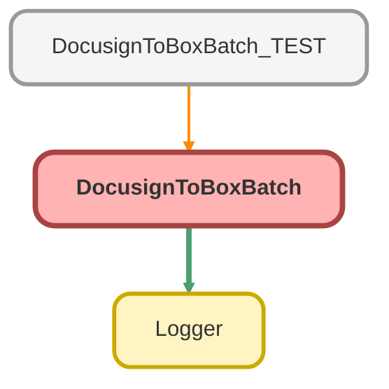

---
hide:
  - path
---

# DocusignToBoxBatch Class

**Implements**

Database.Batchable&lt;sObject&gt;, 
Database.AllowsCallouts, 
Database.Stateful, 
Schedulable

## Class Diagram



<!-- Apex description -->

## Apex Code

```java
public without sharing class DocusignToBoxBatch implements Database.Batchable<sObject>, Database.AllowsCallouts, Database.Stateful, Schedulable {
	private String originalTransactionId;
	private Integer errorCount = 0;
	private Integer docsProcessed = 0;
	private Double fileSize = 0;
	private Integer timeSaved = 0;

	public Database.QueryLocator start(Database.BatchableContext bc) {
		this.originalTransactionId = Logger.getTransactionId();
		Logger.info('Starting docusign batch ' + originalTransactionId);
		Logger.saveLog();
		return Database.getQueryLocator(
			[
				SELECT
					TYPEOF LinkedEntity
						WHEN dsfs__Docusign_Status__c THEN
							Id,
							dsfs__Subject__c,
							dsfs__Company__c,
							dsfs__Company__r.Box_Folder_Id__c,
							dsfs__Company__r.Box_Docusign_Folder_Id__c

					END,
					ContentDocumentId,
					ContentDocument.Title,
					ContentDocument.LatestPublishedVersionId
				FROM ContentDocumentLink
				WHERE
					LinkedEntityId IN (
						SELECT Id
						FROM dsfs__DocuSign_Status__c
						WHERE dsfs__Company__c != NULL AND dsfs__Company__r.Box_Folder_Linked__c = TRUE AND dsfs__Company__r.Box_Folder_Id__c != NULL
					)
					AND ContentDocument.FileType = 'PDF'
					AND ContentDocument.ContentSize < 1887436
				ORDER BY ContentDocument.CreatedDate ASC
			]
		);
	}

	public void execute(Database.BatchableContext bc, List<ContentDocumentLink> contentLinks) {
		Logger.setParentLogTransactionId(this.originalTransactionId);
		Map<Id, Attachment> versionAttMap = new Map<Id, Attachment>();
		Map<Id, String> accIdBoxIdMap = new Map<Id, String>();
		List<Id> accIds = new List<Id>();
		List<Account> accs2update = new List<Account>();
		box.Toolkit toolkit = new box.Toolkit();

		//Collects the Ids and retrieves the relevant accounts in case they need a docusign folder Id field update
		for (ContentDocumentLink cdl : contentLinks) {
			accIds.add(cdl.LinkedEntity.get('dsfs__Company__c').toString());
		}
		Map<Id, Account> accounts = new Map<Id, Account>([SELECT Id, Box_Folder_Id__c, Box_Docusign_Folder_Id__c FROM Account WHERE Id IN :accIds]);

		//Loops through accounts and either uses existing docusign folder as destination, or creates new folder for destination.
		//If creating a new folder fails, uses the existing account's folder as destination
		for (Id key : accounts.keySet()) {
			Account a = accounts.get(key);
			String destinationFolder = (a.Box_Docusign_Folder_Id__c != null) ? a.Box_Docusign_Folder_Id__c : createDocusignFolder(a, toolkit);
			if (a.Box_Docusign_Folder_Id__c == null && destinationFolder != a.Box_Folder_Id__c) {
				a.Box_Docusign_Folder_Id__c = destinationFolder;
				accs2update.add(a);
			}
			accIdBoxIdMap.put(a.Id, destinationFolder);
		}

		//Defines attachment for each file and gives it the latest content version's id as a key
		for (ContentDocumentLink contentLink : contentLinks) {
			dsfs__DocuSign_Status__c ds = contentLink.LinkedEntity;
			Account a = accounts.get(ds.dsfs__Company__c);
			Attachment att = buildAttachment(contentLink, a.Id, ds.dsfs__Subject__c);
			versionAttMap.put(contentLink.ContentDocument.LatestPublishedVersionId, att);
		}

		List<Id> files2Delete = new List<Id>();

		//Retrieves content versions for versiondata (body of pdf)
		for (ContentVersion cv : [
			SELECT Id, VersionData, ContentSize, ContentDocumentId
			FROM ContentVersion
			WHERE Id IN :versionAttMap.keySet()
		]) {
			Attachment att = versionAttmap.get(cv.Id);
			att.Body = cv.VersionData;
			String boxFolderId = accIdBoxIdMap.get(att.ParentId).toString();
			String boxFileId = uploadToBox(att, boxFolderId, toolkit);
			if (boxFileId == null) {
				Logger.warn(
					'Error creating file ' +
						att.Name +
						' in Box. ' +
						'Account Id: ' +
						att.ParentId +
						' Folder Id: ' +
						accIdBoxIdMap.get(att.ParentId) +
						' Box Error: ' +
						toolkit.mostRecentError
				);
				errorCount++;
				if (errorCount > 10) {
					abortJob(bc);
					return;
				}
				//Assigns fake file Id if a test is running
				if (!Test.isRunningTest()) {
					continue;
				} else {
					boxFileId = 'testId12345';
				}
			}
			// Add to list to delete
			Logger.debug('New Box file: ' + boxFileId + ' ' + att.Name + ' For account: ' + att.ParentId);
			Logger.debug('Queueing original for deletion: ' + cv.ContentDocumentId);
			fileSize += cv.ContentSize;
			timeSaved += 30;
			files2Delete.add(cv.ContentDocumentId);
		}
		toolkit.commitChanges();
		Logger.saveLog();
		if (!accs2update.isEmpty()) {
			Database.update(accs2update);
		}
		if (!files2Delete.isEmpty()) {
			docsProcessed += files2Delete.size();
			Database.delete(files2Delete);
		}
	}

	//Defines attachment skeleton (no content)
	private Attachment buildAttachment(ContentDocumentLink cl, Id accId, String subject) {
		String title = ((cl.ContentDocument.Title == 'file.pdf' || cl.ContentDocument.Title == 'file') && !String.isBlank(subject))
			? subject
			: cl.ContentDocument.Title;
		if (!title.endsWith('.pdf')) {
			title += '.pdf';
		}
		Attachment att = new Attachment(ParentId = accId, ContentType = 'application/pdf', Name = title);
		return att;
	}

	public void finish(Database.BatchableContext bc) {
		AsyncApexJob finishedJob = [
			SELECT Id, Status, NumberOfErrors, JobItemsProcessed, TotalJobItems
			FROM AsyncApexJob
			WHERE Id = :bc.getJobId()
		];
		Logger.setParentLogTransactionId(this.originalTransactionId);
		Logger.info('Completed Docusign Batch Job');
		summarizeJob(finishedJob);
	}

	//This is what's called by the scheduler
	public void execute(SchedulableContext sc) {
		Database.executeBatch(new DocusignToBoxBatch(), 5);
	}

	//immediately summarizes then aborts job
	private void abortJob(Database.BatchableContext bc) {
		AsyncApexJob abortedJob = [
			SELECT Id, Status, NumberOfErrors, JobItemsProcessed, TotalJobItems
			FROM AsyncApexJob
			WHERE Id = :bc.getJobId()
		];
		Logger.error('Aborting Docusign to Box job!  Error threshold exceeded.');
		summarizeJob(abortedJob);
		System.abortJob(bc.getJobId());
	}

	//Translates bytes from "contentsize" field into human readable format
	private String fileSizeFormatter(Double data) {
		String dataUnit = '';
		if (data >= (1024 * 1024 * 1024)) {
			data /= (1024 * 1024 * 1024);
			dataUnit = 'GB';
		} else if (data > (1024 * 1024)) {
			data /= (1024 * 1024);
			dataUnit = 'MB';
		} else {
			data /= 1024;
			dataUnit = 'KB';
		}
		return data.format() + ' ' + dataUnit;
	}

	//Attempts upload to box twice.  Sometimes if it errors it's because another file/folder in the directory has the same name.
	//To compensate, it will retry the upload once with a modified name.
	//attempt 1: filename.pdf attempt 2: filename_111111.pdf
	private String uploadToBox(Attachment att, String boxFolderId, box.Toolkit toolkit) {
		String boxFileId = toolkit.createFileFromAttachment(att, null, boxFolderId, null);
		//error could be from duplicate name, so add random numbers to end of file name and retry once
		if (boxFileId == null) {
			att.name = att.name.replace('.pdf', '_' + math.abs(Crypto.getRandomInteger()).toString().left(6)) + '.pdf';
			boxFileId = toolkit.createFileFromAttachment(att, null, boxFolderId, null);
		}
		return boxFileId;
	}

	//Translates total duration of job into human readable format
	private String durationFormatter(Integer dur) {
		String formattedDur = '';
		String hoursText = '';
		String minutesText = '';
		String secondsText = '';

		Integer seconds = dur;
		Integer minutes = dur / 60;
		Integer hours = minutes / 60;

		if (hours >= 1) {
			hoursText = hours + ' Hours ';
		} else {
			hoursText = '';
		}

		if (minutes >= 1) {
			minutesText = string.valueOf(math.mod(minutes, 60)) + ' Minutes ';
		} else {
			minutesText = '';
		}

		if (seconds >= 1) {
			secondsText = string.valueOf(math.mod(seconds, 60)) + ' Seconds ';
		} else {
			secondsText = '';
		}

		formattedDur = hoursText + minutesText + secondsText;
		return formattedDur;
	}

	private void summarizeJob(AsyncApexJob aj) {
		Logger.info('Migrated ' + docsProcessed + ' documents to box');
		Logger.info(errorCount + ' documents failed to upload');
		Logger.info('Total file storage saved: ' + fileSizeFormatter(fileSize));
		Logger.info('Total time saved: ' + durationFormatter(timeSaved));
		Logger.info('Total Batches Processed: ' + aj.JobItemsProcessed);
		Logger.info('Total Batches Errored: ' + aj.NumberOfErrors);
		Logger.info('Total Batches: ' + aj.TotalJobItems);
		Logger.saveLog();
	}

	//Creates docusign upload folder if one doesn't exist.  If that fails, reverts to default folder
	private String createDocusignFolder(Account a, box.Toolkit toolkit) {
		String destinationFolderId = toolkit.createFolder('Docusign Uploads', a.Box_Folder_Id__c, null);
		if (String.isBlank(destinationFolderId)) {
			destinationFolderId = a.Box_Folder_Id__c;
		}
		return destinationFolderId;
	}
}
```

## Fields
### `originalTransactionId`

#### Signature
```apex
private originalTransactionId
```

#### Type
String

---

### `errorCount`

#### Signature
```apex
private errorCount
```

#### Type
Integer

---

### `docsProcessed`

#### Signature
```apex
private docsProcessed
```

#### Type
Integer

---

### `fileSize`

#### Signature
```apex
private fileSize
```

#### Type
Double

---

### `timeSaved`

#### Signature
```apex
private timeSaved
```

#### Type
Integer

## Methods
### `start(bc)`

#### Signature
```apex
public Database.QueryLocator start(Database.BatchableContext bc)
```

#### Parameters
| Name | Type | Description |
|------|------|-------------|
| bc | Database.BatchableContext |  |

#### Return Type
**Database.QueryLocator**

---

### `execute(bc, contentLinks)`

#### Signature
```apex
public void execute(Database.BatchableContext bc, List<ContentDocumentLink> contentLinks)
```

#### Parameters
| Name | Type | Description |
|------|------|-------------|
| bc | Database.BatchableContext |  |
| contentLinks | List&lt;ContentDocumentLink&gt; |  |

#### Return Type
**void**

---

### `buildAttachment(cl, accId, subject)`

#### Signature
```apex
private Attachment buildAttachment(ContentDocumentLink cl, Id accId, String subject)
```

#### Parameters
| Name | Type | Description |
|------|------|-------------|
| cl | ContentDocumentLink |  |
| accId | Id |  |
| subject | String |  |

#### Return Type
**Attachment**

---

### `finish(bc)`

#### Signature
```apex
public void finish(Database.BatchableContext bc)
```

#### Parameters
| Name | Type | Description |
|------|------|-------------|
| bc | Database.BatchableContext |  |

#### Return Type
**void**

---

### `execute(sc)`

#### Signature
```apex
public void execute(SchedulableContext sc)
```

#### Parameters
| Name | Type | Description |
|------|------|-------------|
| sc | SchedulableContext |  |

#### Return Type
**void**

---

### `abortJob(bc)`

#### Signature
```apex
private void abortJob(Database.BatchableContext bc)
```

#### Parameters
| Name | Type | Description |
|------|------|-------------|
| bc | Database.BatchableContext |  |

#### Return Type
**void**

---

### `fileSizeFormatter(data)`

#### Signature
```apex
private String fileSizeFormatter(Double data)
```

#### Parameters
| Name | Type | Description |
|------|------|-------------|
| data | Double |  |

#### Return Type
**String**

---

### `uploadToBox(att, boxFolderId, toolkit)`

#### Signature
```apex
private String uploadToBox(Attachment att, String boxFolderId, box.Toolkit toolkit)
```

#### Parameters
| Name | Type | Description |
|------|------|-------------|
| att | Attachment |  |
| boxFolderId | String |  |
| toolkit | box.Toolkit |  |

#### Return Type
**String**

---

### `durationFormatter(dur)`

#### Signature
```apex
private String durationFormatter(Integer dur)
```

#### Parameters
| Name | Type | Description |
|------|------|-------------|
| dur | Integer |  |

#### Return Type
**String**

---

### `summarizeJob(aj)`

#### Signature
```apex
private void summarizeJob(AsyncApexJob aj)
```

#### Parameters
| Name | Type | Description |
|------|------|-------------|
| aj | AsyncApexJob |  |

#### Return Type
**void**

---

### `createDocusignFolder(a, toolkit)`

#### Signature
```apex
private String createDocusignFolder(Account a, box.Toolkit toolkit)
```

#### Parameters
| Name | Type | Description |
|------|------|-------------|
| a | [Account](../objects/Account.md) |  |
| toolkit | box.Toolkit |  |

#### Return Type
**String**