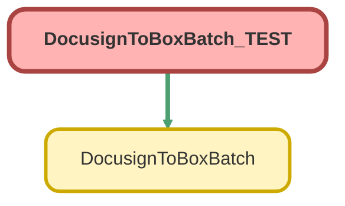

---
hide:
  - path
---

# DocusignToBoxBatch_TEST Class

`ISTEST`

## Class Diagram



<!-- Apex description -->

## Apex Code

```java
@isTest
public class DocusignToBoxBatch_TEST {
	@TestSetup
	private static void makeData() {
		List<Account> aList = new List<Account>();
		//will insert 5 of these
		for (Integer i = 1; i < 6; i++) {
			Account acc = new Account(Name = 'Test Acc w Doc Folder ' + i, Box_Folder_Id__c = 'testId12345' + i, Box_Folder_Linked__c = true);
			aList.add(acc);
		}
		//will insert 1 of these
		Account acc = new Account(
			Name = 'Test Acc No Doc Folder 0',
			Box_Folder_Id__c = 'testId12345',
			Box_Folder_Linked__c = true,
			Box_Docusign_Folder_Id__c = 'testDocId312387'
		);
		aList.add(acc);

		System.debug('Accounts: ' + aList);
		System.debug(alist.size());
		insert aList;

		//everything below here is just creating 1 docusign record and attached content document for each
		List<dsfs__DocuSign_Status__c> dsList = new List<dsfs__DocuSign_Status__c>();
		for (Account a : aList) {
			dsfs__DocuSign_Status__c ds = new dsfs__DocuSign_Status__c(dsfs__Subject__c = 'TEST DOC BULK ' + a.Name.right(1), dsfs__Company__c = a.Id);
			dsList.add(ds);
		}

		System.debug('Docusign statuses: ' + dsList);
		System.debug(dsList.size());
		insert dsList;

		//Half will not have file ext in name, other half will need "file.pdf" name correction
		Integer itr = 1;
		List<ContentVersion> cvList = new List<ContentVersion>();
		for (dsfs__DocuSign_Status__c ds : dsList) {
			ContentVersion cv = new ContentVersion();
			if (math.mod(itr, 2) == 0) {
				cv.Title = 'file.pdf';
				cv.PathOnClient = 'file.pdf';
				cv.VersionData = Blob.valueOf('Test Content');
				cv.IsMajorVersion = true;
			} else {
				cv.Title = 'noPdfFileExt.pdf';
				cv.PathOnClient = 'noPdfFileExt.pdf';
				cv.VersionData = Blob.valueOf('Test Content');
				cv.IsMajorVersion = true;
			}
			itr++;
			cvList.add(cv);
		}
		System.debug('Content Versions: ' + cvList);
		System.debug(cvList.size());
		insert cvList;

		List<ContentDocument> removeExt = [SELECT Id, Title FROM ContentDocument WHERE Title = 'noPdfFileExt.pdf'];

		for (ContentDocument re : removeExt) {
			re.Title = 'noPdfFileExt';
		}

		update removeExt;

		List<Id> cvIds = new List<Id>();
		for (ContentVersion cv : cvList) {
			cvIds.add(cv.Id);
		}

		List<ContentVersion> cvNewList = [SELECT Id, ContentDocumentId FROM ContentVersion WHERE Id IN :cvIds];
		List<Id> contentDocIds = new List<Id>();
		for (ContentVersion cv : cvNewList) {
			contentDocIds.add(cv.ContentDocumentId);
		}

		List<ContentDocumentLink> cdlList = new List<ContentDocumentLink>();
		for (Integer i = 0; i < contentDocIds.size(); i++) {
			ContentDocumentLink cdl = new ContentDocumentLink(ContentDocumentId = contentDocIds[i], LinkedEntityId = dsList[i].Id, ShareType = 'V');
			cdlList.add(cdl);
		}
		System.debug('Content Documents: ' + cdlList);
		System.debug(cdlList.size());
		insert cdlList;
	}

	@isTest
	private static void testBatch() {
		List<ContentDocument> files2Process = [
			SELECT Id
			FROM ContentDocument
		];

		Assert.isFalse(files2Process.isEmpty(), 'Files should be present before batch run');

		List<Id> contentDocumentIds = new List<Id>();
		for (ContentDocument f : files2Process) {
			contentDocumentIds.add(f.Id);
		}

		System.debug('Files found: ' + files2Process.size());

		test.startTest();
		DocusignToBoxBatch doc2Box = new DocusignToBoxBatch();
		Database.executeBatch(doc2Box, 20);
		test.stopTest();

		List<ContentDocument> filesAfterProcess = [
			SELECT Id
			FROM ContentDocument
			WHERE Id IN :contentDocumentIds
		];

		System.debug('Files left: ' + filesAfterProcess.size());
		Assert.isTrue(filesAfterProcess.isEmpty(), 'Files should be deleted');
	}
}
```

## Methods
### `makeData()`

`TESTSETUP`

#### Signature
```apex
private static void makeData()
```

#### Return Type
**void**

---

### `testBatch()`

`ISTEST`

#### Signature
```apex
private static void testBatch()
```

#### Return Type
**void**