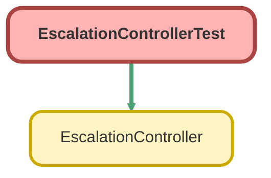

---
hide:
  - path
---

# EscalationControllerTest Class

`ISTEST`

## Class Diagram



<!-- Apex description -->

## Apex Code

```java
@isTest
public class EscalationControllerTest {
    
    @isTest
	public static void testEscalation() {
        String oppRecordType = [SELECT id FROM RecordType WHERE SobjectType = 'Opportunity' AND Name = '401(k)'].Id;
        String oppStage = [SELECT ApiName FROM OpportunityStage WHERE SortOrder = 1].ApiName;
        Account acct = new Account(Name='Test');
        acct.Escalated__c = true;
        acct.NumberOfEmployees = 5;
        insert acct;

        Contact cont = new Contact(LastName='TestCont');
        cont.AccountId = acct.Id;
        insert cont;
        
        Opportunity opp = new Opportunity(Name='Test');
        opp.AccountId = acct.Id;
        opp.StageName = oppStage;
        opp.CloseDate = Date.today();
        opp.Description = 'test';
        opp.RecordTypeId = oppRecordType;
        insert opp;
        
        Implementation__c imp = new Implementation__c(Name='Test');
        imp.Account__c = acct.Id;
        imp.Opportunity_Name__c = opp.Id;
        insert imp;
        
        String acctId = acct.Id;
        String recId  = cont.Id;
        String custId = imp.Id;
        
        Account acct2 = new Account(Name='Test');
        acct2.Escalated__c = false;
        insert acct2;

        Contact cont2 = new Contact(LastName='TestCont');
        cont2.AccountId = acct2.Id;
        insert cont2;
        
        Opportunity opp2 = new Opportunity(Name='Test');
        opp2.AccountId = acct.Id;
        opp2.StageName = oppStage;
        opp2.CloseDate = Date.today();
        opp2.Description = 'test';
        opp2.RecordTypeId = oppRecordType;
        insert opp2;
        
        Implementation__c imp2 = new Implementation__c(Name='Test');
        imp2.Account__c = acct2.Id;
        imp2.Opportunity_Name__c = opp2.Id;
        insert imp2;
        
        String acctId2 = acct2.Id;
        String recId2  = cont2.Id;
        String custId2 = imp2.Id;

        Escalation__c newEsc = new Escalation__c();
        newEsc.Escalated_Account__c = acct.Id;
        newEsc.Escalation_Contact__c = cont.Id;
        newEsc.Status__c = 'Escalated';
        insert newEsc;
        
               
        System.assertEquals(EscalationController.isEscalated(acctId), True, 'Account 1 should show as escalated');
        System.assertEquals(EscalationController.isEscalated(recId), True, 'Contact 1 should show as escalated');
        System.assertEquals(EscalationController.isEscalated(custId), True, 'Implementation 1 should show as escalated');
        System.assertEquals(EscalationController.isEscalated(acctId2), False, 'Account 2 shouldn\'t show as escalated');
        System.assertEquals(EscalationController.isEscalated(recId2), False, 'Contact 2 shouldn\'t show as escalated');
        System.AssertEquals(EscalationController.isEscalated(custId2), False, 'Implementation 2 shouldn\'t show as escalated');
        
        List<Escalation__c> result = EscalationController.getEscalatedRecord(acctId);
        List<Escalation__c> result2 = EscalationController.getEscalatedRecord(recId);
        List<Escalation__c> result3 = EscalationController.getEscalatedRecord(custId);
        system.assertEquals(1, result.size(), 'Controller should return 1 escalation record from accountId');
        system.assertEquals(1, result2.size(), 'Controller should return 1 escalation record from contactId');        
        system.assertEquals(1, result3.size(), 'Controller should return 1 escalation record from impId'); 

    }
}
```

## Methods
### `testEscalation()`

`ISTEST`

#### Signature
```apex
public static void testEscalation()
```

#### Return Type
**void**