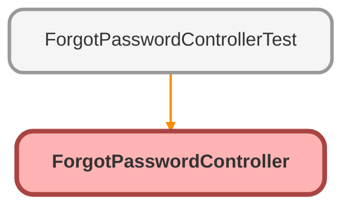

---
hide:
  - path
---

# ForgotPasswordController Class

An apex page controller that exposes the site forgot password functionality

## Class Diagram



<!-- Apex description -->

## Apex Code

```java
/**
 * An apex page controller that exposes the site forgot password functionality
 */
public with sharing class ForgotPasswordController {
    public String username {get; set;}   
       
    public ForgotPasswordController() {}
	
  	public PageReference forgotPassword() {
  		boolean success = Site.forgotPassword(username);
  		PageReference pr = Page.ForgotPasswordConfirm;
  		pr.setRedirect(true);
  		
  		if (success) {  			
  			return pr;
  		}
  		return null;
  	}
}
```

## Properties
### `username`

#### Signature
```apex
public username
```

#### Type
String

## Constructors
### `ForgotPasswordController()`

#### Signature
```apex
public ForgotPasswordController()
```

## Methods
### `forgotPassword()`

#### Signature
```apex
public PageReference forgotPassword()
```

#### Return Type
**PageReference**