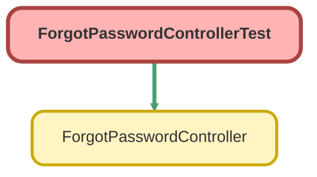

---
hide:
  - path
---

# ForgotPasswordControllerTest Class

`ISTEST`

An apex page controller that exposes the site forgot password functionality

## Class Diagram



<!-- Apex description -->

## Apex Code

```java
/**
 * An apex page controller that exposes the site forgot password functionality
 */
@IsTest public with sharing class ForgotPasswordControllerTest {
  	 @IsTest(SeeAllData=true) public static void testForgotPasswordController() {
    	// Instantiate a new controller with all parameters in the page
    	ForgotPasswordController controller = new ForgotPasswordController();
    	controller.username = 'test@salesforce.com';     	
    
    	System.assertEquals(controller.forgotPassword(),null); 
    }
}
```

## Methods
### `testForgotPasswordController()`

`ISTEST`

#### Signature
```apex
public static void testForgotPasswordController()
```

#### Return Type
**void**