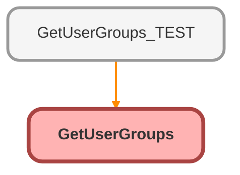

---
hide:
  - path
---

# GetUserGroups Class

## Class Diagram



<!-- Apex description -->

## Apex Code

```java
public with sharing class GetUserGroups {
	/**
	 * Static list of all group members, queried once for performance
	 */
	private static final List<GroupMember> ALL_GROUP_MEMBERS = [
		SELECT
			TYPEOF UserOrGroup
				WHEN Group THEN RelatedId
			END,
			Id,
			GroupId,
			Group.RelatedId,
			UserOrGroupId,
			Group.Name,
			Group.DeveloperName
		FROM GroupMember
		WHERE Group.Type = 'Regular' OR Group.Type = 'RoleAndSubordinates' OR Group.Type = 'RoleAndSubordinatesInternal'
		WITH SYSTEM_MODE
	];

	/**
	 * Returns a list of groups that the user is a member of, including nested groups
	 * @param userId The user's ID
	 * @param userRoleId The user's role ID
	 * @return List of Group objects representing the user's groups
	 */
	public static List<Group> getGroups(Id userId, Id userRoleId) {
		// Create a map to store the groups the user is a member of
		Map<Id, Group> groupMap = new Map<Id, Group>();

		// Iterate through all group members
		for (GroupMember gm : ALL_GROUP_MEMBERS) {
			// If the user is a direct member of the group, add it to the map
			if (gm.UserOrGroupId == userId) {
				groupMap.put(gm.GroupId, new Group(Id = gm.GroupId, Name = gm.Group.Name, DeveloperName = gm.Group.DeveloperName));
				continue;
			}

			// If the user is a member of a group and that group is related to the user's role, add it to the map
			if (gm.UserOrGroupId.getSobjectType().toString() == 'Group' && gm.UserOrGroup.get('RelatedId') == userRoleId) {
				groupMap.put(gm.GroupId, new Group(Id = gm.GroupId, Name = gm.Group.Name, DeveloperName = gm.Group.DeveloperName));
			}
		}

		// Call a helper method to add nested groups to the map
		return addNestedGroups(groupMap);
	}

	/**
	 * Helper method to add nested groups to the group map
	 * @param groupMap The map of groups the user is a member of
	 * @return List of Group objects representing the user's groups, including nested groups
	 */
	private static List<Group> addNestedGroups(Map<Id, Group> groupMap) {
		// var to determine if nested group was found on this pass
		Boolean continueLoop;
		// Max loops = 3
		Integer loopLimit = 0;
		do {
			continueLoop = false;
			loopLimit++;
			for (Groupmember gm : ALL_GROUP_MEMBERS) {
				// If one of the user's groups found so far is the child of another group (nesting), add parent group to map
				if (groupMap.containsKey(gm.UserOrGroupId) && !groupMap.containsKey(gm.GroupId)) {
					groupMap.put(gm.GroupId, new Group(Id = gm.GroupId, Name = gm.Group.Name, DeveloperName = gm.Group.DeveloperName));
					continueLoop = true;
				}
			}
		} while (continueLoop && loopLimit < 3);

		// Return the list of groups the user is a member of, including nested groups
		return groupMap.values();
	}

	/**
	 * Invocable method to get a list of groups the user is a member of, including nested groups
	 * @param inputs List of InputVariables objects containing the user's ID and role ID
	 * @return List of ReturnVariables objects containing the list of groups the user is a member of
	 */
	@InvocableMethod(label='Get User\'s Public Groups' iconName='slds:standard:groups')
	public static List<ReturnVariables> invocableGetGroups(List<InputVariables> inputs) {
		// Create a list to store the return variables
		List<ReturnVariables> returnVars = new List<ReturnVariables>();

		// Iterate through the input variables
		for (InputVariables input : inputs) {
			// Get the user's ID and role ID from the input
			Id userId = input.userId;
			Id userRoleId = input.userRoleId;

			// Call the getGroups method to get the list of groups the user is a member of
			List<Group> groups = getGroups(userId, userRoleId);

			// Get the names of the groups
			List<String> groupNames = new List<String>();
			for (Group g : groups) {
				groupNames.add(g.DeveloperName);
			}

			// Create a ReturnVariables object and add it to the list
			ReturnVariables returnVar = new ReturnVariables();
			returnVar.groups = groups;
			returnVar.groupDevNames = groupNames;
			returnVars.add(returnVar);
		}

		// Return the list of return variables
		return returnVars;
	}

	/**
	 * Inner class to represent input variables for the invocable method
	 */
	public class InputVariables {
		@InvocableVariable(Label='User Id' Required=true)
		public Id userId;
		@InvocableVariable(Label='User Role Id' Required=true)
		public Id userRoleId;
	}

	/**
	 * Inner class to represent return variables for the invocable method
	 */
	public class ReturnVariables {
		@InvocableVariable(Label='Groups')
		public List<Group> groups;
		@InvocableVariable(Label='Group Developer Names')
		public List<String> groupDevNames;
	}
}
```

## Fields
### `ALL_GROUP_MEMBERS`

Static list of all group members, queried once for performance

#### Signature
```apex
private static final ALL_GROUP_MEMBERS
```

#### Type
List&lt;GroupMember&gt;

## Methods
### `getGroups(userId, userRoleId)`

Returns a list of groups that the user is a member of, including nested groups

#### Signature
```apex
public static List<Group> getGroups(Id userId, Id userRoleId)
```

#### Parameters
| Name | Type | Description |
|------|------|-------------|
| userId | Id | The user&#x27;s ID |
| userRoleId | Id | The user&#x27;s role ID |

#### Return Type
**List&lt;Group&gt;**

List of Group objects representing the user&#x27;s groups

---

### `addNestedGroups(groupMap)`

Helper method to add nested groups to the group map

#### Signature
```apex
private static List<Group> addNestedGroups(Map<Id,Group> groupMap)
```

#### Parameters
| Name | Type | Description |
|------|------|-------------|
| groupMap | Map&lt;Id,Group&gt; | The map of groups the user is a member of |

#### Return Type
**List&lt;Group&gt;**

List of Group objects representing the user&#x27;s groups, including nested groups

---

### `invocableGetGroups(inputs)`

`INVOCABLEMETHOD`

Invocable method to get a list of groups the user is a member of, including nested groups

#### Signature
```apex
public static List<ReturnVariables> invocableGetGroups(List<InputVariables> inputs)
```

#### Parameters
| Name | Type | Description |
|------|------|-------------|
| inputs | List&lt;InputVariables&gt; | List of InputVariables objects containing the user&#x27;s ID and role ID |

#### Return Type
**List&lt;ReturnVariables&gt;**

List of ReturnVariables objects containing the list of groups the user is a member of

## Classes
### InputVariables Class

Inner class to represent input variables for the invocable method

#### Fields
##### `userId`

`INVOCABLEVARIABLE`

###### Signature
```apex
public userId
```

###### Type
Id

---

##### `userRoleId`

`INVOCABLEVARIABLE`

###### Signature
```apex
public userRoleId
```

###### Type
Id

### ReturnVariables Class

Inner class to represent return variables for the invocable method

#### Fields
##### `groups`

`INVOCABLEVARIABLE`

###### Signature
```apex
public groups
```

###### Type
List&lt;Group&gt;

---

##### `groupDevNames`

`INVOCABLEVARIABLE`

###### Signature
```apex
public groupDevNames
```

###### Type
List&lt;String&gt;