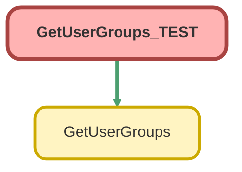

---
hide:
  - path
---

# GetUserGroups_TEST Class

`ISTEST`

## Class Diagram



<!-- Apex description -->

## Apex Code

```java
@isTest
private class GetUserGroups_TEST {
	@isTest
	static void testInvocableGetGroups() {
		// Create test data - UserRole and Profile IDs
		UserRole testRole = [SELECT Id FROM UserRole WHERE Name = 'Service User' LIMIT 1];
		Profile testProfile = [SELECT Id FROM Profile WHERE Name = 'Lightning Service User' LIMIT 1];

		// Create test user
		User testUser = new User(
			FirstName = 'Test',
			LastName = 'User',
			Email = 'burgertime@midway.com',
			Username = System.currentTimeMillis() + 'burgertime@midway.com',
			Alias = 'tstUser',
			CommunityNickname = 'testUser',
			TimeZoneSidKey = 'America/New_York',
			LocaleSidKey = 'en_US',
			EmailEncodingKey = 'UTF-8',
			ProfileId = testProfile.Id,
			LanguageLocaleKey = 'en_US',
			UserRoleId = testRole.Id
		);
		insert testUser;

		// Create test data - GroupMember records
		Group testGroup = new Group(Name = 'Test Group', DeveloperName = 'Test_Group', Type = 'Regular');
		insert testGroup;

		GroupMember gm = new GroupMember(GroupId = testGroup.Id, UserOrGroupId = testUser.Id);
		insert gm;

		// Define the input variables for the invocable method
		List<GetUserGroups.InputVariables> inputs = new List<GetUserGroups.InputVariables>();
		GetUserGroups.InputVariables input = new GetUserGroups.InputVariables();
		input.userId = testUser.Id;
		input.userRoleId = testRole.Id;
		inputs.add(input);

		// Call the invocable method
		List<GetUserGroups.ReturnVariables> returnVars = GetUserGroups.invocableGetGroups(inputs);

		// Assertions
		System.assertEquals(1, returnVars.size(), 'Expected one ReturnVariables record');
		GetUserGroups.ReturnVariables var = returnVars[0];

		// Check if the User is a member of the groups
		Assert.isTrue(var.groups.size() >= 1, 'Expected at least one group');
	}
}
```

## Methods
### `testInvocableGetGroups()`

`ISTEST`

#### Signature
```apex
private static void testInvocableGetGroups()
```

#### Return Type
**void**