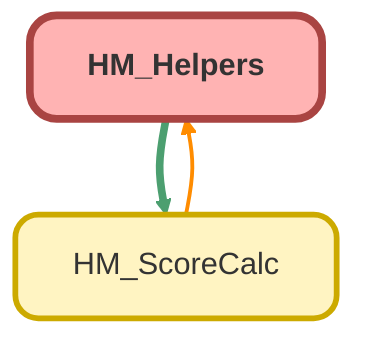

---
hide:
  - path
---

# HM_Helpers Class

## Class Diagram



<!-- Apex description -->

## Apex Code

```java
public without sharing class HM_Helpers {
  //Builds the query string to retrieve related objects and their required fields
  //Loops through childList and adds the related objects to the query string
  public static String buildChildQuery(HM_ScoreCalc.HM_ChildMod[] childList) {
    Map<String, String> nameRelMap = new Map<String, String>();

    Schema.DescribeSObjectResult r = Plan__c.SObjectType.getDescribe();
    for (Schema.ChildRelationship cr : R.getChildRelationships()) {
      nameRelMap.put(cr.getChildSObject().toString(), cr.getRelationshipName());
    }

    Map<String, Set<String>> childFieldMap = new Map<String, Set<String>>();
    String relQuery = '';
    for (HM_ScoreCalc.HM_ChildMod hmChild : childList) {
      hmChild.relName = nameRelMap.get(hmChild.objectName);
      Set<String> childFieldSet = (childFieldMap.containsKey(hmChild.relName))
        ? childFieldMap.get(hmChild.relName)
        : new Set<String>{ 'Id', 'CreatedDate' };
      childFieldSet.add(hmChild.filterField);
      childFieldSet.add(hmChild.filterField2);
      childFieldSet.add(hmChild.filterField3);
      childFieldMap.put(hmChild.relName, childFieldSet);
    }
    for (String key : childFieldMap.keySet()) {
      Set<String> item = childFieldMap.get(key);
      item.remove(null);
      String fieldSet = item.toString();
      fieldSet = fieldSet.remove('{');
      fieldSet = fieldSet.remove('}');
      final String relQueryBit = ', (SELECT ' + fieldSet + ' FROM ' + key + ')';
      relQuery += relQueryBit;
    }
    return relQuery;
  }

  public static String getScoreMessage(Decimal score, String message) {
    if (score == 0 || score == null) {
      return message;
    }
    final String operator = (score > 0) ? '+' : '-';
    String plusMinus = '';
    if (score.abs() >= 30) {
      plusMinus = operator.repeat(3);
    } else if (score.abs() >= 15) {
      plusMinus = operator.repeat(2);
    } else {
      plusMinus = operator;
    }
    plusMinus += ' ' + message;
    return plusMinus;
  }

  //For each individual related record, this function will evaluate it against HM_ChildMod info derived from mdt
  //Returns either a 0 if criteria unmet, or a 1 if its met
  public static Integer checkChildRecord(
    SObject child,
    HM_ScoreCalc.HM_ChildMod hmChild
  ) {
    Integer count = 0;
    Datetime createdDateTime = (Datetime)child.get('CreatedDate');
    if (
      hmChild.maxAge != null &&
      createdDateTime.date().daysBetween(Date.today()) > hmChild.maxAge
    ) {
      return count;
    }
    if (hmChild.filterField != null) {
      String fieldValue = (child.get(hmChild.filterField) != null)
        ? child.get(hmChild.filterField).toString()
        : 'null';
      Set<String> fieldValues = new Set<String>(
        hmChild.filterFieldValue.split(',')
      );
      if (!fieldValues.contains(fieldValue)) {
        return count;
      }
    }
    if (hmChild.filterField2 != null) {
      String fieldValue = (child.get(hmChild.filterField2) != null)
        ? child.get(hmChild.filterField2).toString()
        : 'null';
      Set<String> fieldValues = new Set<String>(
        hmChild.filterFieldValue2.split(',')
      );
      if (!fieldValues.contains(fieldValue)) {
        return count;
      }
    }
    if (hmChild.filterField3 != null) {
      String fieldValue = (child.get(hmChild.filterField3) != null)
        ? child.get(hmChild.filterField3).toString()
        : 'null';
      Set<String> fieldValues = new Set<String>(
        hmChild.filterFieldValue3.split(',')
      );
      if (!fieldValues.contains(fieldValue)) {
        return count;
      }
    }
    count = 1;
    return count;
  }

  //Takes in incoming HM_Score, plan, and tempScore to calculate age reduction, if any.
  //Its intended that the inputs for this should at least have a date field filter, though there may not be a value on the plan
  //Returns the modified tempscore
  public static Decimal scoreAgeReduction(
    Plan__c plan,
    HM_ScoreCalc.HM_Score hmScore,
    Decimal tempScore
  ) {
    Decimal red = 0;
    Date d = Date.valueOf(plan.get(hmScore.ageDateField));
    if (d != null) {
      red = (d.daysBetween(Date.today()) >= hmScore.reductionAge)
        ? (hmScore.reductionStep / 100) *
          (d.daysBetween(Date.today()) - hmScore.reductionAge)
        : 0;
      // red *= .01;
      if (red.abs() > tempScore.abs()) {
        tempScore = null;
      } else if (tempScore > 0) {
        tempScore -= red;
      } else {
        tempScore += red;
      }
    }
    // System.debug('New age: ' + d);
    return tempScore;
  }
}
```

## Methods
### `buildChildQuery(childList)`

#### Signature
```apex
public static String buildChildQuery(HM_ScoreCalc.HM_ChildMod childList)
```

#### Parameters
| Name | Type | Description |
|------|------|-------------|
| childList | HM_ScoreCalc.HM_ChildMod |  |

#### Return Type
**String**

---

### `getScoreMessage(score, message)`

#### Signature
```apex
public static String getScoreMessage(Decimal score, String message)
```

#### Parameters
| Name | Type | Description |
|------|------|-------------|
| score | Decimal |  |
| message | String |  |

#### Return Type
**String**

---

### `checkChildRecord(child, hmChild)`

#### Signature
```apex
public static Integer checkChildRecord(SObject child, HM_ScoreCalc.HM_ChildMod hmChild)
```

#### Parameters
| Name | Type | Description |
|------|------|-------------|
| child | SObject |  |
| hmChild | HM_ScoreCalc.HM_ChildMod |  |

#### Return Type
**Integer**

---

### `scoreAgeReduction(plan, hmScore, tempScore)`

#### Signature
```apex
public static Decimal scoreAgeReduction(Plan__c plan, HM_ScoreCalc.HM_Score hmScore, Decimal tempScore)
```

#### Parameters
| Name | Type | Description |
|------|------|-------------|
| plan | [Plan__c](../objects/Plan__c.md) |  |
| hmScore | HM_ScoreCalc.HM_Score |  |
| tempScore | Decimal |  |

#### Return Type
**Decimal**