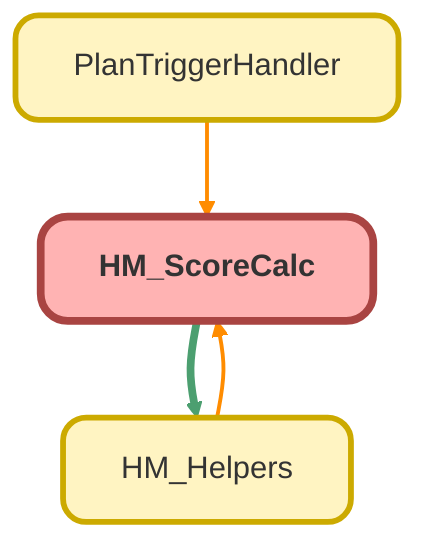

---
hide:
  - path
---

# HM_ScoreCalc Class

## Class Diagram



<!-- Apex description -->

## Apex Code

```java
public without sharing class HM_ScoreCalc {
  public static Map<String, HM_Setting__mdt> fieldVal = new Map<String, HM_Setting__mdt>();
  public static Map<String, String> targetFieldMap = new Map<String, String>();
  public static Map<String, String> sourceFieldMap = new Map<String, String>();
  public static List<HM_ChildMod> childList = new List<HM_ChildMod>();
  public static String scoreMessages = '';

  public static void calcScores(Map<Id, Plan__c> planMap) {
    Set<Id> planIdsOther = planMap.keySet();

    Map<String, String> filterFieldMap = new Map<String, String>();
    Set<String> fieldDurableIds = new Set<String>();
    Set<String> targetDurableIds = new Set<String>();
    Set<String> sourceDurableIds = new Set<String>();

    //Retrieve HM_Setting metadata records
    for (HM_Setting__mdt hm : HM_Setting__mdt.getAll().values()) {
      List<String> values = hm.Value__c.split(',');
      for (String value : values) {
        //This is used to match settings records with plan fields + values.  Key is "durableId,value"
        String key = hm.Source_Field__c + ',' + value;
        fieldVal.put(key, hm);
      }
      targetDurableIds.add(hm.Related_Date_Field__c);
      targetDurableIds.add(hm.Target_Field__c);
      sourceDurableIds.add(hm.Source_Field__c);
    }

    //Assign field definition IDs and query them to get the QualifiedApiName
    fieldDurableIds.addAll(targetDurableIds);
    fieldDurableIds.addAll(sourceDurableIds);

    //Pull child relationship metadata records, then store field Ids for query
    Set<String> childObjectDurableIds = new Set<String>();
    Set<String> childFieldDurableIds = new Set<String>();
    List<HM_Child__mdt> hmChildMdt = HM_Child__mdt.getAll().values();
    for (HM_Child__mdt hc : hmChildMdt) {
      childObjectDurableIds.add(hc.Object__c);
      childFieldDurableIds.add(hc.Filter_Field__c);
      childFieldDurableIds.add(hc.Filter_Field2__c);
      childFieldDurableIds.add(hc.Filter_Field3__c);
    }
    fieldDurableIds.addAll(childFieldDurableIds);

    //Set up maps for source and target fields
    //DurableID is the key, and the value is the QualifiedApiName of the field
    for (FieldDefinition field : [
      SELECT Id, QualifiedApiName, DurableId
      FROM FieldDefinition
      WHERE DurableId IN :fieldDurableIds
      WITH SECURITY_ENFORCED
    ]) {
      if (sourceDurableIds.contains(field.DurableId)) {
        sourceFieldMap.put(field.DurableId, field.QualifiedApiName);
      } else if (targetDurableIds.contains(field.DurableId)) {
        targetFieldMap.put(field.DurableId, field.QualifiedApiName);
      } else if (childFieldDurableIds.contains(field.DurableId)) {
        filterFieldMap.put(field.DurableId, field.QualifiedApiName);
      }
    }
    Map<String, String> childIdApiMap = new Map<String, String>();
    for (EntityDefinition ed : [
      SELECT DurableId, QualifiedApiName
      FROM EntityDefinition
      WHERE DurableId IN :childObjectDurableIds
      WITH SECURITY_ENFORCED
    ]) {
      childIdApiMap.put(ed.DurableId, ed.QualifiedApiName);
    }
    for (HM_Child__mdt hc : hmChildMdt) {
      HM_ChildMod c = new HM_ChildMod();
      c.objectName = childIdApiMap.get(hc.Object__c);
      c.maxAge = hc.Max_Age__c;
      c.threshold = hc.Score_Threshold__c;
      c.score = hc.Score__c;
      c.message = hc.Message__c;
      c.filterField = filterFieldMap.get(hc.Filter_Field__c);
      c.filterField2 = filterFieldMap.get(hc.Filter_Field2__c);
      c.filterField3 = filterFieldMap.get(hc.Filter_Field3__c);
      c.filterFieldValue = hc.Filter_Field_Value__c;
      c.filterFieldValue2 = hc.Filter_Field_Value2__c;
      c.filterFieldValue3 = hc.Filter_Field_Value3__c;
      childList.add(c);
    }
    String childQuery = HM_Helpers.buildChildQuery(childList);

    //Define fields to be retrieved from plan
    List<Plan__c> plans = database.query(
      'SELECT Id' +
        String.escapeSingleQuotes(childQuery) +
        ' FROM Plan__c WHERE Id IN :planIdsOther'
    );

    Map<String, List<SObject>> planChildMap = new Map<String, List<SObject>>();

    Set<String> relNames = new Set<String>();
    for (HM_ChildMod hcm : childList) {
      relNames.add(hcm.relName);
    }

    for (Plan__c p : plans) {
      for (String relName : relNames) {
        List<SObject> l = p.getSObjects(relName);
        if (l != null) {
          String planRelKey = p.Id + ',' + relName;
          planChildMap.put(planRelKey, l);
        }
      }
    }
    assignPlanScores(planMap, planChildMap);
  }

  //Checks the plan for field/fieldvalue pairs by comparing each to the fieldVal map
  //A new HM_Score is created for each match
  private static Map<Id, Plan__c> assignPlanScores(
    Map<Id, Plan__c> planMap,
    Map<String, List<SObject>> planRelMap
  ) {
    List<HM_Subtotal__mdt> hmSubtotals = HM_Subtotal__mdt.getAll().values();
    for (String planKey : planMap.keySet()) {
      Plan__c plan = planMap.get(planKey);
      scoreMessages = '';
      List<HM_Score> scores = new List<HM_Score>();

      for (String key : sourceFieldMap.keySet()) {
        String item = sourceFieldMap.get(key);
        //key is durableId of the plan field + , + value of the plan field
        String searchKey = key + ',' + plan.get(item);
        searchKey = searchKey.removeEnd('.0');
        String searchKeyAlt = key + ',!other';
        HM_Setting__mdt hm = new HM_Setting__mdt();
        //Tries to match this field's value with a setting record
        if (fieldVal.containsKey(searchKey)) {
          hm = fieldVal.get(searchKey);
        } else if (fieldVal.containsKey(searchKeyAlt)) {
          hm = fieldVal.get(searchKeyAlt);
        }

        if (hm.Score__c != null) {
          HM_Score s = new HM_Score();
          s.weight = hm.Weight__c;
          s.totalWeight = 0;
          s.subtotalField = targetFieldMap.get(hm.Target_Field__c);
          s.ageDateField = targetFieldMap.get(hm.Related_Date_Field__c);
          s.reductionAge = hm.Age_of_Reduction__c;
          s.reductionStep = hm.Reduction_per_Day__c;
          s.weight100 = hm.Round_Up_Weight__c;
          s.score = (s.ageDateField != null)
            ? HM_Helpers.scoreAgeReduction(plan, s, hm.Score__c)
            : hm.Score__c;
          if (s.score != null) {
            scores.add(s);
          }
        }
      }
      if (!scores.isEmpty() || !hmSubtotals.isEmpty()) {
        wipeSubtotals(plan, hmSubtotals);
        assignSubtotals(plan, scores);
      }
      if (!hmSubtotals.isEmpty()) {
        assignTotal(plan, hmSubtotals, planRelMap);
      }
      plan.Client_Health_Information__c = scoreMessages;
    }
    return planMap;
  }

  //List of HM_Score records are added up to be applied to the plan's subtotal fields
  //Magnitude of each HM_Score will be reduced by age, if applicable
  //Multiple HM_Scores could contribute to one subtotal field, so weighting is applied and added to the totalweight for each subtotalfield
  //Total weight is normalized to equal 100%, so it could be greater or less than the sum of its parts.
  private static Plan__c assignSubtotals(Plan__c plan, List<HM_Score> scores) {
    Map<String, HM_Score> scoreMap = new Map<String, HM_Score>();
    for (HM_Score s : scores) {
      Decimal tempScore = 0;
      Decimal tempTotalWeight = 0;
      if (scoreMap.containsKey(s.subtotalField)) {
        tempScore = scoreMap.get(s.subtotalField).score;
        tempTotalWeight = scoreMap.get(s.subtotalField).totalWeight;
        s.weight100 = (scoreMap.get(s.subtotalField).weight100)
          ? true
          : s.weight100;
      }
      tempScore += (s.score * (s.weight / 100));
      tempTotalWeight += s.weight;
      s.score = tempScore;
      s.totalWeight += tempTotalWeight;
      scoreMap.put(s.subtotalField, s);
    }

    for (String key : scoreMap.keyset()) {
      HM_Score item = scoreMap.get(key);
      item.score = (item.weight100)
        ? (item.score / (item.totalWeight / 100))
        : item.score;
      plan.put(key, item.score);
    }
    return plan;
  }

  //Checks the plan's fields that have been assigned by the subtotals step, totaling them up with the corresponding weights from the subtotal mdt
  //After weighted subtotal fields are added, total has child modifiers added to it.
  //Score is normalized to fit between 0 -> 100
  private static Plan__c assignTotal(
    Plan__c plan,
    List<HM_Subtotal__mdt> subtotals,
    Map<String, List<SObject>> planRelMap
  ) {
    Decimal totalScore = 0;
    Decimal totalWeight = 0;
    for (HM_Subtotal__mdt subtotalInfo : subtotals) {
      String sourceField = targetFieldMap.get(subtotalInfo.Source_Field__c);
      Decimal subScore = Decimal.valueOf(plan.get(sourceField).toString());
      subScore *= (subtotalInfo.Weight__c);
      if (subScore > 0) {
        addScoreMessage(subScore, subTotalInfo.Positive_Message__c);
      } else if (subScore < 0) {
        addScoreMessage(subScore, subTotalInfo.Negative_Message__c);
      }
      totalScore += subScore;
      totalWeight += subtotalInfo.Weight__c;
    }
    totalScore += addChildMods(plan, planRelMap);
    if (totalScore < 0) {
      totalScore = 0;
    } else if (totalScore > 100) {
      totalScore = 100;
    }
    plan.Client_Health_Score__c = totalScore;
    return plan;
  }

  //Loops through child relationships of plan defined by HM_ChildMods, counting up each one that meets the HM_ChildMod's criteria
  //If enough meet the criteria to reach the threshold, a modifier is added to the score and a message is added
  private static Decimal addChildMods(
    Plan__c plan,
    Map<String, List<SObject>> planRelMap
  ) {
    Decimal mod = 0;
    for (HM_ChildMod hmChild : childList) {
      Integer count = 0;
      List<SObject> relatedList = planRelMap.get(
        plan.Id + ',' + hmChild.relName
      );
      if (relatedList == null) {
        continue;
      }
      for (SObject child : relatedList) {
        count += HM_Helpers.checkChildRecord(child, hmChild);
      }
      if (count >= hmChild.threshold) {
        mod += hmChild.score;
        addScoreMessage(hmChild.score, hmChild.message);
      }
    }
    return mod;
  }

  private static void addScoreMessage(Decimal score, String message) {
    if (message == null) {
      return;
    }
    final String formattedMessage = HM_Helpers.getScoreMessage(score, message);
    scoreMessages += (scoreMessages == '')
      ? formattedMessage
      : '\r\n' + formattedMessage;
  }

  //Resets all subtotal fields to 0 before calc.  Used in case there aren't any valid scores for a field yet
  private static Plan__c wipeSubtotals(
    Plan__c plan,
    List<HM_Subtotal__mdt> hmSubtotals
  ) {
    for (HM_Subtotal__mdt subtotal : hmSubtotals) {
      plan.put(targetFieldMap.get(subtotal.Source_Field__c), 0);
    }
    return plan;
  }

  public class HM_Score {
    public Decimal score;
    public Decimal weight;
    public Decimal totalWeight;
    public String subtotalField;
    public Decimal reductionAge;
    public Decimal reductionStep;
    public String ageDateField;
    public Boolean weight100;
  }

  public class HM_ChildMod {
    public String objectName;
    public String relName;
    public Decimal maxAge;
    public Decimal score;
    public Decimal threshold;
    public String message;
    public String filterField;
    public String filterFieldValue;
    public String filterField2;
    public String filterFieldValue2;
    public String filterField3;
    public String filterFieldValue3;
  }
}
```

## Fields
### `fieldVal`

#### Signature
```apex
public static fieldVal
```

#### Type
Map&lt;String,HM_Setting__mdt&gt;

---

### `targetFieldMap`

#### Signature
```apex
public static targetFieldMap
```

#### Type
Map&lt;String,String&gt;

---

### `sourceFieldMap`

#### Signature
```apex
public static sourceFieldMap
```

#### Type
Map&lt;String,String&gt;

---

### `childList`

#### Signature
```apex
public static childList
```

#### Type
List&lt;HM_ChildMod&gt;

---

### `scoreMessages`

#### Signature
```apex
public static scoreMessages
```

#### Type
String

## Methods
### `calcScores(planMap)`

#### Signature
```apex
public static void calcScores(Map<Id,Plan__c> planMap)
```

#### Parameters
| Name | Type | Description |
|------|------|-------------|
| planMap | Map&lt;Id,Plan__c&gt; |  |

#### Return Type
**void**

---

### `assignPlanScores(planMap, planRelMap)`

#### Signature
```apex
private static Map<Id,Plan__c> assignPlanScores(Map<Id,Plan__c> planMap, Map<String,List<SObject>> planRelMap)
```

#### Parameters
| Name | Type | Description |
|------|------|-------------|
| planMap | Map&lt;Id,Plan__c&gt; |  |
| planRelMap | Map&lt;String,List&lt;SObject&gt;&gt; |  |

#### Return Type
**Map&lt;Id,Plan__c&gt;**

---

### `assignSubtotals(plan, scores)`

#### Signature
```apex
private static Plan__c assignSubtotals(Plan__c plan, List<HM_Score> scores)
```

#### Parameters
| Name | Type | Description |
|------|------|-------------|
| plan | [Plan__c](../objects/Plan__c.md) |  |
| scores | List&lt;HM_Score&gt; |  |

#### Return Type
**[Plan__c](../objects/Plan__c.md)**

---

### `assignTotal(plan, subtotals, planRelMap)`

#### Signature
```apex
private static Plan__c assignTotal(Plan__c plan, List<HM_Subtotal__mdt> subtotals, Map<String,List<SObject>> planRelMap)
```

#### Parameters
| Name | Type | Description |
|------|------|-------------|
| plan | [Plan__c](../objects/Plan__c.md) |  |
| subtotals | List&lt;HM_Subtotal__mdt&gt; |  |
| planRelMap | Map&lt;String,List&lt;SObject&gt;&gt; |  |

#### Return Type
**[Plan__c](../objects/Plan__c.md)**

---

### `addChildMods(plan, planRelMap)`

#### Signature
```apex
private static Decimal addChildMods(Plan__c plan, Map<String,List<SObject>> planRelMap)
```

#### Parameters
| Name | Type | Description |
|------|------|-------------|
| plan | [Plan__c](../objects/Plan__c.md) |  |
| planRelMap | Map&lt;String,List&lt;SObject&gt;&gt; |  |

#### Return Type
**Decimal**

---

### `addScoreMessage(score, message)`

#### Signature
```apex
private static void addScoreMessage(Decimal score, String message)
```

#### Parameters
| Name | Type | Description |
|------|------|-------------|
| score | Decimal |  |
| message | String |  |

#### Return Type
**void**

---

### `wipeSubtotals(plan, hmSubtotals)`

#### Signature
```apex
private static Plan__c wipeSubtotals(Plan__c plan, List<HM_Subtotal__mdt> hmSubtotals)
```

#### Parameters
| Name | Type | Description |
|------|------|-------------|
| plan | [Plan__c](../objects/Plan__c.md) |  |
| hmSubtotals | List&lt;HM_Subtotal__mdt&gt; |  |

#### Return Type
**[Plan__c](../objects/Plan__c.md)**

## Classes
### HM_Score Class

#### Fields
##### `score`

###### Signature
```apex
public score
```

###### Type
Decimal

---

##### `weight`

###### Signature
```apex
public weight
```

###### Type
Decimal

---

##### `totalWeight`

###### Signature
```apex
public totalWeight
```

###### Type
Decimal

---

##### `subtotalField`

###### Signature
```apex
public subtotalField
```

###### Type
String

---

##### `reductionAge`

###### Signature
```apex
public reductionAge
```

###### Type
Decimal

---

##### `reductionStep`

###### Signature
```apex
public reductionStep
```

###### Type
Decimal

---

##### `ageDateField`

###### Signature
```apex
public ageDateField
```

###### Type
String

---

##### `weight100`

###### Signature
```apex
public weight100
```

###### Type
Boolean

### HM_ChildMod Class

#### Fields
##### `objectName`

###### Signature
```apex
public objectName
```

###### Type
String

---

##### `relName`

###### Signature
```apex
public relName
```

###### Type
String

---

##### `maxAge`

###### Signature
```apex
public maxAge
```

###### Type
Decimal

---

##### `score`

###### Signature
```apex
public score
```

###### Type
Decimal

---

##### `threshold`

###### Signature
```apex
public threshold
```

###### Type
Decimal

---

##### `message`

###### Signature
```apex
public message
```

###### Type
String

---

##### `filterField`

###### Signature
```apex
public filterField
```

###### Type
String

---

##### `filterFieldValue`

###### Signature
```apex
public filterFieldValue
```

###### Type
String

---

##### `filterField2`

###### Signature
```apex
public filterField2
```

###### Type
String

---

##### `filterFieldValue2`

###### Signature
```apex
public filterFieldValue2
```

###### Type
String

---

##### `filterField3`

###### Signature
```apex
public filterField3
```

###### Type
String

---

##### `filterFieldValue3`

###### Signature
```apex
public filterFieldValue3
```

###### Type
String