---
hide:
  - path
---

# HM_Tests Class

`ISTEST`

## Class Diagram

```mermaid
graph TD
  HM_Tests["HM_Tests"]:::mainApexClass
  click HM_Tests "/objects/HM_Tests/"




classDef apexClass fill:#FFF4C2,stroke:#CCAA00,stroke-width:3px,rx:12px,ry:12px,shadow:drop,color:#333;
classDef apexTestClass fill:#F5F5F5,stroke:#999999,stroke-width:3px,rx:12px,ry:12px,shadow:drop,color:#333;
classDef mainApexClass fill:#FFB3B3,stroke:#A94442,stroke-width:4px,rx:14px,ry:14px,shadow:drop,color:#333,font-weight:bold;

```



<!-- Apex description -->

## Apex Code

```java
@isTest
private class HM_Tests {
  @TestSetup
  static void makeData() {
    // HM_Child__mdt testChild = new HM_Child__mdt(
    //   Label = 'Ten Test Cases',
    //   DeveloperName = 'Ten_Test_Cases',
    //   Max_Age__c = 30,
    //   Score_Threshold__c = 10,
    //   Score__c = -10000,
    //   Message__c = 'Too many cases my dude',
    //   Object__c = 'Case',
    //   Filter_Field__c = 'Case.SuppliedName',
    //   Filter_Field_Value__c = 'BurgerTime',
    //   Filter_Field2__c = 'Case.SuppliedEmail',
    //   Filter_Field_Value2__c = 'testEmail@ubi.webzone',
    //   Filter_Field3__c = 'Case.SuppliedPhone',
    //   Filter_Field_Value3__c = '1111111111'
    // );
    // insert testChild;

    Plan__c p = new Plan__c(
      Name = 'Test Plan HM_Test',
      Status__c = 'Active',
      Date_Most_Recent_Sponsor_Trustee_CSAT__c = Date.today(),
      Most_Recent_CSAT_Score_Sponsor_Trustee__c = 5,
      Billing_Status__c = 'Current',
      Payroll_Submission_Status__c = 'Current'
    );
    insert p;

    List<Case> cList = new List<Case>();
    for (Integer i = 0; i < 10; i++) {
      Case c = new Case(
        Subject = 'Test Case ' + i,
        Plan__c = p.Id,
        SuppliedEmail = 'testEmail@ubi.webzone',
        SuppliedName = 'BurgerTime',
        SuppliedPhone = '1111111111'
      );
      cList.add(c);
    }
    insert cList;

    Escalation__c e = new Escalation__c(
      Plan__c = p.Id,
      Status__c = 'Escalated'
    );
    insert e;
  }

  @isTest
  static void didHMcalc() {
    Plan__c pBefore = [
      SELECT Id, Client_Health_Score__c
      FROM Plan__c
      WHERE Name = 'Test Plan HM_Test'
    ];
    Decimal oldScore = pBefore.Client_Health_Score__c;
    pBefore.Billing_Status__c = 'Behind';
    test.startTest();
    update pBefore;
    test.stopTest();

    Plan__c pAfter = [
      SELECT Id, Client_Health_Score__c
      FROM Plan__c
      WHERE Name = 'Test Plan HM_Test'
    ];

    Assert.areNotEqual(
      oldScore,
      pAfter.Client_Health_Score__c,
      'Expected to get a different Client Health Score'
    );
  }
}
```

## Methods
### `makeData()`

`TESTSETUP`

#### Signature
```apex
private static void makeData()
```

#### Return Type
**void**

---

### `didHMcalc()`

`ISTEST`

#### Signature
```apex
private static void didHMcalc()
```

#### Return Type
**void**