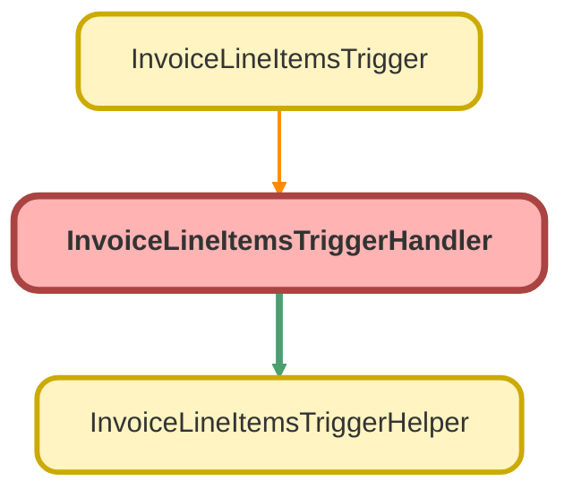

---
hide:
  - path
---

# InvoiceLineItemsTriggerHandler Class

## Class Diagram



<!-- Apex description -->

## Apex Code

```java
public with sharing class InvoiceLineItemsTriggerHandler {
    private boolean triggerIsExecuting;
    private integer triggerSize;
    public InvoiceLineItemsTriggerHelper helper;
    public InvoiceLineItemsTriggerHandler(boolean triggerIsExecuting, integer triggerSize) {
        this.triggerIsExecuting = triggerIsExecuting;
        this.triggerSize = triggerSize;
        this.helper = new InvoiceLineItemsTriggerHelper();

    }
    public void beforeInsert(List<Invoice_Line_Items__c> newInvoiceLineItems) {
        system.debug('Executing before insert helper');
        InvoiceLineItemsTriggerHelper.parseProductName(newInvoiceLineItems);
    }
//    public void afterInsert(List<Invoice_Line_Items__c> newInvoiceLineItems, Map<Id, SObject> newInvoiceLineItemsMap) {
//
//    }
    public void beforeUpdate(List<Invoice_Line_Items__c> oldInvoiceLineItems, List<Invoice_Line_Items__c> newInvoiceLineItems, Map<Id, SObject> oldInvoiceLineItemsMap, Map<Id, SObject> newInvoiceLineItemsMap) {
        system.debug('Executing before update helper');
        InvoiceLineItemsTriggerHelper.parseProductName(newInvoiceLineItems);
    }
//    public void afterUpdate(List<Invoice_Line_Items__c> oldInvoiceLineItems, List<Invoice_Line_Items__c> newInvoiceLineItems, Map<Id, SObject> oldInvoiceLineItemsMap, Map<Id, SObject> newInvoiceLineItemsMap) {
//
//    }
//    public void beforeDelete(List<Invoice_Line_Items__c> oldInvoiceLineItems, Map<Id, SObject> oldInvoiceLineItemsMap) {
//
//    }
//    public void afterDelete(List<Invoice_Line_Items__c> oldInvoiceLineItems, Map<Id, SObject> oldInvoiceLineItemsMap) {
//
//    }
//    public void afterUndelete(List<Invoice_Line_Items__c> newInvoiceLineItems, Map<Id, SObject> newInvoiceLineItemsMap) {
//
//    }
}
```

## Fields
### `triggerIsExecuting`

#### Signature
```apex
private triggerIsExecuting
```

#### Type
boolean

---

### `triggerSize`

#### Signature
```apex
private triggerSize
```

#### Type
integer

---

### `helper`

#### Signature
```apex
public helper
```

#### Type
[InvoiceLineItemsTriggerHelper](InvoiceLineItemsTriggerHelper.md)

## Constructors
### `InvoiceLineItemsTriggerHandler(triggerIsExecuting, triggerSize)`

#### Signature
```apex
public InvoiceLineItemsTriggerHandler(boolean triggerIsExecuting, integer triggerSize)
```

#### Parameters
| Name | Type | Description |
|------|------|-------------|
| triggerIsExecuting | boolean |  |
| triggerSize | integer |  |

## Methods
### `beforeInsert(newInvoiceLineItems)`

#### Signature
```apex
public void beforeInsert(List<Invoice_Line_Items__c> newInvoiceLineItems)
```

#### Parameters
| Name | Type | Description |
|------|------|-------------|
| newInvoiceLineItems | List&lt;Invoice_Line_Items__c&gt; |  |

#### Return Type
**void**

---

### `beforeUpdate(oldInvoiceLineItems, newInvoiceLineItems, oldInvoiceLineItemsMap, newInvoiceLineItemsMap)`

#### Signature
```apex
public void beforeUpdate(List<Invoice_Line_Items__c> oldInvoiceLineItems, List<Invoice_Line_Items__c> newInvoiceLineItems, Map<Id,SObject> oldInvoiceLineItemsMap, Map<Id,SObject> newInvoiceLineItemsMap)
```

#### Parameters
| Name | Type | Description |
|------|------|-------------|
| oldInvoiceLineItems | List&lt;Invoice_Line_Items__c&gt; |  |
| newInvoiceLineItems | List&lt;Invoice_Line_Items__c&gt; |  |
| oldInvoiceLineItemsMap | Map&lt;Id,SObject&gt; |  |
| newInvoiceLineItemsMap | Map&lt;Id,SObject&gt; |  |

#### Return Type
**void**