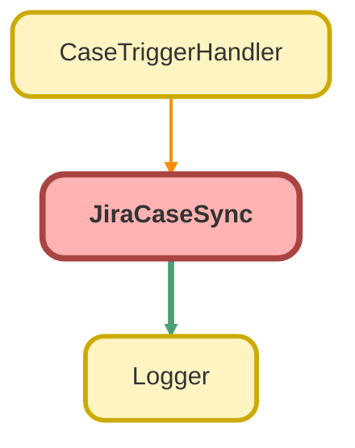

---
hide:
  - path
---

# JiraCaseSync Class

## Class Diagram



<!-- Apex description -->

## Apex Code

```java
public with sharing class JiraCaseSync {
	//Defining constants
	private final static String JIRA_ISSUE = System.Label.Default_Jira_Issue;
	private final static String JIRA_PROJECT = System.Label.Default_Jira_Project;
	private final static String JIRA_RECORD_TYPE = [SELECT Id FROM RecordType WHERE SobjectType = 'Case' AND DeveloperName LIKE '%Jira%' LIMIT 1].Id;
	private final static Map<Id, User> MAP_USER_ROLE = new Map<Id, User>([SELECT Id, userRoleId FROM User]);

	//Used for inserts
	public static void newCases(List<Case> cases, List<Case> oldCases) {
		List<Case> casesToCreate = new List<Case>();
		for (Case c : cases) {
			//If it should sync, add to cases to create
			if (shouldSync(c)) {
				Logger.debug('Queueing new case for Jira creation: ' + c.Id, c.Id);
				casesToCreate.add(c);
			} else {
				Logger.debug('Jira sync bypassed for case: ' + c.Id, c.Id);
			}
		}
		if (!casesToCreate.isEmpty()) {
			Logger.info('Creating ' + casesToCreate.size() + ' case(s) in Jira', casesToCreate);
			JCFS.API.createJiraIssueWithDefaultPostAction(JIRA_PROJECT, JIRA_ISSUE, casesToCreate, oldCases);
		}
		Logger.saveLog();
	}

	//Used for updates
	public static void updateCases(List<Case> cases, Map<Id, Case> oldCaseMap) {
		List<Case> casesToCreate = new List<Case>();
		List<Case> casesToPush = new List<Case>();
		for (Case c : cases) {
			//If it shouldn't sync, skip
			if (!shouldSync(c)) {
				Logger.debug('Jira sync bypassed for case: ' + c.Id, c.Id);
				continue;
			}
			//If this has been newly approved, create it in jira.  Otherwise update existing
			if (c.Approval_Status__c != oldCaseMap.get(c.Id).Approval_Status__c && c.Approval_Status__c == 'Approved') {
				Logger.debug('Queueing updated case for Jira creation: ' + c.Id, c.Id);
				casesToCreate.add(c);
			} else {
				casesToPush.add(c);
			}
		}
		//Creates jira issue w/ default post action
		if (!casesToCreate.isEmpty()) {
			Logger.info('Creating ' + casesToCreate.size() + ' case(s) in Jira', casesToCreate);
			JCFS.API.createJiraIssueWithDefaultPostAction(JIRA_PROJECT, JIRA_ISSUE, casesToCreate, oldCaseMap.values());
		}
		//Updates existing jira issue(s)
		if (!casesToPush.isEmpty()) {
			Logger.debug('Updating ' + casesToPush.size() + ' case(s) in Jira', casesToPush);
			JCFS.API.pushUpdatesToJira(casesToPush, oldCaseMap.values());
		}
		Logger.saveLog();
	}

	//Series of checks to determine if case should be synced, whether new or update
	private static Boolean shouldSync(Case c) {
		//Must be correct record type
		if (c.RecordTypeId != JIRA_RECORD_TYPE) {
			Logger.fine('Wrong record type for Jira: ' + c.RecordTypeId, c.Id);
			return false;
		}
		//Must be a paradigm bug or enhancement
		if (c.Reason != 'Paradigm Bug' && c.Reason != 'Paradigm Enhancement') {
			Logger.fine('Wrong reason for Jira: ' + c.Reason, c.Id);
			return false;
		}
		//If case needs approval, must be approved
		if (checkApprovalReq(c) && c.Approval_Status__c != 'Approved') {
			return false;
		}
		Logger.debug('Case is ok to sync to Jira: ' + c.Id, c.Id);
		return true;
	}

	//Checks if case needs to be approved b4 sync using subflow
	private static Boolean checkApprovalReq(Case c) {
		Map<String, Object> params = new Map<String, Object>();
		params.put('case', c);
		params.put('userId', c.CreatedById);
		params.put('userRoleId', MAP_USER_ROLE.get(c.CreatedById));
		Logger.fine('Checking if case needs approval before Jira sync', c.Id);
		Flow.Interview.Case_Autolaunched_Need_Approval_For_Jira flowcheck = new Flow.Interview.Case_Autolaunched_Need_Approval_For_Jira(params);
		flowcheck.start();
		Logger.debug('Approval check flow result: ' + flowcheck.getVariableValue('needsApproval'), c.Id);
		return (Boolean) flowcheck.getVariableValue('needsApproval');
	}
}
```

## Fields
### `JIRA_ISSUE`

#### Signature
```apex
private final static JIRA_ISSUE
```

#### Type
String

---

### `JIRA_PROJECT`

#### Signature
```apex
private final static JIRA_PROJECT
```

#### Type
String

---

### `JIRA_RECORD_TYPE`

#### Signature
```apex
private final static JIRA_RECORD_TYPE
```

#### Type
String

---

### `MAP_USER_ROLE`

#### Signature
```apex
private final static MAP_USER_ROLE
```

#### Type
Map&lt;Id,User&gt;

## Methods
### `newCases(cases, oldCases)`

#### Signature
```apex
public static void newCases(List<Case> cases, List<Case> oldCases)
```

#### Parameters
| Name | Type | Description |
|------|------|-------------|
| cases | List&lt;Case&gt; |  |
| oldCases | List&lt;Case&gt; |  |

#### Return Type
**void**

---

### `updateCases(cases, oldCaseMap)`

#### Signature
```apex
public static void updateCases(List<Case> cases, Map<Id,Case> oldCaseMap)
```

#### Parameters
| Name | Type | Description |
|------|------|-------------|
| cases | List&lt;Case&gt; |  |
| oldCaseMap | Map&lt;Id,Case&gt; |  |

#### Return Type
**void**

---

### `shouldSync(c)`

#### Signature
```apex
private static Boolean shouldSync(Case c)
```

#### Parameters
| Name | Type | Description |
|------|------|-------------|
| c | [Case](../objects/Case.md) |  |

#### Return Type
**Boolean**

---

### `checkApprovalReq(c)`

#### Signature
```apex
private static Boolean checkApprovalReq(Case c)
```

#### Parameters
| Name | Type | Description |
|------|------|-------------|
| c | [Case](../objects/Case.md) |  |

#### Return Type
**Boolean**