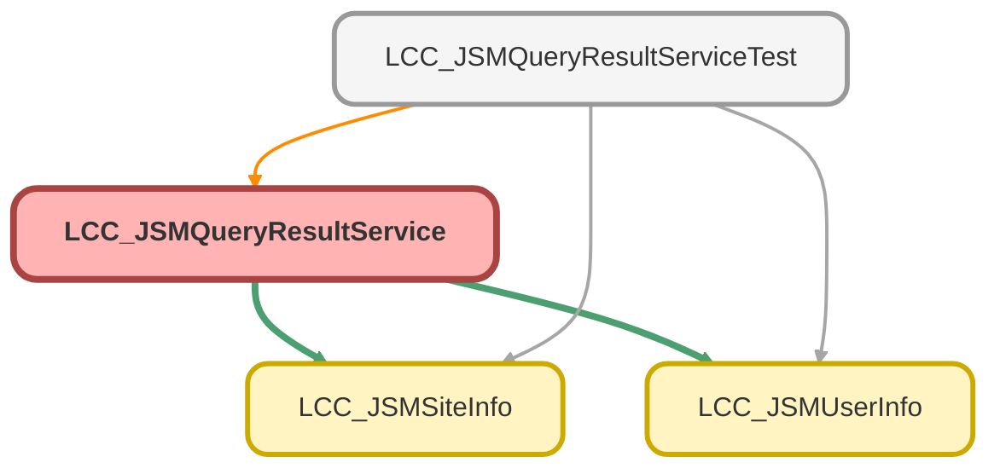

---
hide:
  - path
---

# LCC_JSMQueryResultService Class

## Class Diagram



<!-- Apex description -->

## Apex Code

```java
public class LCC_JSMQueryResultService {
    
    @AuraEnabled
    public static List<sObject> executeQuery(String theQuery){
        try{
            //We do not escape  parameters here since the query must not be modified. 
            //Parameters must be escaped by consumers of this method
            return Database.query(theQuery);
        }catch(Exception e){
            throw new AuraHandledException('Error doing the query: '+theQuery+' Error: '+e.getMessage());
            
            
        }
        
    }
        
    @AuraEnabled
    public static sObject executeQueryOneObject(String theQuery){
        try{
            //We do not escape  parameters here since the query must not be modified. 
            //Parameters must be escaped by consumers of this method
            return Database.query(theQuery);
        }catch(Exception e){
            throw new AuraHandledException('Error doing the query: '+theQuery+' Error: '+e.getMessage());
            
            
        }
        
    }
        
    @AuraEnabled
    public static LCC_JSMUserInfo getUserInfo(){
        try{
            LCC_JSMUserInfo info = new LCC_JSMUserInfo();
            info.Id = Userinfo.getUserId();
            info.FirstName = Userinfo.getFirstName();
            info.LastName = Userinfo.getLastName();
            info.UserEmail = Userinfo.getUserEmail();
            info.Name = Userinfo.getName();
            info.UserName = Userinfo.getUserName();
            return info;
        }catch(Exception e){
            throw new AuraHandledException(e.getMessage()); 
        }
        
    }
        
    @AuraEnabled
    public static Profile getProfileInfo(){
        try{
            String profileId = UserInfo.getProfileId();
            Profile profile = [SELECT Id, Name FROM Profile WHERE Id =:profileId];
            return profile;
        }catch(Exception e){
            throw new AuraHandledException(e.getMessage()); 
        }
    }
        
    @AuraEnabled
    public static LCC_JSMSiteInfo getSiteInfo(){
        try{
            LCC_JSMSiteInfo info = new LCC_JSMSiteInfo();
            info.Prefix = Site.getPathPrefix();
            info.Domain = Site.getDomain();
            info.Name = Site.getName();
            return info;
        }catch(Exception e){
            throw new AuraHandledException(e.getMessage()); 
        }
    }

    @AuraEnabled
    public static sObject loadObjectInfoById(Id recordId) {

        DescribeSObjectResult objectType = recordId.getSobjectType().getDescribe();
        List<String> objectFields = new List<String>(objectType.fields.getMap().keySet());

        String query = 'SELECT ' + String.join(objectFields, ',') + ' FROM ' + objectType.getName() + ' WHERE Id = \'' + String.escapeSingleQuotes(recordId) + '\' LIMIT 1';

        return executeQueryOneObject(query);
    }
}
```

## Methods
### `executeQuery(theQuery)`

`AURAENABLED`

#### Signature
```apex
public static List<sObject> executeQuery(String theQuery)
```

#### Parameters
| Name | Type | Description |
|------|------|-------------|
| theQuery | String |  |

#### Return Type
**List&lt;sObject&gt;**

---

### `executeQueryOneObject(theQuery)`

`AURAENABLED`

#### Signature
```apex
public static sObject executeQueryOneObject(String theQuery)
```

#### Parameters
| Name | Type | Description |
|------|------|-------------|
| theQuery | String |  |

#### Return Type
**sObject**

---

### `getUserInfo()`

`AURAENABLED`

#### Signature
```apex
public static LCC_JSMUserInfo getUserInfo()
```

#### Return Type
**[LCC_JSMUserInfo](LCC_JSMUserInfo.md)**

---

### `getProfileInfo()`

`AURAENABLED`

#### Signature
```apex
public static Profile getProfileInfo()
```

#### Return Type
**Profile**

---

### `getSiteInfo()`

`AURAENABLED`

#### Signature
```apex
public static LCC_JSMSiteInfo getSiteInfo()
```

#### Return Type
**[LCC_JSMSiteInfo](LCC_JSMSiteInfo.md)**

---

### `loadObjectInfoById(recordId)`

`AURAENABLED`

#### Signature
```apex
public static sObject loadObjectInfoById(Id recordId)
```

#### Parameters
| Name | Type | Description |
|------|------|-------------|
| recordId | Id |  |

#### Return Type
**sObject**