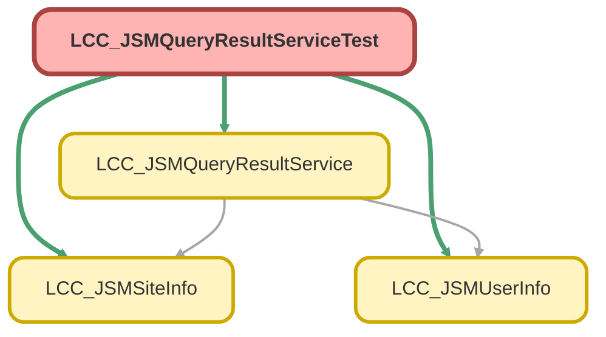

---
hide:
  - path
---

# LCC_JSMQueryResultServiceTest Class

`ISTEST`

## Class Diagram



<!-- Apex description -->

## Apex Code

```java
@isTest
public class LCC_JSMQueryResultServiceTest {
    
    @isTest
    static public void executeQueryTest(){
        //do the query
        String theQuery = 'SELECT Id FROM User LIMIT 5';
        List<User> user = LCC_JSMQueryResultService.executeQuery(theQuery);
        
        //compare the result
        System.assertNotEquals(null, user);
    }
    
    @isTest
    static public void executeQueryOneObjectTest(){
        //do the query
        String theQuery = 'SELECT Id FROM User LIMIT 1';
        User user = (User)LCC_JSMQueryResultService.executeQueryOneObject(theQuery);
        
        //compare the result
        System.assertNotEquals(null, user);
    }
    
    @isTest
    static public void getUserInfoTest(){
        LCC_JSMUserInfo user = LCC_JSMQueryResultService.getUserInfo();
        //compare the result
        System.assertEquals(UserInfo.getUserId(), user.Id);
        System.assertEquals(UserInfo.getFirstName(), user.FirstName);
        System.assertEquals(UserInfo.getLastName(), user.LastName);
        System.assertEquals(UserInfo.getUserEmail(), user.UserEmail);
        System.assertEquals(UserInfo.getName(), user.Name);
        System.assertEquals(UserInfo.getUserName(), user.UserName);
    }
    
    @isTest
    static public void getProfileInfoTest(){
        String profileId = UserInfo.getProfileId();
        Profile profile = [SELECT Id, Name FROM Profile WHERE Id =:profileId];
        
        Profile prof = LCC_JSMQueryResultService.getProfileInfo();
        //compare the result
        System.assertEquals(profile.Id, prof.Id);
        System.assertEquals(profile.Name, prof.Name);
    }
    
    @isTest
    static public void getSiteInfoTest(){
        LCC_JSMSiteInfo info = LCC_JSMQueryResultService.getSiteInfo();
        //compare the result
        System.assertEquals(Site.getPathPrefix(), info.Prefix);
        System.assertEquals(Site.getDomain(), info.Domain);
        System.assertEquals(Site.getName(), info.Name);
    }

    @isTest
    static public void executeQueryNegTest(){
        //do the query
        String theQuery = 'SELECT Id, Count From Account LIMIT 5';
        
        try{
        	List<Account> acc = LCC_JSMQueryResultService.executeQuery(theQuery);
            System.assert(false);
        }catch(AuraHandledException ex){
            System.assert(true);
        }
    }
    
    @isTest
    static public void executeQueryOneObjectNegTest(){
        //do the query
        String theQuery = 'SELECT Id From Account LIMIT 5';
        
        try{
        	Account acc = (Account)LCC_JSMQueryResultService.executeQueryOneObject(theQuery);
        	System.assert(false);
        }catch(AuraHandledException ex){
            System.assert(true);
        }
    }

    @isTest
    static public void loadObjectInfoByIdTest(){
        try{
            Task testTask = new Task();
            testTask.Subject = 'Subject Test';
            testTask.Priority = 'Normal';
            testTask.Status = 'Completed';

            Test.startTest();
                insert testTask;
            Test.stopTest();

            Task tsk = (Task)LCC_JSMQueryResultService.loadObjectInfoById(testTask.Id);

            System.assertEquals(testTask.Id, tsk.Id);
            System.assertEquals(testTask.Subject, tsk.Subject);
            System.assertEquals(testTask.Priority, tsk.Priority);
            System.assertEquals(testTask.Status, tsk.Status);

        } catch(AuraHandledException ex) {
            System.assert(false);
        }
    }

}
```

## Methods
### `executeQueryTest()`

`ISTEST`

#### Signature
```apex
public static void executeQueryTest()
```

#### Return Type
**void**

---

### `executeQueryOneObjectTest()`

`ISTEST`

#### Signature
```apex
public static void executeQueryOneObjectTest()
```

#### Return Type
**void**

---

### `getUserInfoTest()`

`ISTEST`

#### Signature
```apex
public static void getUserInfoTest()
```

#### Return Type
**void**

---

### `getProfileInfoTest()`

`ISTEST`

#### Signature
```apex
public static void getProfileInfoTest()
```

#### Return Type
**void**

---

### `getSiteInfoTest()`

`ISTEST`

#### Signature
```apex
public static void getSiteInfoTest()
```

#### Return Type
**void**

---

### `executeQueryNegTest()`

`ISTEST`

#### Signature
```apex
public static void executeQueryNegTest()
```

#### Return Type
**void**

---

### `executeQueryOneObjectNegTest()`

`ISTEST`

#### Signature
```apex
public static void executeQueryOneObjectNegTest()
```

#### Return Type
**void**

---

### `loadObjectInfoByIdTest()`

`ISTEST`

#### Signature
```apex
public static void loadObjectInfoByIdTest()
```

#### Return Type
**void**