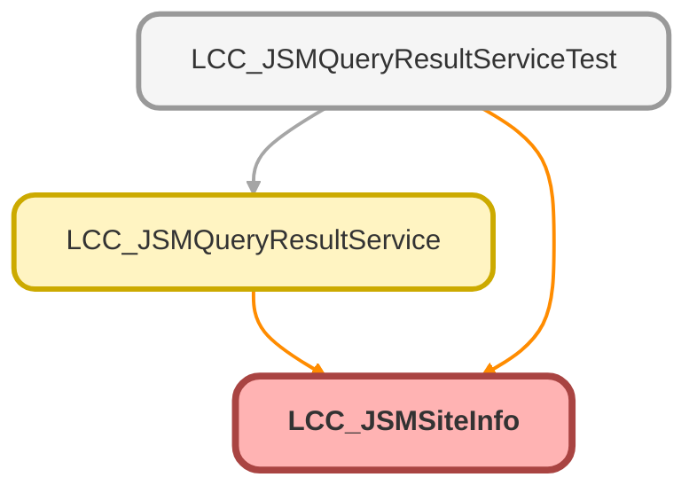

---
hide:
  - path
---

# LCC_JSMSiteInfo Class

## Class Diagram



<!-- Apex description -->

## Apex Code

```java
public class LCC_JSMSiteInfo {
    @AuraEnabled
    public String Prefix {get;set;}
    @AuraEnabled
    public String Name {get;set;}
    @AuraEnabled
    public String Domain {get;set;}
}
```

## Properties
### `Prefix`

`AURAENABLED`

#### Signature
```apex
public Prefix
```

#### Type
String

---

### `Name`

`AURAENABLED`

#### Signature
```apex
public Name
```

#### Type
String

---

### `Domain`

`AURAENABLED`

#### Signature
```apex
public Domain
```

#### Type
String