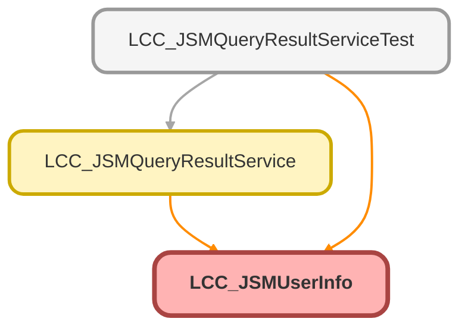

---
hide:
  - path
---

# LCC_JSMUserInfo Class

## Class Diagram



<!-- Apex description -->

## Apex Code

```java
public class LCC_JSMUserInfo{
    @AuraEnabled
    public String Id {get;set;}
    @AuraEnabled
    public String FirstName {get;set;}
    @AuraEnabled
    public String LastName {get;set;}
    @AuraEnabled
    public String UserEmail {get;set;}
    @AuraEnabled
    public String Name {get;set;}
    @AuraEnabled
    public String UserName {get;set;}
}
```

## Properties
### `Id`

`AURAENABLED`

#### Signature
```apex
public Id
```

#### Type
String

---

### `FirstName`

`AURAENABLED`

#### Signature
```apex
public FirstName
```

#### Type
String

---

### `LastName`

`AURAENABLED`

#### Signature
```apex
public LastName
```

#### Type
String

---

### `UserEmail`

`AURAENABLED`

#### Signature
```apex
public UserEmail
```

#### Type
String

---

### `Name`

`AURAENABLED`

#### Signature
```apex
public Name
```

#### Type
String

---

### `UserName`

`AURAENABLED`

#### Signature
```apex
public UserName
```

#### Type
String